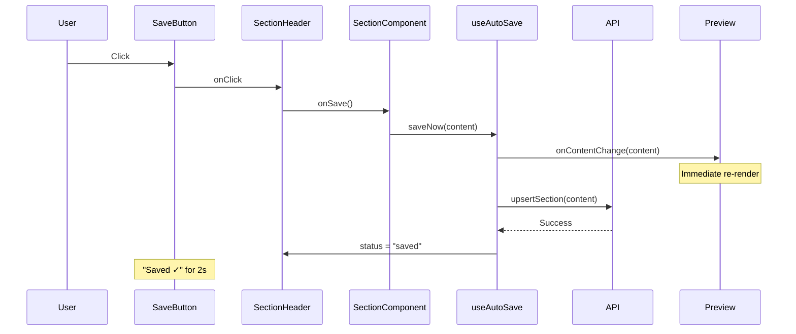
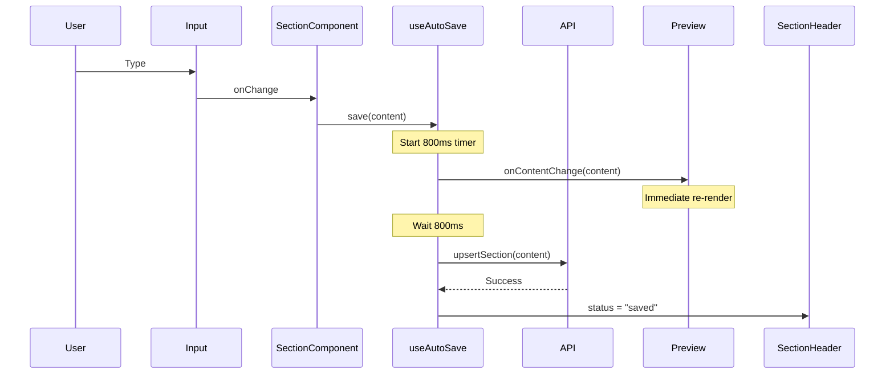

# Design Document: Add Save Button

## Overview

This design implements an explicit Save button in the Section Header component that appears across all 31 section components in the TS Document Generator application. The Save button provides immediate save functionality alongside the existing 800ms autosave mechanism, enabling users to manually trigger saves and see instant preview updates.

### Key Design Decisions

1. **Minimal Invasiveness**: Changes to 31 section components are limited to mechanical prop passing only, avoiding complex refactoring
2. **Hook Enhancement**: The useAutoSave hook is extended to expose a `saveNow()` function for immediate, non-debounced saves
3. **Callback Architecture**: A clean callback propagation pattern flows from Section Header → Section Component → Editor → Preview
4. **State Coexistence**: Manual saves and autosaves coexist without conflicts through debounce timer clearing
5. **Visual Consistency**: Save button styling matches existing Delete button patterns using Hitachi red (#E60012)

### Architecture Principles

- **Single Responsibility**: Section Header owns UI rendering, Section Component owns state management, useAutoSave hook owns persistence logic
- **Prop Drilling**: Explicit prop passing preferred over context for clarity and debuggability
- **Idempotence**: Both autosave and manual save produce identical backend state
- **Immediate Feedback**: UI updates occur synchronously before async API calls complete

## Architecture

### Component Hierarchy

```
Editor (root)
  └─ SectionInputPanel
      └─ Section Component (e.g., CoverSection)
          ├─ useAutoSave hook
          │   ├─ save() - debounced autosave
          │   └─ saveNow() - immediate save (NEW)
          └─ SectionHeader
              ├─ Save Button (NEW)
              ├─ Save Status indicator
              └─ Delete Button
```

### Data Flow for Manual Save



### Data Flow for Autosave (Existing)



### State Management

**Section Component State**:
- `content`: Current section content (e.g., CoverContent)
- `loading`: Initial data fetch state

**useAutoSave Hook State**:
- `status`: 'idle' | 'saving' | 'saved' | 'error'
- `timerRef`: Debounce timer for autosave
- `resetTimerRef`: Timer to reset status from 'saved' to 'idle'

**Section Header State**:
- No internal state (stateless presentation component)
- Receives `status` prop from useAutoSave
- Receives `onSave` callback from Section Component

## Components and Interfaces

### 1. SectionHeader Component (Modified)

**New Props**:
```typescript
interface SectionHeaderProps {
  projectId: string;
  sectionKey: string;
  title: string;
  showDeleteButton?: boolean;
  onDelete?: () => void;
  onRefresh?: () => void;
  status?: 'saving' | 'saved' | 'error' | 'idle' | null;
  onSave?: () => void; // NEW: Callback for Save button click
}
```

**New UI Elements**:
- Save button with text "Save" (default), "Saving..." (during save), "Saved ✓" (after success)
- Button disabled state during save operations
- Hover effects matching Delete button styling

**Responsibilities**:
- Render Save button with appropriate text based on status
- Invoke `onSave` callback when Save button is clicked
- Display save status indicator (existing functionality)
- Manage Delete button and confirmation dialog (existing functionality)

### 2. useAutoSave Hook (Enhanced)

**Current Interface**:
```typescript
interface UseAutoSaveReturn {
  save: (content: Record<string, any>) => void;
  status: AutoSaveStatus;
}
```

**New Interface**:
```typescript
interface UseAutoSaveReturn {
  save: (content: Record<string, any>) => void;
  saveNow: (content: Record<string, any>) => void; // NEW
  status: AutoSaveStatus;
}
```

**saveNow() Implementation**:
```typescript
const saveNow = useCallback(
  async (content: Record<string, any>) => {
    // Clear any pending debounce timer
    if (timerRef.current) {
      clearTimeout(timerRef.current);
    }
    if (resetTimerRef.current) {
      clearTimeout(resetTimerRef.current);
    }

    // Immediately notify parent of content change (for live preview)
    if (onContentChange) {
      onContentChange(content);
    }

    // Set status to saving
    setStatus('saving');

    // Execute save immediately without debounce
    try {
      await upsertSection(projectId, sectionKey, content);
      setStatus('saved');

      // Reset to idle after 2 seconds
      resetTimerRef.current = setTimeout(() => {
        setStatus('idle');
      }, 2000);
    } catch (error) {
      setStatus('error');
      console.error('Immediate save error:', error);
    }
  },
  [projectId, sectionKey, onContentChange]
);
```

**Key Behaviors**:
- `saveNow()` executes immediately without debounce delay
- Clears pending autosave timers to prevent duplicate saves
- Invokes `onContentChange` callback before API call for instant preview update
- Updates status through same state machine as autosave
- Handles errors identically to autosave

### 3. Section Component Pattern (e.g., CoverSection)

**New Code Pattern**:
```typescript
const CoverSection: React.FC<CoverSectionProps> = ({ projectId, onContentChange }) => {
  const [content, setContent] = useState<CoverContent>({ /* ... */ });
  
  const handleAutoSaveChange = (updatedContent: Record<string, any>) => {
    if (onContentChange) {
      onContentChange(updatedContent);
    }
  };
  
  const { save, saveNow, status } = useAutoSave(
    projectId, 
    'cover', 
    800, 
    handleAutoSaveChange
  );

  // NEW: Callback for Save button
  const handleSaveClick = () => {
    saveNow(content);
  };

  const handleChange = (field: keyof CoverContent, value: string) => {
    const updated = { ...content, [field]: value };
    setContent(updated);
    save(updated); // Existing autosave
  };

  return (
    <div>
      <SectionHeader
        projectId={projectId}
        sectionKey="cover"
        title="Cover Page"
        status={status}
        onSave={handleSaveClick} // NEW: Pass callback
      />
      {/* Form inputs */}
    </div>
  );
};
```

**Modification Pattern for All 31 Sections**:
1. Destructure `saveNow` from useAutoSave hook
2. Create `handleSaveClick` callback that invokes `saveNow(content)`
3. Pass `onSave={handleSaveClick}` prop to SectionHeader

**No Changes Required**:
- Existing state management logic
- Existing form input handlers
- Existing autosave behavior via `save()` function

## Data Models

### AutoSaveStatus Type

```typescript
type AutoSaveStatus = 'idle' | 'saving' | 'saved' | 'error';
```

**State Transitions**:
- `idle` → `saving`: When save() or saveNow() is called
- `saving` → `saved`: When API call succeeds
- `saving` → `error`: When API call fails
- `saved` → `idle`: After 2 second timeout
- `error` → `saving`: When user retries save

### Section Content Types

No changes to existing content types (e.g., CoverContent, ExecutiveSummaryContent). All section content types remain as-is.

### API Request/Response

**Existing upsertSection API**:
```typescript
POST /api/projects/{project_id}/sections/{section_key}
Body: { content: Record<string, any> }
Response: { id: string, section_key: string, content: Record<string, any> }
```

No API changes required. Both autosave and manual save use the same endpoint.


## Error Handling

### Save Operation Failures

**Error Scenarios**:
1. Network timeout during API call
2. Backend returns 4xx/5xx error
3. Invalid content structure
4. Concurrent save conflicts

**Error Handling Strategy**:

```typescript
// In useAutoSave hook
try {
  await upsertSection(projectId, sectionKey, content);
  setStatus('saved');
} catch (error) {
  setStatus('error');
  console.error('Save error:', error);
  // Do NOT throw - allow user to retry
}
```

**User Experience**:
- Status indicator shows "Error saving" in red (#E60012)
- Save button remains enabled for retry
- Error logged to console for debugging
- No toast notification (avoid interrupting user flow)
- User can continue editing and retry save

### Debounce Timer Conflicts

**Scenario**: User clicks Save button while autosave timer is pending

**Resolution**:
```typescript
// Clear pending autosave timer
if (timerRef.current) {
  clearTimeout(timerRef.current);
}
```

**Guarantee**: Only one save operation executes, preventing duplicate API calls

### Content State Synchronization

**Scenario**: Content state changes between Save button click and API response

**Resolution**:
- Save button captures content at click time via closure
- Subsequent edits trigger new autosave cycle
- No race condition because each save is independent

**Example**:
```typescript
const handleSaveClick = () => {
  saveNow(content); // Captures current content value
};
```

### Status Reset Timer Conflicts

**Scenario**: User clicks Save button while "Saved ✓" status is displaying

**Resolution**:
```typescript
// Clear existing reset timer
if (resetTimerRef.current) {
  clearTimeout(resetTimerRef.current);
}
// Start new 2-second countdown
resetTimerRef.current = setTimeout(() => {
  setStatus('idle');
}, 2000);
```

**Guarantee**: Status always resets 2 seconds after the most recent successful save

## Testing Strategy

### Overview

This feature requires a combination of unit tests and integration tests. Property-based testing is NOT applicable because:
- The feature involves UI component behavior and user interactions
- There are no pure functions with universal properties across input spaces
- Testing focuses on event-driven behavior (button clicks, callbacks) rather than data transformations
- Integration between React components and API calls is the primary concern

### Unit Tests

**useAutoSave Hook Tests** (`tests/hooks/useAutoSave.test.ts`):

1. **saveNow() executes immediately without debounce**
   - Call saveNow() and verify API called within 100ms
   - Verify no 800ms delay

2. **saveNow() clears pending autosave timer**
   - Call save(), then saveNow() before 800ms elapses
   - Verify only one API call occurs

3. **saveNow() invokes onContentChange callback**
   - Mock onContentChange callback
   - Call saveNow(content)
   - Verify callback invoked with correct content

4. **saveNow() updates status to 'saving' then 'saved'**
   - Call saveNow()
   - Assert status === 'saving' immediately
   - Assert status === 'saved' after API resolves

5. **saveNow() handles API errors**
   - Mock API to throw error
   - Call saveNow()
   - Assert status === 'error'
   - Verify error logged to console

6. **Status resets to 'idle' after 2 seconds**
   - Call saveNow()
   - Wait for API to resolve
   - Assert status === 'saved'
   - Wait 2 seconds
   - Assert status === 'idle'

7. **Concurrent saveNow() calls clear previous reset timer**
   - Call saveNow()
   - Wait 1 second
   - Call saveNow() again
   - Wait 2 seconds
   - Assert status === 'idle' (not reset prematurely)

**SectionHeader Component Tests** (`tests/components/SectionHeader.test.tsx`):

1. **Save button renders with correct text**
   - Render SectionHeader with status='idle'
   - Assert button text === "Save"

2. **Save button shows 'Saving...' during save**
   - Render with status='saving'
   - Assert button text === "Saving..."
   - Assert button disabled

3. **Save button shows 'Saved ✓' after success**
   - Render with status='saved'
   - Assert button text === "Saved ✓"

4. **Save button invokes onSave callback**
   - Mock onSave callback
   - Click Save button
   - Assert callback invoked once

5. **Save button disabled during save**
   - Render with status='saving'
   - Assert button disabled
   - Assert cursor style === 'not-allowed'

6. **Save button shows error state**
   - Render with status='error'
   - Assert "Error saving" text visible
   - Assert button enabled (for retry)

7. **Save button keyboard accessible**
   - Focus Save button via Tab
   - Press Enter
   - Assert onSave callback invoked

**Section Component Tests** (example: `tests/components/CoverSection.test.tsx`):

1. **handleSaveClick invokes saveNow with current content**
   - Mock useAutoSave hook
   - Render CoverSection
   - Update form field
   - Click Save button
   - Assert saveNow called with updated content

2. **onSave prop passed to SectionHeader**
   - Render CoverSection
   - Assert SectionHeader receives onSave prop
   - Assert prop is a function

3. **Autosave still works after adding Save button**
   - Render CoverSection
   - Update form field
   - Wait 800ms
   - Assert save() called (not saveNow)

### Integration Tests

**End-to-End Save Flow** (`tests/integration/saveButton.test.tsx`):

1. **Click Save button triggers API call and preview update**
   - Render Editor with CoverSection
   - Update form field
   - Click Save button
   - Assert API called with correct content
   - Assert preview re-renders with updated content
   - Assert status shows "Saved ✓"

2. **Save button and autosave coexist without conflicts**
   - Render Editor with CoverSection
   - Update form field
   - Click Save button before 800ms
   - Wait 1 second
   - Assert only one API call occurred

3. **Multiple rapid Save button clicks**
   - Click Save button 3 times rapidly
   - Assert only one API call in progress
   - Assert subsequent clicks queued or ignored

4. **Save button works across all 31 sections**
   - Iterate through all section components
   - Render each section
   - Assert Save button present
   - Click Save button
   - Assert API called with correct section_key

### Manual Testing Checklist

- [ ] Save button appears in all 31 sections
- [ ] Save button styling matches Delete button
- [ ] Clicking Save updates preview immediately
- [ ] Status shows "Saving..." → "Saved ✓" → "Save"
- [ ] Save button disabled during save
- [ ] Error state displays correctly
- [ ] Autosave still works after 800ms
- [ ] No duplicate saves when clicking during autosave
- [ ] Keyboard navigation works (Tab + Enter)
- [ ] Hover effects work correctly

### Performance Testing

**Metrics to Verify**:
- Save button click → status update: < 50ms
- Save button click → API request initiated: < 100ms
- Save button click → preview update: < 100ms
- Full save cycle (click → API → status reset): < 2.5 seconds

**Test Approach**:
- Use React DevTools Profiler to measure render times
- Use Network tab to measure API latency
- Use Performance.now() to measure callback execution time

### Test Coverage Goals

- useAutoSave hook: 100% line coverage
- SectionHeader component: 100% line coverage
- Section components: 90% line coverage (focus on new handleSaveClick logic)
- Integration tests: Cover all critical user flows

## Implementation Plan

### Phase 1: Hook Enhancement (1-2 hours)

1. Modify `frontend/src/hooks/useAutoSave.ts`:
   - Add `saveNow` function to hook implementation
   - Ensure timer clearing logic works correctly
   - Update return type to include `saveNow`

2. Write unit tests for `saveNow` function
3. Verify existing autosave tests still pass

### Phase 2: SectionHeader Update (1-2 hours)

1. Modify `frontend/src/components/shared/SectionHeader.tsx`:
   - Add `onSave` prop to interface
   - Add Save button UI element
   - Implement button state logic based on status
   - Add hover effects and accessibility attributes

2. Write unit tests for Save button rendering and behavior
3. Verify existing SectionHeader tests still pass

### Phase 3: Section Component Updates (3-4 hours)

1. Create a template pattern for section modifications:
   ```typescript
   const { save, saveNow, status } = useAutoSave(/* ... */);
   const handleSaveClick = () => saveNow(content);
   <SectionHeader onSave={handleSaveClick} />
   ```

2. Apply pattern to all 31 section components:
   - CoverSection
   - ExecutiveSummary
   - IntroductionSection
   - (... 28 more sections)

3. Write unit tests for 2-3 representative sections
4. Manually test 5-6 diverse sections

### Phase 4: Integration Testing (2-3 hours)

1. Write end-to-end tests for save flow
2. Test autosave/manual save coexistence
3. Test error handling scenarios
4. Performance testing and optimization

### Phase 5: Manual QA (1-2 hours)

1. Test all 31 sections manually
2. Verify visual consistency
3. Test keyboard navigation
4. Test error scenarios
5. Verify preview updates correctly

### Total Estimated Effort: 8-13 hours

## Rollout Strategy

### Development Environment

1. Implement and test on local development environment
2. Verify all unit tests pass
3. Verify all integration tests pass

### Staging Environment

1. Deploy to staging
2. Perform full manual QA across all 31 sections
3. Test with realistic content sizes
4. Verify performance metrics

### Production Deployment

1. Deploy during low-traffic window
2. Monitor error logs for save failures
3. Monitor API latency for upsertSection endpoint
4. Collect user feedback on Save button UX

### Rollback Plan

If critical issues arise:
1. Revert SectionHeader changes (removes Save button UI)
2. Revert useAutoSave changes (removes saveNow function)
3. Section components remain functional with autosave only
4. No data loss risk (backend unchanged)

## Future Enhancements

### Potential Improvements

1. **Keyboard Shortcut**: Add Ctrl+S / Cmd+S to trigger save
2. **Optimistic UI Updates**: Show "Saved ✓" immediately, revert on error
3. **Batch Saves**: Save multiple sections simultaneously
4. **Conflict Resolution**: Detect and handle concurrent edits from multiple users
5. **Save History**: Show last saved timestamp
6. **Offline Support**: Queue saves when network unavailable

### Technical Debt Considerations

1. **Prop Drilling**: Consider React Context if prop chains become unwieldy
2. **Hook Complexity**: Consider splitting useAutoSave into smaller hooks
3. **Type Safety**: Add stricter typing for content objects
4. **Error Reporting**: Integrate with error tracking service (e.g., Sentry)

## Appendix: Section Component List

All 31 sections requiring modification:

1. CoverSection
2. ExecutiveSummary
3. IntroductionSection
4. ScopeSection
5. DefinitionsSection
6. AbbreviationsSection
7. ReferencesSection
8. OverviewSection
9. SystemContextSection
10. UserCharacteristicsSection
11. ConstraintsSection
12. AssumptionsSection
13. FunctionalRequirementsSection
14. ExternalInterfaceSection
15. PerformanceSection
16. SafetySection
17. SecuritySection
18. SoftwareQualitySection
19. BusinessRulesSection
20. UserDocumentationSection
21. ComponentsSection
22. ArchitectureSection
23. DataDesignSection
24. InterfaceDesignSection
25. ProcedureDesignSection
26. TestPlanSection
27. TestCasesSection
28. TraceabilitySection
29. AppendixASection
30. AppendixBSection
31. AppendixCSection

Each section follows the same modification pattern with no special cases.
