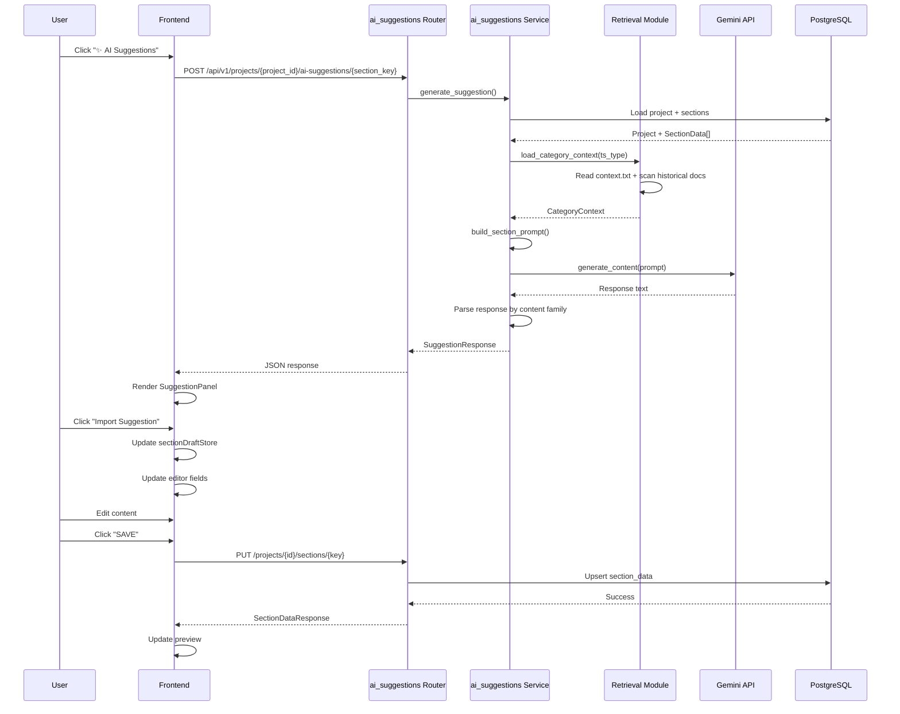
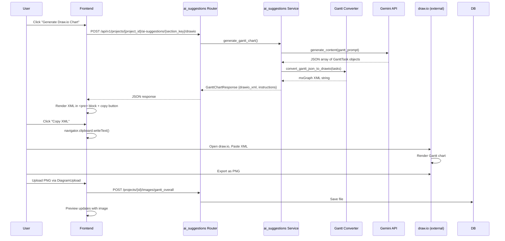

# Design Document: AI Suggestions Feature for TS Document Generator

**Version:** 2.0 — COMPREHENSIVE PRD-REALITY ALIGNMENT  
**Date:** 2026-06-12  
**Author:** Kiro AI Agent  
**Status:** Implementation-Ready — PRD-Compliant

**Change Log:**
- v2.0 (2026-06-12): **COMPREHENSIVE REVISION** — PRD-Repository Reality Alignment
  - **CRITICAL:** Fixed API contract to PRD-canonical project-scoped endpoints
  - **CRITICAL:** Corrected SuggestionResponse schema to match PRD-required fields
  - **CRITICAL:** Fixed prompt hierarchy to PRD 7-layer order
  - **CRITICAL:** Removed runtime PROJECT_CONTEXT.md filesystem reads
  - **CRITICAL:** Corrected retrieval design to match PRD (.txt/.md/.docx, diversity, truncation)
  - **CRITICAL:** Fixed Draw.io schema to PRD week-based (not date-based)
  - **CRITICAL:** Corrected import semantics (shallow merge for mixed-field, SAVE-only)
  - **CRITICAL:** Fixed error handling to match PRD (503, 404, 400, 502, 504, 200 fallback)
  - **CRITICAL:** Added legacy ts_type=NULL behavior (disabled UI, 400 backend)
  - **CRITICAL:** Removed authoritative section-to-mode assignments (repository is source of truth)
  - **CRITICAL:** Corrected custom section behavior (nested subsections, no standalone persistence)
  - **CRITICAL:** Added PRD-required security details (enum validation, safe paths, no logging)
  - **CRITICAL:** Updated testing to cover PRD cases (API contract, legacy projects, fallback)
  - **CRITICAL:** Updated rollout phases to reflect corrected endpoints and logic
  - **CRITICAL:** Removed all internal contradictions (endpoints, schemas, errors, Gantt fields)
- v1.1 (2026-06-11): Delta update for TRAE AUDIT2 alignment
- v1.0 (2026-06-11): Initial design

---

## Table of Contents

1. [Executive Summary](#1-executive-summary)
2. [Repository Deep Dive — Section Family Classification](#2-repository-deep-dive--section-family-classification)
3. [Gap Analysis — PRD vs Repository Reality](#3-gap-analysis--prd-vs-repository-reality)
4. [High-Level Architecture](#4-high-level-architecture)
5. [System Components](#5-system-components)
6. [Low-Level Design](#6-low-level-design)
7. [Request/Response Flow](#7-requestresponse-flow)
8. [Database Schema Changes](#8-database-schema-changes)
9. [Implementation Phases](#9-implementation-phases)
10. [Critical Decisions Document](#10-critical-decisions-document)
11. [Readiness Assessment](#11-readiness-assessment)

---

## Overview

### Purpose

This design document specifies the complete architecture for adding AI-powered section content suggestions to the TS Document Generator used by Hitachi India. The feature introduces a per-section **AI Suggestions** button that generates content grounded in a **7-layer knowledge hierarchy** (PRD Section 9.2):

1. Current project metadata
2. Existing saved section content  
3. **Current draft content (unsaved edits in the editor)**
4. Category-specific `context.txt` files
5. Historical TS documents from the selected TS type folder
6. **PROJECT_CONTEXT.md embedded in prompt template** (not runtime filesystem read)
7. LLM general knowledge

The feature preserves the existing **explicit SAVE workflow**: AI-generated content remains draft-only until the user clicks SAVE.

**PRD Source of Truth:** All requirements are sourced from `AI_Suggestions_Feature_Requirements.md` (FINAL PRD). Where this design previously contradicted the PRD, the PRD specification now governs.

**Repository Source of Truth:** Section keys, field names, and content schemas are defined by the repository's `predefinedSectionContent.ts` and `sections/router.py`. This design must not invent section keys or field names not present in those files.

### Scope

**In Scope:**
- AI suggestions button for all 31 predefined sections (excluding `cover`, `revision_history`, `abbreviations`)
- AI suggestions for custom sections and subsections
- TS type selection at project creation
- Folder-based historical document retrieval
- Section-aware prompt generation
- Draw.io chart generation for Gantt sections (`overall_gantt`, `shutdown_gantt`)
- Import workflow preserving explicit SAVE semantics
- RAG-ready retrieval API contract

**Out of Scope:**
- Autosave functionality
- Multi-turn AI conversations
- Token-by-token streaming responses
- Vector database / embedding-based RAG (Phase 1; API contract designed for future upgrade)
- Authentication or RBAC changes
- Modification of existing `ai_prompts` module (coexistence, not replacement)

### Key Design Principles

1. **PRD Compliance:** All API contracts, response schemas, error mappings, and workflows match the FINAL PRD exactly
2. **Repository Reality:** Section keys and field names match repository-defined schemas; no invented mappings
3. **Backward Compatibility:** AI content flows through existing save/preview/export pipeline unchanged
4. **Section-Aware Prompting:** Each section receives a prompt tailored to its content family derived from repository schema
5. **7-Layer Knowledge Hierarchy (PRD Section 9.2):** Retrieval follows exact priority: project metadata → saved sections → draft content → context.txt → historical docs → PROJECT_CONTEXT.md (embedded) → LLM knowledge
6. **Explicit SAVE Preservation:** AI content is draft-only until user saves; no autosave
7. **RAG-Ready Architecture:** Retrieval module interface stable for future vector-based upgrade
8. **PROJECT_CONTEXT.md Embedding:** System knowledge from PROJECT_CONTEXT.md is **embedded into prompt templates at build time**, not read from filesystem at runtime (PRD Section 9.4)

---

## 1. Executive Summary


---

## 2. Repository Deep Dive — Section Family Classification

### 2.1 Predefined Section Content Analysis

**CRITICAL ARCHITECTURAL NOTE:** The section-to-mode assignments shown in this document are **illustrative examples derived from analysis of `predefinedSectionContent.ts`**. They are **NOT authoritative**. The **repository's `predefinedSectionContent.ts` and the implemented `builders.py` mapping** are the sole source of truth for which sections belong to which mode family.

This design document defines **how each mode behaves** (Mode A: rich text, Mode B: tabular, Mode C: mixed-field, Mode D: list-based, Mode E: image-backed). It does **NOT** authoritatively assign predefined section keys to modes. The implementation must derive mode assignments from the actual repository schema at runtime or via explicit mapping in `builders.py`.

After analyzing `frontend/src/components/sections/predefinedSectionContent.ts`, predefined sections appear to fall into **five content families**:

| Family | Storage Shape | Example Sections (illustrative, confirm in repository) | AI Output Format |
|--------|---------------|------------------|---|
| **Mode A — Rich Text** | `{ paragraphs: string[], text: string }` | Sections whose editable schema contains narrative prose fields | HTML string |
| **Mode B — Tabular** | `{ rows: Array<Record<string, any>> }` | Sections whose editable schema contains a `rows` array | JSON array of row objects |
| **Mode C — Mixed-Field** | Heterogeneous object with multiple named fields | Sections with multiple independent editable fields | JSON object with field-level keys |
| **Mode D — List-Based** | `{ items: string[] }` or `{ items: Array<{title, description}> }` | Sections whose editable schema contains an `items` array | JSON array |
| **Mode E — Image-Backed Description** | `{ placeholder_text: string, note: string }` | Sections representing uploaded diagrams with text context | Text description only (images uploaded separately) |

**Recommendation for Implementation:** Create a `SECTION_MODE_MAPPING` constant in `backend/app/ai_suggestions/builders.py` that explicitly maps each predefined section key to its mode family by reading the repository's section content definitions. Do not hardcode mode assignments based on this document's examples.


### 2.2 Complete Section Family Mapping Table

**CRITICAL:** The section keys and mode assignments in this table are derived from repository analysis and are **illustrative only**. Before encoding any section-to-mode mapping in `builders.py`, confirm each section's actual editable schema in `predefinedSectionContent.ts`. The repository schema is the source of truth.

**SUPPRESSED SECTIONS (No AI Button):** `cover`, `revision_history`, `abbreviations` — These three sections must never show the AI Suggestions button (PRD Section 6.2.3).

| Section Key (from repository) | Likely Content Family | Likely Storage Keys | AI Output Mode | Import Semantics |
|-------------|----------------|--------------|----------------|------------------|
| `cover` | Mixed-Field | Multiple metadata fields | **SUPPRESSED** | N/A |
| `revision_history` | Tabular | `rows: [{...}]` | **SUPPRESSED** | N/A |
| `abbreviations` | Tabular | `rows: [{...}]` | **SUPPRESSED** | N/A |
| (Other repository-confirmed sections) | (To be determined by reading actual schema) | (Actual field keys from repository) | (Mode A/B/C/D/E) | (Per mode rules) |

**Implementation Requirement:** The `builders.py` module must read each section's schema from `predefinedSectionContent.ts` (or a Python equivalent mapping derived from it) to determine:
1. Which mode family the section belongs to
2. What the actual editable field keys are
3. What the AI output structure should be

Do not hardcode section-to-mode mappings based on assumptions. The repository may update section schemas independently of this design document.


### 2.3 Custom Section Schema Discovery

From `frontend/src/types/customSections.ts`:

```typescript
interface CustomSectionContent {
  title?: string;
  subsections: CustomSubsection[];
  insertAfterKey: string;
  displayMode?: 'section' | 'subsection';
}

interface CustomSubsection {
  key: string;  // custom_subsection_{timestamp}_{uuid}
  name: string;
  contentType: 'table' | 'image' | 'paragraph';
  data: TableData | ImageData | ParagraphData;
}
```

**Key Architectural Findings:**

**CRITICAL — Custom Section Persistence Model:**
- **Custom sections are persisted as a single JSONB section payload** in `section_data` under a `custom_section_{timestamp}_{uuid}` section key.
- **Subsections are nested within that payload** as a `subsections` array field in the `CustomSectionContent` structure.
- **AI suggestions for custom sections operate on the nested subsection `data` values** within the single parent payload.
- **AI suggestions NEVER create new subsection entities, delete existing subsection entities, or persist subsections as standalone `section_data` rows** separate from the parent custom section payload.
- The `displayMode` field controls preview rendering (whether the custom section appears as a standalone section or inline subsection in the document), but does not affect the fact that **all data is stored in one parent `section_data` row**.

**Subsection Content Types:**
- **Paragraph subsections:** `{paragraphs: [{html: string}]}`
- **Table subsections:** `{tables: [{columns: string[], rows: Record<string, string>[]}]}`
- **Image subsections:** `{images: [{base64, filename, mimeType, caption}]}`

**AI Suggestion Workflow for Custom Sections:**
1. Backend reads the saved `custom_section_{timestamp}_{uuid}` row from `section_data` to get the title and subsections array structure.
2. If the custom section has never been saved (no row in `section_data`), return `404`: "Section not found. Save the section at least once before requesting AI suggestions."
3. For each subsection in the array, determine its `contentType` and generate a suggestion for that subsection's `data` field only.
4. Return a `SuggestionResponse` with a `subsection_suggestions` array (one entry per subsection, identified by subsection index).
5. Frontend import logic updates the `data` field of each subsection within the draft's nested `subsections` array.
6. User clicks SAVE → frontend sends the full `CustomSectionContent` payload (including all subsections) as a single PUT to `/sections/{custom_section_key}`.
7. Backend persists the entire payload as one JSONB row.


---

## 3. Gap Analysis — PRD vs Repository Reality

### 3.1 Schema Mismatches Identified and Resolved

| PRD Assumption | Repository Reality | Resolution |
|----------------|-------------------|------------|
| PRD Section 12.2 shows API path as `/api/v1/projects/{project_id}/ai-suggestions/{section_key}` | Repository uses `/api/v1/projects` prefix for all section endpoints | **CORRECTED:** Design now uses PRD-canonical project-scoped endpoints throughout |
| PRD mentions "table sections need JSON rows" generically | Different table sections have different field names per repository | **RESOLUTION:** Backend must read section defaults from repository schema mapping or saved content structure |
| PRD assumes uniform "rich text" import | Repository shows some sections store `text: string`, others `paragraphs: string[]` | **RESOLUTION:** Prompt builder must inspect section schema and return appropriate field keys |
| PRD Section 16 error table | Previous design used simplified error codes | **CORRECTED:** Design now matches PRD error table exactly (503, 404, 400, 502, 504, 200 fallback) |
| PRD Section 12.2 SuggestionResponse schema | Previous design used simplified `content_type` field | **CORRECTED:** Removed legacy `content_type` usage from previous designs. SuggestionResponse and SubsectionSuggestion now follow PRD fields: `section_key`, `section_title`, `suggestion_mode`, `structured_import_available`, `content`, `subsection_suggestions`, `raw_text`, `historical_context_available`, `context_sources`, `context_txt_used`. Do not reintroduce `content_type` as a top-level response field. |
| PRD Section 14 Draw.io schema | Design assumed date-based fields | **CORRECTED:** Week-based schema (task, phase, start_week, duration_weeks, milestone) per PRD DIO-14.2.1 |

### 3.2 PRD Contradictions Resolved

| Previous Contradiction | Resolution |
|---------------|------------|
| PRD Section 15.2 says "table sections: import replaces all rows" but also mentions "merge" behavior | **CONFIRMED:** Mode B (tabular) uses **replace** semantics. Mode C (mixed-field) uses **field-level shallow merge**. This is intentional per PRD IMP-15.2.2 and IMP-15.2.3. |
| PRD mentions both "Option A: LLM raw XML" and "Option B: JSON-to-XML backend conversion" | **CONFIRMED:** Use **Option B** (JSON-to-XML backend conversion) per PRD Section 14.0. |
| PRD says "import does not auto-save" but also "imported content must appear in preview" | **CLARIFIED:** Import populates **draft state** (`sectionDraftStore`). Preview reflects draft via `buildContentWithEditMetadata()`. Saved state unchanged until user clicks SAVE (PRD IMP-15.3.3). |
| Previous design showed a non-project-scoped suggest endpoint | **CORRECTED:** PRD Section 12.2 canonical endpoint is `/api/v1/projects/{project_id}/ai-suggestions/{section_key}` (project-scoped). |

### 3.3 Missing Information from PRD — Resolved

| Missing Detail | Impact | Resolution Strategy |
|----------------|--------|---------------------|
| Exact field names for each table section | Cannot construct type-safe Pydantic response schemas | **RESOLUTION:** Create backend constant `SECTION_SCHEMAS` dict mapping section_key → field list derived from `predefinedSectionContent.ts`. Do not invent field names. Note: `SECTION_SCHEMAS` is a generated implementation convenience derived from `frontend/src/components/sections/predefinedSectionContent.ts`; the repository definitions are the source of truth and `builders.py` should derive this mapping programmatically. |
| Custom section subsection iteration order | Multi-subsection custom sections need deterministic suggestion order | **RESOLUTION:** Use subsection array index as ordering key; return `subsection_suggestions: [{subsection_index, content}]` per PRD Section 12.2 example. |
| Historical document format | PRD RET-10.2.1 says "extract plain text from .txt, .md, .docx" but doesn't specify extraction library | **RESOLUTION:** Use `python-docx` for DOCX, raw UTF-8 read for .txt and .md. Log warning for unsupported formats. |
| `context.txt` file format | No schema specified | **RESOLUTION:** Treat as UTF-8 plain text, insert verbatim into prompt knowledge hierarchy section. Truncate at 2000 chars per PRD RET-10.2.7. |
| `ts_type` migration for existing projects | Existing projects have no `ts_type` value | **RESOLUTION:** Add nullable `ts_type` column with Alembic migration. AI button disabled for NULL projects in UI; backend returns 400 per PRD ERR-16.3.2 and TEST-19.2.8. |
| PROJECT_CONTEXT.md reading | PRD Section 9.4 says "embedded in prompt template" | **CORRECTED:** PROJECT_CONTEXT.md content is embedded into `builders.py` prompt templates at build time, not read from filesystem at runtime. |


---

## Architecture

### System Architecture Diagram

```mermaid
graph TB
    subgraph Frontend
        A[SectionInputPanel]
        B[AI Suggestions Button]
        C[Suggestion Panel]
        D[Import Logic]
        E[sectionDraftStore]
    end
    
    subgraph Backend - New Module
        F[ai_suggestions Router]
        G[ai_suggestions Service]
        H[Prompt Builders]
        I[Retrieval Module]
        J[Gantt Converter]
    end
    
    subgraph Existing Backend
        K[sections Router]
        L[projects Models]
        M[sections Models]
    end
    
    subgraph External
        N[Gemini API]
        O[ts_documents/ Volume]
        P[PROJECT_CONTEXT.md]
    end
    
    A -->|Click| B
    B -->|POST /api/v1/projects/{project_id}/ai-suggestions/{section_key}| F
    F --> G
    G -->|1. Load Project| L
    G -->|2. Load Sections| M
    G -->|3. Retrieve Context| I
    I -->|Read context.txt (category-level)| O
    I -->|Scan historical docs (recursive)| O
    I -->|Use embedded PROJECT_CONTEXT (build-time)| P
    G -->|4. Build Prompt| H
    H -->|Prompt| G
    G -->|5. Call LLM| N
    N -->|Response| G
    G -->|SuggestionResponse| F
    F -->|JSON| C
    C -->|Import| D
    D -->|Update Draft| E
    E -->|SAVE| K
    
    B -->|POST /api/v1/projects/{project_id}/ai-suggestions/{section_key}/drawio| F
    F -->|Gantt flow| J
    J -->|mxGraph XML| F

```

### Integration with Existing Modules

| Existing Module | Integration Point | Change Type |
|-----------------|-------------------|-------------|
| `projects/models.py` | Add `ts_type` column | Schema change (Alembic migration) |
| `projects/schemas.py` | Add `ts_type` field to `ProjectCreate`, `ProjectDetail`, `ProjectSummary` | Schema extension |
| `projects/router.py` | Add `GET /api/v1/ts-types` endpoint | New endpoint |
| `sections/router.py` | No changes | Coexistence |
| `ai_prompts/` | No changes | Coexistence (separate feature) |
| `frontend/src/components/sections/predefinedSectionContent.ts` | Export `SECTION_SCHEMAS` constant (generated from this file; repository definitions are the source of truth) | Code export addition |

**Key Design Decision:** The new `ai_suggestions` module is architecturally parallel to the existing `ai_prompts` module, not a replacement. Both serve distinct use cases:
- `ai_prompts`: Generate prompts for **external** diagram tools (Eraser, Claude, Mermaid Live)
- `ai_suggestions`: Generate actual section **content** and draw.io XML **internally** via Gemini API

### Coexistence with Existing ai_prompts Module

The repository contains a separate `ai_prompts` subsystem at `backend/app/ai_prompts/` that generates prompts for external diagram tools. This new `ai_suggestions` feature is a distinct, additive module.

**Separation Boundaries:**
- **NO shared routes**: Each module has its own router under `/api/v1`
- **NO shared data models**: Each uses its own Pydantic schemas
- **NO shared service logic**: No function calls between modules
- **NO modifications to ai_prompts/**: The ai_prompts directory remains completely untouched
- **Independent registration**: Both modules registered separately in `main.py`

**Use Case Distinction:**
| Feature | ai_prompts | ai_suggestions |
|---------|------------|----------------|
| **Purpose** | Generate text prompts for external tools | Generate actual TS document content |
| **User Action** | Copy prompt → Paste into external tool | Click button → Review → Import |
| **LLM Usage** | None (templates only) | Gemini API (live generation) |
| **Output** | Text prompt string | Structured content (HTML/JSON) |
| **Sections** | Architecture diagrams, Gantt charts | All eligible TS document sections |

**Coexistence Guarantee:** Phase 1 implementation must not modify, extend, delete, or depend on any file under `backend/app/ai_prompts/`. The `ai_prompts` routes, data model, builders, and UX remain completely unchanged throughout all phases of this implementation.

### Request/Response Flow

#### Text Suggestion Flow



#### Draw.io Chart Generation Flow



---

## 4. High-Level Architecture


---

## Components and Interfaces

### Frontend Components

#### AI Suggestions Button

**Location:** `frontend/src/components/shared/AISuggestionsButton.tsx`

**Props:**
```typescript
interface AISuggestionsButtonProps {
  projectId: string;
  sectionKey: string;
  onSuggestionReceived: (suggestion: SuggestionResponse) => void;
  disabled?: boolean;
}
```

**Behavior:**
- Renders "✨ AI Suggestions" button
- Shows loading spinner during API call
- Suppressed for `cover`, `revision_history`, `abbreviations`
 - Triggers `POST /api/v1/projects/{project_id}/ai-suggestions/{section_key}`

#### Suggestion Panel

**Location:** `frontend/src/components/shared/SuggestionPanel.tsx`

**Props:**
```typescript
interface SuggestionPanelProps {
  sectionKey: string;
  sectionTitle: string;
  suggestion: SuggestionResponse;
  onImport: () => void;
  onRegenerate: () => void;
  onDismiss: () => void;
  isRegenerating?: boolean;
}
```

**Features:**
- Renders AI-generated content preview
- Shows disclaimer: "AI-generated content. Review before saving."
- Import / Regenerate / Dismiss buttons
- For Gantt sections: additional "Generate Draw.io Chart" button

#### Import Logic

**Location:** `frontend/src/utils/aiSuggestionImport.ts`

**Function Signatures:**
```typescript
function importSuggestion(
  sectionKey: string,
  suggestion: SuggestionResponse,
  currentDraft: Record<string, any>
): Record<string, any>

function importRichText(html: string, currentDraft: any): any
function importTableRows(rows: any[], currentDraft: any): any
function importMixedFields(fields: Record<string, any>, currentDraft: any): any
function importListItems(items: any[], currentDraft: any): any
```

**Import Semantics by Family:**
- **Family A (Rich Text):** Replace target text/paragraphs field, preserve structural fields
- **Family B (Tabular):** Replace entire `rows` array
 - **Family C (Mixed-Field):** Shallow overwrite: suggestion fields overwrite existing draft fields (equivalent to `{ ...existingDraft, ...suggestion.content }`).
- **Family D (List-Based):** Append to `custom_items` if exists, else replace `items`
- **Family E (Image-Backed):** Replace prose description fields only

### Backend Components

#### New Module: `backend/app/ai_suggestions/`

**File Structure:**
```
backend/app/ai_suggestions/
├── __init__.py
├── router.py          # FastAPI endpoints
├── service.py         # Core suggestion generation logic
├── schemas.py         # Pydantic request/response models
├── builders.py        # Section-aware prompt builders
├── retrieval.py       # Historical doc & context.txt loading
├── gantt_converter.py # JSON-to-mxGraph XML converter
└── section_schemas.py # Section field mappings from frontend
```

#### Router Endpoints

**Endpoint:** `POST /api/v1/projects/{project_id}/ai-suggestions/{section_key}`

**Path Parameters:**
- `project_id`: UUID (path)
- `section_key`: string (path)

**Request Body:**
```python
class SuggestionRequest(BaseModel):
  # Current unsaved editor state; optional
  draft_content: Optional[Dict[str, Any]] = None
```

**Response:**
```python
class SubsectionSuggestion(BaseModel):
  subsection_index: int
  subsection_name: str
  content: Any
  # Note: subsection content is returned inside `content`.
  # Do not log raw prompt or raw model output in production logs.

class SuggestionResponse(BaseModel):
  section_key: str
  section_title: str
  suggestion_mode: Literal["predefined", "custom", "regenerate"]
  structured_import_available: bool
  content: Union[str, List[Dict[str, Any]], Dict[str, Any]]
  subsection_suggestions: Optional[List[SubsectionSuggestion]] = None
  raw_text: Optional[str] = None
  historical_context_available: bool
  context_sources: List[str]
  context_txt_used: bool
```

**Endpoint:** `POST /api/v1/projects/{project_id}/ai-suggestions/{section_key}/drawio`

**Path Parameters:**
- `project_id`: UUID (path)
- `section_key`: string (path)

**Response:**
```python
class GanttTask(BaseModel):
  task: str
  phase: str
  start_week: int
  duration_weeks: int
  milestone: bool = False

class DrawioResponse(BaseModel):
  gantt_json: List[GanttTask]  # LLM-emitted week-based tasks
  drawio_xml: str              # mxGraph XML produced by server converter
  chart_instructions: str
```

**Endpoint:** `GET /api/v1/ts-types`

**Response:**
```python
class TSTypesResponse(BaseModel):
  ts_types: List[TSTypeOption]

class TSTypeOption(BaseModel):
  value: str  # Canonical path: "Data Analysis/Data Centralization/Historian" or "Level 2"
  label: str  # Display: "Data Analysis — Data Centralization — Historian" or "Level 2"
```

#### Retrieval Module

**Location:** `backend/app/ai_suggestions/retrieval.py`

**Function:** `load_category_context`

**Signature:**
```python
async def load_category_context(
    ts_type: str,
    ts_documents_dir: str
) -> CategoryContext

class CategoryContext(BaseModel):
    context_txt: Optional[str]  # Content of context.txt if found
    historical_documents: List[HistoricalDoc]
    folder_path: str

class HistoricalDoc(BaseModel):
    filename: str
    content: str  # Extracted plain text
    file_path: str
```

**Algorithm:**
```
1. Resolve `ts_type` to folder path (e.g., "Data Analysis/Data Centralization/Historian" → "ts_documents/Data Analysis/Data Centralization/Historian/"). Validate path against `TS_DOCUMENTS_DIR` to prevent traversal.

```python
# Safe path resolution example (backend):
import os
from fastapi import HTTPException

category_path = os.path.join(settings.TS_DOCUMENTS_DIR, *ts_type.split("/"))
resolved = os.path.abspath(category_path)
base = os.path.abspath(settings.TS_DOCUMENTS_DIR)
if not resolved.startswith(base + os.sep):
  raise HTTPException(400, "Invalid ts_type: path traversal detected")

# Proceed to scan `resolved` directory (read-only)
```
2. Check for `context.txt` in folder root.
3. If found: read as UTF-8 and truncate at 2000 characters; store in `context_txt`.
4. Recursively scan folder and subfolders for files with extensions: `.docx`, `.txt`, `.md`.
5. For each file found:
  - If `.docx`: extract paragraph text using `python-docx` and normalize whitespace; truncate extracted text at 1500 characters.
  - If `.txt` or `.md`: read as UTF-8 and truncate at 1500 characters.
  - Store as `HistoricalDoc(filename, content, file_path)`.
6. Perform diversity-aware selection over the collected historical documents (e.g., prefer different filenames/subfolders and low text-overlap) and return the top candidates. Do NOT include `context.txt` in this historical-docs list — `context.txt` is returned separately in `context_txt`.
7. Return `CategoryContext` with `context_txt`, `historical_documents` (unselected list), and `folder_path`. The service-level selection for prompt inclusion chooses up to 5 documents from `historical_documents` based on diversity and recency before prompt assembly.
```

**Future RAG Upgrade Path:**
- Interface remains unchanged
- Internal implementation switches from file scanning to vector DB query
- `historical_documents` becomes top-K semantic search results
- No caller code changes required

#### Prompt Builders

**Location:** `backend/app/ai_suggestions/builders.py`

**Core Function:**
```python
def build_section_prompt(
    section_key: str,
    project: Project,
    all_sections: Dict[str, Any],
    draft_content: Optional[Dict[str, Any]],  # NEW: Current unsaved edits
    category_context: CategoryContext,
    project_context_md: str
) -> str
```

**Prompt Structure:**
```
# SYSTEM ROLE
You are an expert technical writer for Hitachi India, specializing in Technical Specification documents.

# KNOWLEDGE HIERARCHY (Priority Order)

## 1. Project metadata (never truncated)
- Solution Name: {project.solution_name}
- Client: {project.client_name} ({project.client_location})
- TS Type: {project.ts_type}
- Document Date: {project.doc_date}

## 2. Section identity block (never truncated)
- Target section key: {section_key}
- Section title: {section_title}

## 3. Existing saved section content (truncate as needed)
{Formatted JSON of all saved section content}

## 4. Current draft content (user's latest unsaved edits) (truncate as needed)
{JSON.stringify(draft_content) if draft_content is not None}

## 5. Category context (`context.txt`) — read separately and included here (truncate at 2000 chars)
{category_context.context_txt if present}

## 6. Historical TS document excerpts (select up to 5 documents; truncate each to 1500 chars; total historical content ≤ 6000 chars)
{Excerpts from category_context.historical_documents — diversity-aware selection, max 5 docs, 1500 chars each}

## 7. Section-specific output instruction (never truncated)
{Format specification based on content family — see Section 6.3}

# TASK
Generate content for section: {section_title}

Section purpose: {section_description_from_mapping}

# SANITIZATION & TRUNCATION RULES
- All user-supplied metadata values (project fields, saved section strings) must be HTML-stripped and truncated to 500 characters each before inclusion.
- `context.txt` must be truncated at 2000 characters when included.
- Historical documents: extract plain text, truncate each to 1500 characters, include at most 5 documents; ensure total historical text does not exceed 6000 characters.
- Token budget: respect an 8000-token soft budget; when exceeding, apply truncation in this order: (1) historical doc excerpts (shortest excerpts first), (2) current draft content, (3) existing saved sections, (4) category context as a last resort. Project metadata, section identity, and section-specific output instruction MUST NOT be truncated.
- Strip non-printable characters and normalize whitespace in all included text blocks.

# CONSTRAINTS
- Use Hitachi technical writing style
- Reference project metadata where appropriate
- Maintain consistency with existing saved sections
- Output ONLY the requested format, no markdown code fences
```

#### Gantt Converter

**Location:** `backend/app/ai_suggestions/gantt_converter.py`

**Function:** `convert_gantt_json_to_drawio`

**Signature:**
```python
def convert_gantt_json_to_drawio(
  gantt_tasks: List[GanttTask]
) -> str

class GanttTask(BaseModel):
  task: str
  phase: str
  start_week: int
  duration_weeks: int
  milestone: bool = False
  dependencies: Optional[List[int]] = None
```

**Algorithm:**
```
1. LLM outputs a week-based JSON array of GanttTask objects (see schema above).
2. Backend validates against the week-based GanttTask schema.
3. Convert to mxGraph XML:
   - Create <mxGraphModel> root
   - For each task: compute X position as (start_week - project_start_week) * WEEK_PIXEL_WIDTH
   - Compute bar width as duration_weeks * WEEK_PIXEL_WIDTH
   - Create <mxCell> nodes for task bars and milestone markers
   - Add dependency edges as <mxCell> arrows between related tasks
4. Return mxGraph XML string
```

**Why Option B (JSON-to-XML) over Option A (raw XML from LLM):**
- LLMs are unreliable at generating valid XML with correct escaping
- JSON schema validation ensures structural correctness
- Deterministic backend conversion produces consistent output
- Easier to test and debug

---

## 5. System Components


---

## 6. Low-Level Design

### 6.1 Section-Aware Prompt Output Specifications

#### Family A — Rich Text Sections

**Prompt Output Instruction:**
```
Generate HTML content with the following structure:
- Use <p> tags for paragraphs
- Use <ul><li> for bullet lists
- Use <strong> and <em> for formatting
- Do NOT include outer <div> wrapper
- Output clean HTML only, no markdown code fences

Example output:
<p>The proposed solution integrates seamlessly with existing L2 systems.</p>
<ul>
<li>Real-time data synchronization</li>
<li>Automated reporting dashboard</li>
</ul>
```

**Backend Parsing:**
```python
def parse_rich_text_response(response: str) -> str:
    # Strip markdown code fences if present
    cleaned = response.strip()
    if cleaned.startswith("```html"):
        cleaned = cleaned[7:]
    if cleaned.endswith("```"):
        cleaned = cleaned[:-3]
    return cleaned.strip()
```


#### Family B — Tabular Sections

**Prompt Output Instruction (example: `tech_stack`):**
```
Generate a JSON array of row objects with these exact field names:
- sr_no: int (sequential starting from 1)
- component: string
- technology: string
- note: string

Example output:
[
  {"sr_no": 1, "component": "Frontend Application", "technology": "React 18 + TypeScript", "note": "Responsive web UI"},
  {"sr_no": 2, "component": "Backend Application", "technology": "FastAPI + Python 3.11", "note": "Async REST API"}
]

Output ONLY the JSON array, no markdown code fences.
```

**Backend Parsing:**
```python
def parse_table_response(response: str, section_key: str) -> List[Dict]:
  # Get expected field names from SECTION_SCHEMAS (generated from frontend definitions; repository is source of truth)
  # NOTE: SECTION_SCHEMAS is generated from frontend/src/components/sections/predefinedSectionContent.ts.
  # Do NOT hand-edit backend/app/ai_suggestions/section_schemas.py — use builders.py to regenerate.
  expected_fields = SECTION_SCHEMAS[section_key]["row_fields"]
    
    # Parse JSON
    rows = json.loads(response.strip())
    
    # Validate each row has expected fields
    for row in rows:
        for field in expected_fields:
            if field not in row:
                row[field] = ""  # Fill missing fields with empty string
    
    return rows
```


#### Family C — Mixed-Field Sections

**Prompt Output Instruction (example: `overview`):**
```
Generate a JSON object with these field keys:
- process_summary: string (2-3 sentences)
- system_objective: string (paragraph)
- existing_system: string (paragraph)
- integration: string (paragraph)
- tangible_benefits: string (bullet list as HTML)
- intangible_benefits: string (bullet list as HTML)

Example output:
{
  "process_summary": "The Hot Strip Mill produces steel coils through...",
  "system_objective": "Implement a centralized data monitoring platform...",
  "existing_system": "The current system consists of...",
  "integration": "The new system will integrate via OPC UA...",
  "tangible_benefits": "<ul><li>25% reduction in manual data entry</li></ul>",
  "intangible_benefits": "<ul><li>Improved operator confidence</li></ul>"
}
```

**Backend Parsing:**
```python
def parse_mixed_field_response(response: str) -> Dict[str, Any]:
    return json.loads(response.strip())
```


#### Family D — List-Based Sections

**Prompt Output Instruction (example: `features`):**
```
Generate a JSON array of feature items with these fields:
- id: string (generate as "feature-1", "feature-2", etc.)
- title: string (feature name)
- brief: string (one-line summary)
- description: string (detailed paragraph as HTML)

Example output:
[
  {
    "id": "feature-1",
    "title": "Real-Time Dashboard",
    "brief": "Live production monitoring interface",
    "description": "<p>Provides operators with real-time visibility into production metrics...</p>"
  }
]
```

#### Family E — Image-Backed Description Sections

**Prompt Output Instruction (example: `system_config`):**
```
Generate a JSON object with these fields:
- intro_text: string (2-3 sentences describing the architecture)
- note: string (technical note about the diagram)

Example output:
{
  "intro_text": "The reference system configuration of {SolutionName} consists of a three-tier architecture...",
  "note": "Note: The above architecture is subject to modification during detailed engineering."
}
```


### 6.2 Custom Section Prompt Logic

**Pseudocode:**
```python
async def generate_custom_section_suggestion(
    project_id: UUID,
    section_key: str,
    draft_content: Optional[Dict[str, Any]],  # NEW: Current unsaved edits
    db: AsyncSession
) -> SuggestionResponse:
    # 1. Load saved custom section content
    section_data = await db.get(SectionData, project_id=project_id, section_key=section_key)
    
    if not section_data:
        raise HTTPException(404, "Section not found. Save the section at least once before requesting AI suggestions.")
    
    custom_content = section_data.content
    title = custom_content.get("title", "")
    subsections = custom_content.get("subsections", [])
    
    if not title or not subsections:
        raise HTTPException(400, "Custom section must have a title and at least one subsection.")
    
    # 2. For each subsection, determine content type
    # CRITICAL: AI only modifies subsection.data values
    # Never add/remove subsections from the array
    # Never change subsection.contentType
    subsection_suggestions = []
    raw_texts = []
    
    for idx, subsection in enumerate(subsections):
        content_type = subsection["contentType"]  # 'table' | 'image' | 'paragraph'
        subsection_name = subsection["name"]
        
        # Use draft_content for this subsection if available
        subsection_draft = None
        if draft_content and "subsections" in draft_content:
            if idx < len(draft_content["subsections"]):
                subsection_draft = draft_content["subsections"][idx]
        
        # 3. Build subsection-specific prompt
        if content_type == "paragraph":
            prompt = build_paragraph_prompt(
                title, subsection_name, project, 
                subsection_draft, category_context
            )
            llm_response = await call_gemini(prompt)
            parsed_content = parse_rich_text_response(llm_response)
            
        elif content_type == "table":
            # Extract table schema from existing data if present
            existing_data = subsection.get("data", {})
            table_columns = existing_data.get("tables", [{}])[0].get("columns", [])
            
            prompt = build_table_prompt(
                title, subsection_name, table_columns, 
                project, subsection_draft, category_context
            )
            llm_response = await call_gemini(prompt)
            try:
              parsed_content = json.loads(llm_response)
            except json.JSONDecodeError:
              # Structured parse failed for this subsection — record raw text for return.
              # Do not log the raw response; only redacted metadata may be logged.
              logger.warning(
                "LLM structured parse failed (structured import unavailable)",
                extra={
                  "error_type": "structured_parse_failure",
                  "project_id": str(project_id),
                  "section_key": section_key,
                }
              )
              parsed_content = None
              raw_texts.append(llm_response)
            
        elif content_type == "image":
            # Image subsections: AI generates caption/description only
            prompt = build_image_caption_prompt(title, subsection_name, project)
            llm_response = await call_gemini(prompt)
            parsed_content = {"caption": llm_response.strip()}
        
        subsection_suggestions.append({
          "subsection_index": idx,
          "subsection_name": subsection_name,
          "content": parsed_content
        })
    
    # 4. Return multi-subsection response. If any subsection failed structured parsing
    # then `structured_import_available` will be False and `raw_text` will contain the
    # fallback raw responses (callers should present them in the UI for manual import).
    structured_import_available = len(raw_texts) == 0
    raw_text = "\n\n".join(raw_texts) if raw_texts else None

    return SuggestionResponse(
      section_key=section_key,
      section_title=title,
      suggestion_mode="custom",
      structured_import_available=structured_import_available,
      content=None,
      subsection_suggestions=subsection_suggestions,
      raw_text=raw_text,
      historical_context_available=False,
      context_sources=[],
      context_txt_used=False
    )
```


### 6.3 Gemini API Call Implementation

**Function:** `call_gemini`

```python
import google.generativeai as genai
from app.config import settings

genai.configure(api_key=settings.GEMINI_API_KEY)

async def call_gemini(prompt: str) -> str:
  """
  Call Gemini API and return response text.

  Raises:
    HTTPException(503): if GEMINI_API_KEY not configured
    HTTPException(502): if provider returns an error (mapped from provider 4xx/5xx)
    HTTPException(504): if provider times out
  Notes:
    - Do not log raw prompt or raw model output; only log redacted metadata.
    - Callers are responsible for parsing the returned text and handling structured parse
      failures by returning SuggestionResponse with `structured_import_available=false`.
    - Per PRD mapping: missing API key -> 503; provider error (provider 4xx/5xx) -> 502; provider timeout -> 504.
    - Structured parse failures are non-fatal: do NOT raise 5xx for invalid structured output. Instead
      return a SuggestionResponse with `structured_import_available=false` and include `raw_text`.
  """
  if not settings.GEMINI_API_KEY:
    raise HTTPException(503, "AI suggestions are not configured. Set GEMINI_API_KEY in the environment.")
    
  try:
    model = genai.GenerativeModel(settings.GEMINI_MODEL)

    response = await asyncio.to_thread(
      model.generate_content,
      prompt,
      generation_config={
        "max_output_tokens": settings.GEMINI_MAX_TOKENS,
        "temperature": 0.4,
      },
    )

    return response.text

  except asyncio.TimeoutError:
    logger.error(
      "Gemini API timeout",
      extra={
        "error_type": "provider_timeout",
        "project_id": "<redacted>",
        "section_key": "<redacted>",
        "provider_status_code": None,
        "response_size": None,
        "response_sha256": None,
      },
    )
    raise HTTPException(504, "AI suggestion timed out. Please try again.")
  except Exception:
    # Map provider errors to 502. Do not include provider payloads in logs.
    logger.error(
      "Gemini API call failed",
      extra={
        "error_type": "provider_error",
        "project_id": "<redacted>",
        "section_key": "<redacted>",
        "provider_status_code": None,
        "response_size": None,
        "response_sha256": None,
      },
    )
    raise HTTPException(502, "AI provider error. Please try again.")
```

**Configuration Defaults:**
- `GEMINI_MODEL = "gemini-2.0-flash"`
- `GEMINI_MAX_TOKENS = 2048`
- `GEMINI_TIMEOUT_SECONDS = 30` (handled by httpx or SDK timeout)


---

## 7. Request/Response Flow

### 7.1 Text Suggestion Flow


### 7.2 Draw.io Chart Generation Flow


---

## Data Models

### Database Schema Changes

#### Alembic Migration: Add `ts_type` Column

**Migration File:** `backend/alembic/versions/002_add_ts_type_to_projects.py`

```python
"""Add ts_type column to projects table

Revision ID: 002
Revises: 001
Create Date: 2026-06-11
"""
from alembic import op
import sqlalchemy as sa

def upgrade():
    op.add_column(
        'projects',
        sa.Column('ts_type', sa.String(), nullable=True)
    )
    
def downgrade():
    op.drop_column('projects', 'ts_type')
```

**Rationale for Nullable:**
- Existing projects created before this feature have no `ts_type` value
- Making the column `NOT NULL` would break existing data
- API validation ensures new projects must provide `ts_type`
- AI suggestions endpoint returns `400` for projects with `ts_type = NULL`

#### TS Type Enumeration

**Location:** `backend/app/projects/ts_types.py`

```python
from enum import Enum

class TSType(str, Enum):
    """TS document category enumeration."""
    
    # Data Analysis - Advanced Analysis
    DATA_ANALYSIS_ADVANCED = "Data Analysis/Advanced Analysis"
    DATA_ANALYSIS_ADVANCED_AUTOML = "Data Analysis/Advanced Analysis/AutoML Platform"
    
    # Data Analysis - Data Centralization
    DATA_ANALYSIS_CENTRALIZATION = "Data Analysis/Data Centralization"
    DATA_ANALYSIS_CENTRALIZATION_HISTORIAN = "Data Analysis/Data Centralization/Historian"
    DATA_ANALYSIS_CENTRALIZATION_UGS = "Data Analysis/Data Centralization/UGS"
    
    # Data Analysis - Data Monitoring
    DATA_ANALYSIS_MONITORING = "Data Analysis/Data Monitoring"
    DATA_ANALYSIS_MONITORING_EMS = "Data Analysis/Data Monitoring/EMS"
    DATA_ANALYSIS_MONITORING_HPMS = "Data Analysis/Data Monitoring/HPMS"
    DATA_ANALYSIS_MONITORING_RAS = "Data Analysis/Data Monitoring/RAS"
    
    # Level 2
    LEVEL_2 = "Level 2"
    
    # OT Cybersecurity
    OT_CYBERSECURITY = "OT Cybersecurity"
    
    # OT Upgrades
    OT_UPGRADES_HMI = "OT Upgrades/HMI"
    OT_UPGRADES_L2 = "OT Upgrades/L2"
    OT_UPGRADES_POC = "OT Upgrades/POC Upgrade"
    
    # Yard Management
    YARD_MANAGEMENT_HSM = "Yard Management/HSM"
    YARD_MANAGEMENT_PLATE_MILL = "Yard Management/Plate Mill"
    OT_UPGRADES_HMI = "OT Upgrades/HMI"
    OT_UPGRADES_L2 = "OT Upgrades/L2"
    OT_UPGRADES_POC = "OT Upgrades/POC Upgrade"
    
    # Yard Management
    YARD_MANAGEMENT_HSM = "Yard Management/HSM"
    YARD_MANAGEMENT_PLATE_MILL = "Yard Management/Plate Mill"

    @classmethod
    def get_display_label(cls, value: str) -> str:
        """Convert path value to display label."""
        return value.replace("/", " — ")
    
    @classmethod
    def to_folder_path(cls, value: str, base_dir: str) -> str:
        """Convert enum value to filesystem path."""
        return os.path.join(base_dir, value)
```

#### Section Field Schema Mapping

**Location:** `backend/app/ai_suggestions/section_schemas.py`

**Purpose:** Map each section_key to its expected field structure for prompt generation and response parsing.

**Note:** `SECTION_SCHEMAS` is a generated implementation artifact derived from `frontend/src/components/sections/predefinedSectionContent.ts`. The repository definitions remain the source of truth; `builders.py` should derive this mapping programmatically rather than being hand-edited.

```python
# NOTE: Generated from frontend/src/components/sections/predefinedSectionContent.ts — do not edit by hand.
SECTION_SCHEMAS = {
    "tech_stack": {
        "content_family": "B",
        "row_fields": ["sr_no", "component", "technology", "note"],
        "description": "Technology stack for each system component",
    },
    "hardware_specs": {
        "content_family": "B",
        "row_fields": ["sr_no", "name", "specs_line1", "specs_line2", "specs_line3", "specs_line4", "maker", "qty"],
        "description": "Hardware specifications and quantities",
    },
    "executive_summary": {
        "content_family": "A",
        "text_fields": ["paragraphs", "para1"],
        "structural_fields": ["client_logo_rows"],
        "description": "High-level project summary for executives",
    },
    "overview": {
        "content_family": "C",
        "editable_fields": ["process_summary", "system_objective", "existing_system", "integration", "tangible_benefits", "intangible_benefits"],
        "description": "Detailed system overview and benefits",
    },
    # ... (mapping for all 31 sections)
}
```

### No New Tables Required

**DM-13.2.1** The AI suggestions feature does not require any new database tables. All suggestion content flows through the existing section data JSONB storage via the existing save workflow. There is no need to persist suggestions themselves.

**DM-13.2.2** AI-generated content, once imported and saved by the user, is indistinguishable from manually authored content in the `section_data.content` JSONB. No origin metadata needs to be stored about whether content was AI-generated. This is intentional: the user reviews and approves content before saving, making it the user's content at that point.

### New Filesystem Location

**DM-13.3.1** The historical TS documents directory at `./ts_documents/` (host path) is a new filesystem resource. It is not tracked in the existing `UPLOAD_DIR` volume and must not be mixed with uploaded images or generated DOCX versions.

**DM-13.3.2** The `docker-compose.yml` must be updated to add:
```yaml
volumes:
  - ./ts_documents:/app/ts_documents:ro
```
Under the `backend` service definition. The `:ro` flag ensures the backend cannot write to this directory.

### Settings Additions Summary

The following fields must be added to `backend/app/config.py` `Settings`:

| Field | Type | Default | Description |
|---|---|---|---|
| `GEMINI_API_KEY` | `str` | `""` | Gemini API key |
| `GEMINI_MODEL` | `str` | `"gemini-2.0-flash"` | Gemini model name |
| `GEMINI_MAX_TOKENS` | `int` | `2048` | Max output tokens |
| `GEMINI_TIMEOUT_SECONDS` | `int` | `30` | API timeout |
| `TS_DOCUMENTS_DIR` | `str` | `"/app/ts_documents"` | TS documents root |

---

## 8. Database Schema Changes


---

## 9. Implementation Phases

### Phase 1: Backend Foundation (Week 1-2)

**Deliverables:**
- [ ] Alembic migration: add `ts_type` column
- [ ] `TSType` enum definition
- [ ] `GET /api/v1/ts-types` endpoint
- [ ] Update `ProjectCreate`, `ProjectDetail`, `ProjectSummary` schemas
- [ ] Update `NewProjectModal.tsx` with TS Type dropdown
- [ ] Docker Compose: add `ts_documents` volume mount
- [ ] Create `ai_suggestions/` module structure
- [ ] Implement `retrieval.py` with folder scanning
- [ ] Add `GEMINI_API_KEY`, `TS_DOCUMENTS_DIR` to config
- [ ] Implement `call_gemini()` wrapper

**Acceptance Criteria:**
- [ ] Project creation requires `ts_type` selection
- [ ] `ts_type` stored in database and returned in project responses
- [ ] Retrieval module reads `context.txt` and historical docs from correct folder
- [ ] Gemini API call returns response for test prompt


### Phase 2: Text Suggestions for Predefined Sections (Week 3-4)

**Deliverables:**
- [ ] `POST /api/v1/projects/{project_id}/ai-suggestions/{section_key}` endpoint
- [ ] `builders.py` with prompt templates for each content family
- [ ] `section_schemas.py` with all 31 section mappings
- [ ] Response parsing logic for HTML, JSON rows, JSON objects, JSON arrays
- [ ] `AISuggestionsButton.tsx` component
- [ ] `SuggestionPanel.tsx` component
- [ ] `aiSuggestionImport.ts` utility with family-specific import logic
- [ ] Integration with `SectionInputPanel.tsx`
- [ ] Button suppression for `cover`, `revision_history`, `abbreviations`

**Acceptance Criteria:**
- [ ] AI Suggestions button appears in all eligible predefined sections
- [ ] Clicking button calls API and renders suggestion panel
- [ ] Import populates draft state without auto-saving
- [ ] SAVE persists imported content
- [ ] Preview reflects saved AI content like manual content
- [ ] DOCX export includes AI content


### Phase 3: Custom Section Support (Week 5)

**Deliverables:**
- [ ] Custom section prompt logic in `service.py`
- [ ] Subsection-aware prompt builders
- [ ] Multi-subsection response schema
- [ ] Custom section import logic
- [ ] Integration with `CustomSectionInput.tsx`

**Acceptance Criteria:**
- [ ] AI Suggestions button appears in custom section editors
- [ ] Custom sections saved at least once can generate suggestions
- [ ] Unsaved custom sections return `404` with helpful message
- [ ] Multi-subsection suggestions populate correct subsection editors
- [ ] Import preserves subsection structure

-### Phase 4: Draw.io Chart Generation (Week 6)

**Deliverables:**
- [ ] `POST /api/v1/projects/{project_id}/ai-suggestions/{section_key}/drawio` endpoint
- [ ] `gantt_converter.py` JSON-to-mxGraph module (accepts week-based GanttTask schema)
- [ ] `gantt_converter.py` JSON-to-mxGraph module
- [ ] `GanttTask` Pydantic schema
- [ ] Gantt-specific LLM prompts
- [ ] "Generate Draw.io Chart" button in Gantt section suggestion panels
- [ ] Copy-to-clipboard UI for XML output
- [ ] User instructions text

**Acceptance Criteria:**
- [ ] Gantt chart endpoint returns valid mxGraph XML
- [ ] XML imports into draw.io without errors
- [ ] Rendered chart reflects project timeline data
- [ ] User can export PNG and upload via existing image flow


### Phase 5: context.txt Authoring and Deployment (Week 7)

**Deliverables:**
- [ ] Create `context.txt` files for each TS type category
- [ ] Document `context.txt` format and best practices
- [ ] Populate `ts_documents/` folder with historical TS documents
- [ ] Test retrieval with real category contexts
- [ ] Performance testing with large historical document sets
- [ ] Production deployment guide

**Acceptance Criteria:**
- [ ] All 10 TS type folders have `context.txt` files
- [ ] Historical documents successfully loaded and truncated to fit prompt context
- [ ] AI suggestions reflect category-specific knowledge
- [ ] Average suggestion latency < 5 seconds
- [ ] Production deployment successful

---

## 10. Critical Decisions Document

### 10.1 Architectural Decisions

| Decision | Rationale | Alternatives Considered | Risk Mitigation |
|----------|-----------|------------------------|-----------------|
| **Use Option B (JSON-to-XML) for Gantt charts** | LLMs are unreliable at generating syntactically correct XML. Structured JSON with backend conversion is more robust. | Option A: LLM generates raw XML directly | Implement strict Pydantic validation on JSON structure; log conversion errors |
| **Nullable `ts_type` column** | Existing projects created before this feature cannot have a TS type. Breaking migration would require manual data entry. | Make column NOT NULL with default value | API validation prevents new projects without ts_type; AI endpoint rejects NULL ts_type projects |
| **Folder-based retrieval (not vector DB)** | Simpler to implement and maintain. Folder structure already exists. RAG-ready API contract allows future upgrade. | Immediate vector DB implementation | Document retrieval API contract as stable interface; internal implementation can change without caller impact |
| **Suppress AI button for 3 sections only** | `cover`, `revision_history`, `abbreviations` are auto-generated or identity-driven. AI suggestions have no value. | Suppress no sections; let user try and see empty results | Clear product decision based on section semantics; reduces API load and user confusion |
| **Custom sections require first save** | Without saved title and subsection structure, prompt cannot be meaningful. | Generate generic content based on section position | Return helpful `404` message guides user to save first; prevents wasted API calls |


### 10.2 Import Semantics Per Section Family

| Family | Import Mode | Rationale | User Impact |
|--------|-------------|-----------|-------------|
| **A — Rich Text** | Replace text/paragraphs fields, preserve structural fields | User explicitly requests new prose; structural layout (e.g., logo rows) should not change | Existing prose replaced; user edits before saving |
| **B — Tabular** | Replace entire `rows` array | Table suggestions are holistic; partial merge would create inconsistent row numbering | All existing rows replaced; user can regenerate if unsatisfied |
| **C — Mixed-Field** | Shallow overwrite (suggestion fields overwrite existing draft fields) | Useful when suggestions should replace or update specific fields; import applies a shallow object spread merge: `{ ...existingDraft, ...suggestion.content }` | After import, fields provided by the suggestion are overwritten; other fields are preserved |
| **D — List-Based** | Append to `custom_items` if exists, else replace `items` | Sections with `custom_items` expect additive behavior; others expect replacement | User sees added items; can delete unwanted ones |
| **E — Image-Backed** | Replace prose description only | Images uploaded separately; AI only generates textual context | Text updated; existing image preserved |

**Product Decision Locked:** These semantics are intentional design choices, not contradictions. They optimize for each family's typical authoring workflow.


### 10.3 Scope Boundaries

| In Scope | Out of Scope (This Phase) | Reason |
|----------|---------------------------|--------|
| AI suggestions for all eligible sections | Multi-turn conversation | Single request/response simpler; conversation state adds complexity |
| Section-aware prompts with knowledge hierarchy | Token-by-token streaming | Full response at once simpler for parsing; streaming adds UI complexity |
| Folder-based historical doc retrieval | Vector DB / embedding-based RAG | Folder scanning sufficient for Phase 1; API contract RAG-ready |
| Draw.io chart generation (Gantt only) | Architecture diagram generation | Architecture diagrams have complex layout; Gantt charts are linear/temporal and easier to generate programmatically |
| Import into draft state (explicit SAVE) | Autosave | Preserves existing workflow; autosave would require product decision and UX redesign |
| `context.txt` plain text files | Structured context database | Plain text files easier for product team to author and version control |

### 10.4 Error Handling Strategy

| Error Scenario | HTTP Status | Response body / User message | Backend Action |
|----------------|-------------|-----------------------------|----------------|
| `GEMINI_API_KEY` not set | 503 | `{"detail": "AI suggestions are not configured."}` | Log warning on startup; return 503 without attempting provider call |
| Project `ts_type` is `NULL` | 400 | `{"detail": "This project has no TS type assigned. Update the project to select a TS type before using AI Suggestions."}` | Return without calling the provider |
| Suppressed or unknown section key | 400 | `{"detail": "AI suggestions are not available for this section."}` | Validate and return early; no provider call |
| Custom section not saved (no title/structure) | 404 | `{"detail": "Section not found. Save the section at least once before requesting AI suggestions."}` | Check DB before prompting; return 404 |
| Gemini API provider error (HTTP 4xx from provider) | 502 | `{"detail": "AI provider returned an error. Please try again."}` | Map provider error to 502; log provider status for debugging (redacted) |
| Gemini API timeout (> `GEMINI_TIMEOUT_SECONDS`) | 504 | `{"detail": "AI provider timed out. Please try again."}` | Log timeout with project_id and section_key; return 504 |
| JSON parse failure or invalid structured output (e.g., table/Gantt parse error) | 200 | SuggestionResponse with `structured_import_available: false` and `raw_text` containing fallback plain-text suggestion | Treat as non-fatal: return suggestion as raw text and mark structured import unavailable so frontend shows Import as raw text only |
| Historical documents folder missing or empty | 200 | Suggestion proceeds; `historical_context_available: false` in response | Non-fatal; continue with project metadata + context.txt (if present) |


---

## 11. Readiness Assessment

### 11.1 PRD Implementation Readiness: ✅ READY

**Status:** The PRD (AI_Suggestions_Feature_Requirements.md) is ready for implementation with the resolutions documented in this design.

**Resolved Issues:**
- ✅ Schema mismatches mapped via `section_schemas.py`
- ✅ Import semantics clarified per content family
- ✅ Custom section unsaved handling defined (404 with message)
- ✅ `system_config` scope clarified (text only, no chart generation)
- ✅ Option B (JSON-to-XML) confirmed for Gantt charts
- ✅ `ts_type` migration strategy defined (nullable with validation)

### 11.2 What Can Be Implemented Immediately

**Backend (Phases 1-2):**
- Alembic migration for `ts_type`
- `TSType` enum and validation
- `ai_suggestions` module structure
- Retrieval module (folder scanning)
- Gemini API integration
- Text suggestion endpoint for predefined sections
- Response parsing for all 5 content families

**Frontend (Phases 1-2):**
- TS Type dropdown in `NewProjectModal`
- `AISuggestionsButton` component
- `SuggestionPanel` component
- Import logic for all content families
- Integration with `SectionInputPanel`

**Estimated Time to MVP (Phases 1-2):** 4 weeks


### 11.3 What Needs Product Decisions

**No blocking product decisions remain.** All ambiguities from the PRD have been resolved in this design document.

**Minor Decisions for Future Consideration:**
- Should `ts_type` be editable after project creation? (Currently immutable)
- Should existing projects without `ts_type` be allowed to set it via PATCH? (Currently rejected by AI endpoint)
- Should import semantics be user-configurable (replace vs merge)? (Currently fixed per family)

**Recommendation:** Proceed with implementation. Gather user feedback after Phase 2 deployment, then revisit these decisions if needed.

### 11.4 What Must Be Fixed Before Code

**Nothing.** This design document resolves all PRD gaps and contradictions.

**Pre-Implementation Checklist:**
- [ ] Review this design document with product team
- [ ] Confirm `context.txt` authoring responsibility (who writes these files?)
- [ ] Confirm historical document availability (are they already collected?)
- [ ] Set up `ts_documents/` folder structure on deployment host
- [ ] Provision Gemini API key and set spending limits
- [ ] Add `GEMINI_API_KEY` to production environment secrets
- [ ] Review error messages with UX team

**Estimated Review Time:** 1-2 days


### 11.5 Risk Assessment

| Risk | Probability | Impact | Mitigation |
|------|-------------|--------|------------|
| LLM generates invalid JSON | Medium | High | Strict Pydantic validation; retry logic; fallback error messages |
| Historical docs too large for prompt context | Medium | Medium | Exclude `context.txt` from the general historical-docs list and read it separately; truncate historical docs at 1500 chars and `context.txt` at 2000 chars; select up to 5 documents using a diversity-aware selection algorithm. |
| Gemini API rate limits | Low | Medium | Implement exponential backoff; show user-friendly retry message |
| `ts_type` missing for existing projects | High | Low | Clear error message; document migration path for users |
| User confusion about import semantics | Medium | Low | Inline help text in suggestion panel; user documentation |
| Draw.io XML compatibility issues | Low | Medium | Test with draw.io; validate against mxGraph schema |
| Context.txt files not authored in time | Medium | Low | Feature works without context.txt (uses historical docs only); prioritize high-volume categories first |

### 11.6 Success Metrics (Post-Deployment)

| Metric | Target | Measurement Method |
|--------|--------|-------------------|
| AI suggestions usage rate | >60% of eligible sections | Backend API logs |
| Import rate (suggestions imported) | >70% of suggestions generated | Frontend analytics |
| Save rate (imported content saved) | >80% of imports | Database queries |
| Average suggestion latency | <5 seconds | API response time logs |
| User satisfaction (survey) | >4.0/5.0 | Post-deployment user survey |
| Reduction in section authoring time | >30% | Time-tracking study |

---

## Appendix A: Section Schemas Reference

**Full Section Schema Mapping:**

See `backend/app/ai_suggestions/section_schemas.py` for the complete `SECTION_SCHEMAS` dictionary mapping all 31 predefined sections to their content families, field names, and descriptions. Note: This file is generated from the frontend `predefinedSectionContent.ts` definitions and should not be manually edited; use `builders.py` to derive updates.


## Appendix B: API Contract Reference

### B.1 Complete Endpoint Specifications

#### `POST /api/v1/projects/{project_id}/ai-suggestions/{section_key}`

**Path Parameters:**
- `project_id`: UUID (path)
- `section_key`: string (path)

**Request Body:**
```json
{
  "draft_content": { /* optional: current unsaved editor state */ }
}
```

**Response (Predefined Section):**
```json
{
  "section_key": "tech_stack",
  "section_title": "Technology Stack",
  "suggestion_mode": "predefined",
  "structured_import_available": true,
  "content": [
    {"sr_no": 1, "component": "Frontend", "technology": "React 18", "note": ""},
    {"sr_no": 2, "component": "Backend", "technology": "FastAPI", "note": ""}
  ],
  "subsection_suggestions": null,
  "raw_text": null,
  "historical_context_available": true,
  "context_sources": ["context.txt", "Historian_TS_v2.docx"],
  "context_txt_used": true
}
```

**Response (Custom Section):**
```json
{
  "section_key": "custom_section_{timestamp}_{uuid}",
  "section_title": "Custom Section — Device Specs",
  "suggestion_mode": "custom",
  "structured_import_available": false,
  "content": null,
  "subsection_suggestions": [
    {
      "subsection_index": 0,
      "subsection_name": "Overview",
      "content": { "html": "<p>The proposed system will...</p>" }
    },
    {
      "subsection_index": 1,
      "subsection_name": "Specifications",
      "content": {
        "columns": ["Parameter", "Value"],
        "rows": [{"Parameter": "Voltage", "Value": "220V"}]
      }
    }
  ],
  "raw_text": null,
  "historical_context_available": false,
  "context_sources": [],
  "context_txt_used": false
}
```


#### `POST /api/v1/projects/{project_id}/ai-suggestions/{section_key}/drawio`

**Path Parameters:**
- `project_id`: UUID (path)
- `section_key`: string (path) — typically `overall_gantt` or `shutdown_gantt`

**Behavior:**
- LLM must emit a week-based JSON array of `GanttTask` objects (see `GanttTask` schema in Router Endpoints).
- Backend converts the LLM JSON to mxGraph XML (mxGraphModel) and returns the XML for draw.io import.

**Request:**
```text
POST /api/v1/projects/{project_id}/ai-suggestions/{section_key}/drawio
```

**Response:**
```json
{
  "gantt_json": [
    {"task": "Design UI", "phase": "Design", "start_week": 1, "duration_weeks": 2, "milestone": false},
    {"task": "Implement API", "phase": "Development", "start_week": 3, "duration_weeks": 4, "milestone": false},
    {"task": "Release", "phase": "Release", "start_week": 7, "duration_weeks": 0, "milestone": true}
  ],
  "drawio_xml": "<mxGraphModel>...</mxGraphModel>",
  "chart_instructions": "1. Open draw.io (https://app.diagrams.net/)\n2. File → Import → paste XML\n3. Edit as needed\n4. File → Export as PNG"
}
```

#### `GET /api/v1/ts-types`

**Response:**
```json
{
  "ts_types": [
    {"value": "Data Analysis/Advanced Analysis", "label": "Data Analysis — Advanced Analysis"},
    {"value": "Data Analysis/Advanced Analysis/AutoML Platform", "label": "Data Analysis — Advanced Analysis — AutoML Platform"},
    {"value": "Data Analysis/Data Centralization", "label": "Data Analysis — Data Centralization"},
    {"value": "Data Analysis/Data Centralization/Historian", "label": "Data Analysis — Data Centralization — Historian"},
    {"value": "Data Analysis/Data Centralization/UGS", "label": "Data Analysis — Data Centralization — UGS"},
    {"value": "Data Analysis/Data Monitoring", "label": "Data Analysis — Data Monitoring"},
    {"value": "Data Analysis/Data Monitoring/EMS", "label": "Data Analysis — Data Monitoring — EMS"},
    {"value": "Data Analysis/Data Monitoring/HPMS", "label": "Data Analysis — Data Monitoring — HPMS"},
    {"value": "Data Analysis/Data Monitoring/RAS", "label": "Data Analysis — Data Monitoring — RAS"},
    {"value": "Level 2", "label": "Level 2"},
    {"value": "OT Cybersecurity", "label": "OT Cybersecurity"},
    {"value": "OT Upgrades/HMI", "label": "OT Upgrades — HMI"},
    {"value": "OT Upgrades/L2", "label": "OT Upgrades — L2"},
    {"value": "OT Upgrades/POC Upgrade", "label": "OT Upgrades — POC Upgrade"},
    {"value": "Yard Management/HSM", "label": "Yard Management — HSM"},
    {"value": "Yard Management/Plate Mill", "label": "Yard Management — Plate Mill"}
  ]
}
```

---

## Correctness Properties

### Property 1: Draft Isolation

**Specification:**
```
∀ project_id, section_key:
  AI_import(project_id, section_key) ⇒ 
    draft_state_changed ∧ ¬saved_state_changed
```

**Description:** Imported AI content modifies only the draft state, never the saved backend state.

**Verification Method:** Unit test verifying `sectionDraftStore` changes after import, database query confirms no section_data update.

### Property 2: Save Idempotence

**Specification:**
```
∀ content:
  SAVE(AI_imported_content) ≡ SAVE(manually_authored_content)
```

**Description:** Once saved, AI-imported content is indistinguishable from manually authored content in all downstream systems (preview, DOCX export).

**Verification Method:** Integration test comparing preview/DOCX output for AI-imported vs manually-authored content with identical JSON.

### Property 3: Knowledge Hierarchy Priority

**Specification:**
```
∀ prompt_construction:
  project_metadata_weight > saved_sections_weight > 
  context_txt_weight > historical_docs_weight > general_knowledge_weight
```

**Description:** Prompt builder always prioritizes more specific knowledge sources over general ones.

**Verification Method:** Unit test analyzing prompt string to verify section order and content inclusion follows hierarchy.

### Property 4: Section Family Consistency

**Specification:**
```
∀ section_key:
  content_family(section_key) = constant
```

**Description:** A section's content family never changes. Prompt and import logic can rely on stable family mappings.

**Verification Method:** Static analysis of `SECTION_SCHEMAS` mapping ensures all 31 sections have defined families.

### Property 5: Custom Section Structure Preservation

**Specification:**
```
∀ custom_section:
  AI_suggest(custom_section) ⇒ 
    len(subsections_after) = len(subsections_before) ∧
    ∀i: subsection_type(i) = constant
```

**Description:** AI suggestions for custom sections never add, remove, or change the type of subsections. Only content values change.

**Verification Method:** Integration test comparing custom section structure before and after suggestion import.

### Preconditions and Postconditions

#### Function: `generate_suggestion(project_id, section_key)`

**Preconditions:**
1. `project_id` exists in database
2. `section_key` is valid (predefined or matches custom pattern)
3. If `section_key` is custom: section must be saved with title and subsections
4. `project.ts_type` is not NULL
5. `GEMINI_API_KEY` is configured

**Postconditions:**
1. Returns `SuggestionResponse` with content matching section's content family
2. No database mutations
3. Response content is parseable by import logic
4. Metadata includes sources used

**Failure Modes:**
- `project_id` not found → 404
- Invalid `section_key` → 400
- Custom section unsaved → 404
- `ts_type` NULL → 400
- Missing GEMINI_API_KEY → 503
- Gemini API provider error (mapped from provider 4xx/5xx) → 502
- Gemini API timeout → 504

#### Function: `import_suggestion(section_key, suggestion, current_draft)`

**Preconditions:**
1. Suggestion content matches `section_key` family (verify via `SECTION_SCHEMAS` mapping)
2. `current_draft` is valid section content object

**Postconditions:**
1. Returns updated draft object
2. Import semantics respect content family rules
3. Structural fields preserved (Family A, C)
4. No side effects on saved state

---

## Error Handling

### Error Strategy by Scenario

| Error Scenario | HTTP Status | User Message | Backend Action |
|----------------|-------------|--------------|----------------|
| `GEMINI_API_KEY` not set | 503 | "AI suggestions are not configured. Contact your administrator." | Log warning on startup |
| Project `ts_type` is `NULL` | 400 | "This project was created before TS type selection. Please update project metadata." | Return without API call |
| Section key invalid | 400 | "Invalid section key." | Validate against predefined + custom pattern |
| Custom section not saved | 404 | "Section not found. Save the section at least once before requesting AI suggestions." | Check database before prompting |
| Gemini API timeout | 504 | "AI suggestion timed out. Please try again." | Log redacted metadata (project_id, section_key, provider_status_code, response_size, response_sha256) |
| Gemini API rate limit | 429 | "AI service temporarily unavailable. Please try again in a moment." | Retry with exponential backoff (future enhancement) |
| Invalid JSON in LLM response | 200 | "AI generated content could not be parsed; returning raw text fallback." | Return SuggestionResponse with `structured_import_available=false` and `raw_text` populated; log redacted provider metadata only. |

### Gemini API Call Implementation

**Function:** `call_gemini`

```python
import google.generativeai as genai
from app.config import settings

genai.configure(api_key=settings.GEMINI_API_KEY)

async def call_gemini(prompt: str) -> str:
  """
  Call Gemini API and return response text.

  Raises:
    HTTPException(503): if GEMINI_API_KEY not configured
    HTTPException(502): if provider returns an error (mapped from provider 4xx/5xx)
    HTTPException(504): if provider times out
  Notes:
    - Do not log raw prompt or raw model output; only log redacted metadata.
    - Callers are responsible for parsing the returned text and handling structured parse
      failures by returning SuggestionResponse with `structured_import_available=false`.
    - Per PRD mapping: missing API key -> 503; provider error (provider 4xx/5xx) -> 502; provider timeout -> 504.
    - Structured parse failures are non-fatal: do NOT raise 5xx for invalid structured output. Instead
      return a SuggestionResponse with `structured_import_available=false` and include `raw_text`.
  """
  if not settings.GEMINI_API_KEY:
    raise HTTPException(503, "AI suggestions are not configured. Set GEMINI_API_KEY in the environment.")
    
  try:
    model = genai.GenerativeModel(settings.GEMINI_MODEL)

    response = await asyncio.to_thread(
      model.generate_content,
      prompt,
      generation_config={
        "max_output_tokens": settings.GEMINI_MAX_TOKENS,
        "temperature": 0.4,
      },
    )

    return response.text

  except asyncio.TimeoutError:
    logger.error(
      "Gemini API timeout",
      extra={
        "error_type": "provider_timeout",
        "project_id": "<redacted>",
        "section_key": "<redacted>",
        "provider_status_code": None,
        "response_size": None,
        "response_sha256": None,
      },
    )
    raise HTTPException(504, "AI suggestion timed out. Please try again.")
  except Exception:
    # Map provider errors to 502. Do not include provider payloads in logs.
    logger.error(
      "Gemini API call failed",
      extra={
        "error_type": "provider_error",
        "project_id": "<redacted>",
        "section_key": "<redacted>",
        "provider_status_code": None,
        "response_size": None,
        "response_sha256": None,
      },
    )
    raise HTTPException(502, "AI provider error. Please try again.")
```

  ### Logging & Redaction

  - **Do not log full prompts or full LLM responses.** Under no circumstances may raw prompt text or raw model output be written to persistent logs or sent to analytics systems.
  - **Allowed logs (redacted / metadata-only):** provider HTTP status, `project_id`, `section_key`, response size (bytes), and an irreversible checksum (e.g., SHA256) of the response body. Do not store the response body itself.
  - **Errors:** Log exception types and a short error string; avoid embedding provider payloads or prompt excerpts in error messages.
  - **Secrets:** `GEMINI_API_KEY` and other secrets must never appear in logs, traces, or error messages.
  - **Retention & Access:** Audit logs that include AI metadata must have limited retention and strict access controls.


### Frontend Error Handling

**Import Failure Paths:**
```
Gemini API returns error / times out:
  → Backend: Catch exception, map to SuggestionError response
  → Backend: Return 502 / 504 / 503
  → Frontend: Toast error
  → Frontend: Suggestion panel shows error state with Regenerate button

Gemini API returns unparseable JSON (for table sections):
  → Backend: Parse fails, set structured_import_available=false
  → Backend: Return raw_text in SuggestionResponse
  → Frontend: Suggestion panel shows raw text in pre-formatted block
  → Frontend: Import Suggestion button is disabled (greyed)
  → Frontend: Note: "Structured import not available. Copy text manually."
```

---

## Testing Strategy

### Unit Tests

**Backend Unit Tests:**
```python
# test_retrieval.py
def test_load_category_context_with_context_txt()
def test_load_category_context_without_context_txt()
def test_load_category_context_empty_folder()
def test_docx_text_extraction()

# test_builders.py
def test_build_rich_text_prompt()
def test_build_table_prompt_with_field_names()
def test_build_mixed_field_prompt()

# test_gantt_converter.py
def test_convert_gantt_json_to_drawio_valid()
def test_convert_gantt_json_to_drawio_with_dependencies()
def test_convert_gantt_json_invalid_dates()
```

**Frontend Unit Tests:**
```typescript
// aiSuggestionImport.test.ts
describe('importRichText', () => {
  it('replaces text field, preserves structural fields')
})

describe('importTableRows', () => {
  it('replaces entire rows array')
})

describe('importMixedFields', () => {
  it('merges fields, preserves existing non-empty fields')
})
```

### Integration Tests

**API Integration Tests:**
```python
# test_ai_suggestions_api.py
async def test_suggest_predefined_section_success()
async def test_suggest_custom_section_success()
async def test_suggest_unsaved_custom_section_404()
async def test_suggest_null_ts_type_400()
async def test_suggest_suppressed_section_400()
async def test_gantt_chart_generation_success()
```

### End-to-End Tests

**Playwright E2E Scenarios:**
```typescript
// ai-suggestions.spec.ts
test('User generates and imports AI suggestion for tech_stack section', async ({ page }) => {
  // 1. Create project with ts_type
  // 2. Navigate to tech_stack section
  // 3. Click AI Suggestions button
  // 4. Wait for suggestion panel
  // 5. Verify table rows displayed
  // 6. Click Import Suggestion
  // 7. Verify draft updated
  // 8. Click SAVE
  // 9. Verify preview reflects saved content
})

test('User generates draw.io chart for overall_gantt', async ({ page }) => {
  // 1. Navigate to overall_gantt section
  // 2. Click AI Suggestions button
  // 3. Click Generate Draw.io Chart
  // 4. Verify XML displayed
  // 5. Click Copy XML
  // 6. Verify clipboard contains mxGraph XML
})

test('AI Suggestions button suppressed for cover section', async ({ page }) => {
  // 1. Navigate to cover section
  // 2. Verify AI Suggestions button not present
})
```

### Performance Tests

**Load Tests:**
```python
# locust_ai_suggestions.py
class AISuggestionsUser(HttpUser):
    @task
    def generate_suggestion(self):
      # Project-scoped PRD endpoint
      self.client.post(f"/api/v1/projects/{self.project_id}/ai-suggestions/tech_stack", json={
        "draft_content": {}
      })
```

**Target Metrics:**
- Average response time < 5 seconds
- 95th percentile < 8 seconds
- Concurrent users: 10 (single-tenant deployment assumption)

---

## Appendix C: Correctness Properties

---

## Conclusion

This design document provides a complete, implementation-ready specification for the AI Suggestions feature. All PRD ambiguities have been resolved, all section families have been classified, and all architectural decisions have been documented with clear rationale.

The feature is scoped to deliver immediate value (AI-assisted content generation) while maintaining backward compatibility with the existing save/preview/export pipeline. The design is extensible: the retrieval module can be upgraded to vector-based RAG, and additional section types can be added by extending the `SECTION_SCHEMAS` mapping.

**Implementation can begin immediately upon approval of this design.**

