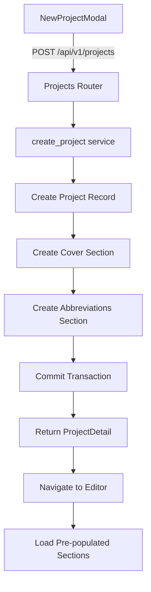

# Design Document: Project Form Autofill

## Overview

The Project Form Autofill feature automatically populates editor section fields from the New Project form data during project creation. When a user creates a new project through the NewProjectModal, the backend creates pre-populated section records for the Cover and Abbreviations sections, eliminating manual data re-entry and improving user experience.

### Key Design Decisions

1. **Backend-Driven Approach**: Section pre-population occurs entirely in the backend during project creation, ensuring data consistency and transaction integrity.

2. **Reuse Existing Infrastructure**: The implementation leverages the existing `upsert_section()` service function, maintaining consistency with current section management patterns.

3. **Transaction Integrity**: All section creation occurs within the project creation transaction, ensuring atomicity (all-or-nothing behavior).

4. **No Frontend Changes Required**: The existing frontend components already handle pre-populated data correctly, requiring no modifications.

5. **Conditional Row Creation**: The Abbreviations section conditionally creates row 15 only when client_abbreviation is provided, avoiding empty rows.

## Architecture

### System Components



### Data Flow

1. **User Input**: User fills New Project form with solution/client details
2. **API Request**: Frontend sends POST request with all form fields
3. **Project Creation**: Backend creates project record in database
4. **Section Pre-population**: Backend creates Cover and Abbreviations section records
5. **Transaction Commit**: All changes committed atomically
6. **Navigation**: Frontend navigates to editor
7. **Section Loading**: Editor loads pre-populated sections from database

### Modified Components

- **Backend**: `backend/app/projects/router.py` (POST endpoint)
- **Backend**: `backend/app/projects/service.py` (create_project function)
- **Frontend**: No changes required

## Components and Interfaces

### Backend API Changes

#### Modified Endpoint: POST /api/v1/projects

**Location**: `backend/app/projects/router.py`

**Current Behavior**: Creates project record only

**New Behavior**: Creates project record + pre-populated section records

**Request Schema**: No changes (ProjectCreate already contains all required fields)

**Response Schema**: No changes (ProjectDetail)

**Error Handling**: Returns 500 if section creation fails (transaction rolled back)

### Service Layer Changes

#### Modified Function: create_project()

**Location**: `backend/app/projects/service.py`

**Signature**:
```python
async def create_project(db: AsyncSession, project_data: ProjectCreate) -> Project
```

**New Responsibilities**:
1. Create project record
2. Create Cover section with form field mappings
3. Create Abbreviations section with default rows + form data
4. Maintain transaction integrity

**Dependencies**:
- `app.sections.service.upsert_section()` - for creating section records
- Existing database session (transaction context)

### Section Pre-population Logic

#### Cover Section Creation

**Section Key**: `'cover'`

**Content Structure**:
```python
{
    "solution_full_name": str,
    "client_name": str,
    "client_location": str,
    "ref_number": str,
    "doc_date": str,
    "doc_version": str
}
```

**Field Mappings**:
- `project_data.solution_full_name` → `content.solution_full_name`
- `project_data.client_name` → `content.client_name`
- `project_data.client_location` → `content.client_location`
- `project_data.ref_number` → `content.ref_number` (empty string if None)
- `project_data.doc_date` → `content.doc_date` (empty string if None)
- `project_data.doc_version` → `content.doc_version` (empty string if None)

#### Abbreviations Section Creation

**Section Key**: `'abbreviations'`

**Content Structure**:
```python
{
    "rows": [
        {
            "sr_no": int,
            "abbreviation": str,
            "description": str,
            "locked": bool
        },
        ...
    ]
}
```

**Default Rows** (rows 1-14):
```python
DEFAULT_ROWS = [
    {"sr_no": 1, "abbreviation": "JSPL", "description": "Jindal Steel & Power Ltd.", "locked": True},
    {"sr_no": 2, "abbreviation": "HIL", "description": "Hitachi India Pvt. Ltd.", "locked": True},
    {"sr_no": 3, "abbreviation": "SV", "description": "Supervisor", "locked": True},
    {"sr_no": 4, "abbreviation": "HMI", "description": "Human Machine Interface", "locked": True},
    {"sr_no": 5, "abbreviation": "PLC", "description": "Programmable Logic Controller", "locked": True},
    {"sr_no": 6, "abbreviation": "EOT", "description": "Electric Overhead Travelling Crane", "locked": True},
    {"sr_no": 7, "abbreviation": "HHT", "description": "Hand-held Terminal", "locked": True},
    {"sr_no": 8, "abbreviation": "LT", "description": "Long Travel of EOT Crane", "locked": True},
    {"sr_no": 9, "abbreviation": "CT", "description": "Cross Travel of EOT Crane", "locked": True},
    {"sr_no": 10, "abbreviation": "L1", "description": "Level-1 system", "locked": True},
    {"sr_no": 11, "abbreviation": "L2", "description": "Level-2 system", "locked": True},
    {"sr_no": 12, "abbreviation": "L3", "description": "Level-3 system", "locked": True},
    {"sr_no": 13, "abbreviation": "", "description": "Plate Mill Yard Management System", "locked": False},
    {"sr_no": 14, "abbreviation": "HTC", "description": "Heat Treatment Complex", "locked": True}
]
```

**Row 13 Population Logic**:
- If `project_data.solution_abbreviation` is provided and non-empty:
  - Set `rows[12].abbreviation = project_data.solution_abbreviation`
- Otherwise:
  - Leave `rows[12].abbreviation = ""`

**Row 15 Creation Logic**:
- If `project_data.client_abbreviation` is provided and non-empty:
  - Append new row: `{"sr_no": 15, "abbreviation": project_data.client_abbreviation, "description": project_data.client_name, "locked": False}`
- Otherwise:
  - Do not create row 15

## Data Models

### Existing Models (No Changes)

#### Project Model
**Location**: `backend/app/projects/models.py`

Already contains all required fields:
- `solution_name`, `solution_full_name`, `solution_abbreviation`
- `client_name`, `client_location`, `client_abbreviation`
- `ref_number`, `doc_date`, `doc_version`

#### SectionData Model
**Location**: `backend/app/sections/models.py`

Already supports JSONB content storage with unique constraint on (project_id, section_key).

### Data Transformation

#### Form Data → Cover Section Content

```python
def build_cover_content(project_data: ProjectCreate) -> dict:
    return {
        "solution_full_name": project_data.solution_full_name,
        "client_name": project_data.client_name,
        "client_location": project_data.client_location,
        "ref_number": project_data.ref_number or "",
        "doc_date": project_data.doc_date or "",
        "doc_version": project_data.doc_version or ""
    }
```

#### Form Data → Abbreviations Section Content

```python
def build_abbreviations_content(project_data: ProjectCreate) -> dict:
    rows = DEFAULT_ROWS.copy()
    
    # Populate row 13 with solution abbreviation
    if project_data.solution_abbreviation:
        rows[12]["abbreviation"] = project_data.solution_abbreviation
    
    # Add row 15 if client abbreviation provided
    if project_data.client_abbreviation:
        rows.append({
            "sr_no": 15,
            "abbreviation": project_data.client_abbreviation,
            "description": project_data.client_name,
            "locked": False
        })
    
    return {"rows": rows}
```


## Correctness Properties

*A property is a characteristic or behavior that should hold true across all valid executions of a system—essentially, a formal statement about what the system should do. Properties serve as the bridge between human-readable specifications and machine-verifiable correctness guarantees.*

### Property 1: Cover Section Content Matches Form Data

*For any* valid ProjectCreate data, when a project is created, the Cover section content SHALL contain all form fields with correct mappings: solution_full_name, client_name, client_location, ref_number (or empty string), doc_date (or empty string), and doc_version (or empty string).

**Validates: Requirements 1.1, 1.2, 1.3, 1.4, 1.5, 1.6, 1.7, 6.1, 6.4**

### Property 2: Abbreviations Section Contains Default Rows

*For any* valid ProjectCreate data, when a project is created, the Abbreviations section SHALL contain exactly 14 default rows (rows 1-14) with correct sr_no, abbreviation, description, and locked values matching the DEFAULT_ROWS specification.

**Validates: Requirements 2.1, 2.3, 2.4**

### Property 3: Row 13 Abbreviation Matches Input

*For any* valid ProjectCreate data, when a project is created, row 13 of the Abbreviations section SHALL have its abbreviation field set to the solution_abbreviation value if provided (non-empty), or empty string if not provided, while preserving the description "Plate Mill Yard Management System".

**Validates: Requirements 2.2, 2.5, 6.2**

### Property 4: Row 15 Created When Client Abbreviation Provided

*For any* valid ProjectCreate data with non-empty client_abbreviation, when a project is created, the Abbreviations section SHALL contain a row 15 with sr_no=15, abbreviation=client_abbreviation, description=client_name, and locked=false. When client_abbreviation is empty or None, row 15 SHALL NOT exist.

**Validates: Requirements 3.1, 3.2, 3.3, 3.4, 3.5, 3.6, 6.3**

### Property 5: Project Record Persists All Form Fields

*For any* valid ProjectCreate data, when a project is created, the project record in the database SHALL contain all form fields with values matching the input: solution_name, solution_full_name, solution_abbreviation, client_name, client_location, client_abbreviation, ref_number, doc_date, and doc_version.

**Validates: Requirements 5.1, 5.2, 5.3, 5.4**

### Property 6: Pre-populated Sections Not Auto-created

*For any* project with pre-populated Cover or Abbreviations sections, when get_section is called for those sections, the returned content SHALL match the pre-populated data, not empty default content, demonstrating that auto-creation logic is bypassed for pre-populated sections.

**Validates: Requirements 4.3**

## Error Handling

### Transaction Rollback

**Scenario**: Section creation fails during project creation

**Behavior**:
- Entire transaction is rolled back
- No project record is created
- No section records are created
- HTTP 500 error returned to client

**Implementation**:
```python
async def create_project(db: AsyncSession, project_data: ProjectCreate) -> Project:
    try:
        # Create project
        project = Project(**project_data.model_dump())
        db.add(project)
        await db.flush()  # Get project.id without committing
        
        # Create sections
        await upsert_section(db, project.id, 'cover', build_cover_content(project_data))
        await upsert_section(db, project.id, 'abbreviations', build_abbreviations_content(project_data))
        
        # Commit transaction
        await db.commit()
        await db.refresh(project)
        return project
    except Exception as e:
        await db.rollback()
        raise HTTPException(status_code=500, detail=f"Project creation failed: {str(e)}")
```

### Empty Optional Fields

**Scenario**: User leaves optional fields empty in form

**Behavior**:
- Optional fields stored as empty strings in Cover section content
- Row 13 abbreviation left empty if solution_abbreviation not provided
- Row 15 not created if client_abbreviation not provided
- No errors raised

**Implementation**:
```python
def build_cover_content(project_data: ProjectCreate) -> dict:
    return {
        "solution_full_name": project_data.solution_full_name,
        "client_name": project_data.client_name,
        "client_location": project_data.client_location,
        "ref_number": project_data.ref_number or "",  # Handle None
        "doc_date": project_data.doc_date or "",      # Handle None
        "doc_version": project_data.doc_version or "" # Handle None
    }
```

### Database Constraint Violations

**Scenario**: Duplicate section creation attempted (violates unique constraint)

**Behavior**:
- Database raises IntegrityError
- Transaction rolled back
- HTTP 500 error returned to client

**Prevention**: The unique constraint on (project_id, section_key) prevents duplicate sections. Since we only create each section once per project, this should not occur under normal operation.

### Invalid Project Data

**Scenario**: Required fields missing from ProjectCreate

**Behavior**:
- Pydantic validation fails before reaching service layer
- HTTP 422 Unprocessable Entity returned to client
- No database operations attempted

**Validation**: Handled by FastAPI/Pydantic schema validation automatically.

## Testing Strategy

### Unit Tests

Unit tests will verify specific examples and edge cases:

**Test Cases**:
1. **Empty Optional Fields**: Create project with all optional fields empty, verify Cover section has empty strings
2. **All Fields Populated**: Create project with all fields populated, verify all data present in sections
3. **Solution Abbreviation Only**: Create project with solution_abbreviation but no client_abbreviation, verify row 13 populated but row 15 absent
4. **Client Abbreviation Only**: Create project with client_abbreviation but no solution_abbreviation, verify row 15 created but row 13 empty
5. **Both Abbreviations**: Create project with both abbreviations, verify both row 13 and row 15 correctly populated
6. **Default Rows Integrity**: Verify rows 1-12 and 14 always match DEFAULT_ROWS specification
7. **Transaction Rollback**: Mock section creation failure, verify project not created
8. **Auto-creation Bypass**: Create project with pre-populated sections, call get_section, verify pre-populated content returned

### Property-Based Tests

Property-based tests will verify universal properties across randomized inputs using **pytest** with **Hypothesis** library.

**Configuration**:
- Minimum 100 iterations per property test
- Each test tagged with feature name and property reference

**Property Test 1: Cover Section Content Matches Form Data**
```python
@given(project_data=project_create_strategy())
@settings(max_examples=100)
def test_cover_section_matches_form_data(project_data):
    """
    Feature: project-form-autofill, Property 1: Cover Section Content Matches Form Data
    
    For any valid ProjectCreate data, the Cover section content should match form fields.
    """
    # Test implementation
```

**Property Test 2: Abbreviations Section Contains Default Rows**
```python
@given(project_data=project_create_strategy())
@settings(max_examples=100)
def test_abbreviations_default_rows(project_data):
    """
    Feature: project-form-autofill, Property 2: Abbreviations Section Contains Default Rows
    
    For any valid ProjectCreate data, the Abbreviations section should contain 14 default rows.
    """
    # Test implementation
```

**Property Test 3: Row 13 Abbreviation Matches Input**
```python
@given(project_data=project_create_strategy())
@settings(max_examples=100)
def test_row_13_abbreviation(project_data):
    """
    Feature: project-form-autofill, Property 3: Row 13 Abbreviation Matches Input
    
    For any valid ProjectCreate data, row 13 abbreviation should match solution_abbreviation input.
    """
    # Test implementation
```

**Property Test 4: Row 15 Created When Client Abbreviation Provided**
```python
@given(project_data=project_create_strategy())
@settings(max_examples=100)
def test_row_15_conditional_creation(project_data):
    """
    Feature: project-form-autofill, Property 4: Row 15 Created When Client Abbreviation Provided
    
    For any valid ProjectCreate data, row 15 should exist if and only if client_abbreviation is provided.
    """
    # Test implementation
```

**Property Test 5: Project Record Persists All Form Fields**
```python
@given(project_data=project_create_strategy())
@settings(max_examples=100)
def test_project_field_persistence(project_data):
    """
    Feature: project-form-autofill, Property 5: Project Record Persists All Form Fields
    
    For any valid ProjectCreate data, the project record should contain all form fields.
    """
    # Test implementation
```

**Property Test 6: Pre-populated Sections Not Auto-created**
```python
@given(project_data=project_create_strategy())
@settings(max_examples=100)
def test_prepopulated_sections_bypass_autocreation(project_data):
    """
    Feature: project-form-autofill, Property 6: Pre-populated Sections Not Auto-created
    
    For any project with pre-populated sections, get_section should return pre-populated content.
    """
    # Test implementation
```

**Hypothesis Strategy**:
```python
from hypothesis import strategies as st

def project_create_strategy():
    return st.builds(
        ProjectCreate,
        solution_name=st.text(min_size=1, max_size=100),
        solution_full_name=st.text(min_size=1, max_size=200),
        solution_abbreviation=st.one_of(st.none(), st.text(min_size=0, max_size=20)),
        client_name=st.text(min_size=1, max_size=100),
        client_location=st.text(min_size=1, max_size=100),
        client_abbreviation=st.one_of(st.none(), st.text(min_size=0, max_size=20)),
        ref_number=st.one_of(st.none(), st.text(min_size=0, max_size=50)),
        doc_date=st.one_of(st.none(), st.text(min_size=0, max_size=50)),
        doc_version=st.one_of(st.none(), st.text(min_size=0, max_size=20))
    )
```

### Integration Tests

Integration tests will verify end-to-end behavior:

**Test Cases**:
1. **Full Project Creation Flow**: POST to /api/v1/projects, verify response, query database, verify project and sections created
2. **Editor Navigation**: Create project, navigate to editor, verify sections load with pre-populated data
3. **Non-pre-populated Section Auto-creation**: Create project, request non-pre-populated section, verify auto-creation still works
4. **Frontend Display**: Create project with various data combinations, verify UI displays correct values
5. **Error Handling**: Test various error scenarios, verify appropriate error responses and rollback behavior

### Test Coverage Goals

- **Unit Tests**: 100% coverage of data transformation functions
- **Property Tests**: 100% coverage of correctness properties
- **Integration Tests**: Coverage of all API endpoints and transaction flows
- **Overall**: Minimum 90% code coverage for modified files

