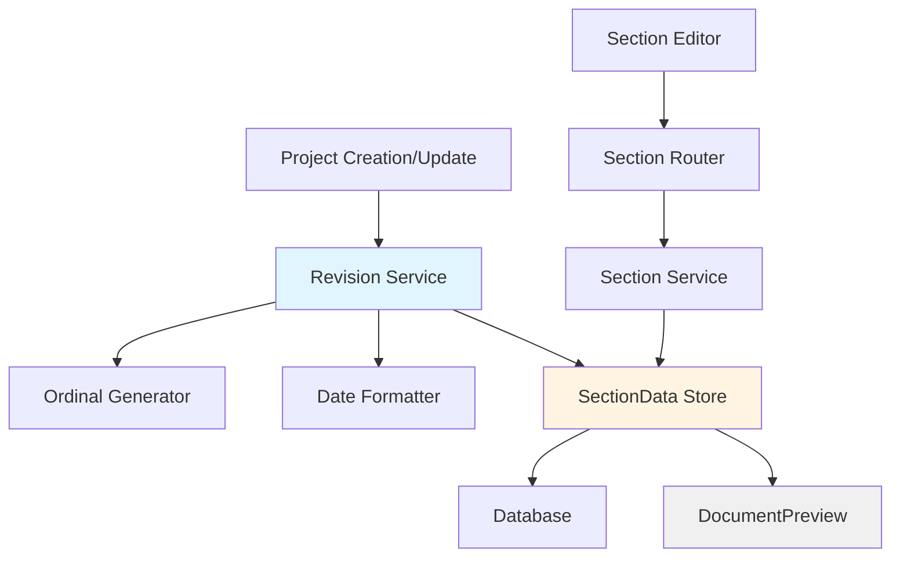

# Design Document: Revision History Auto-Tracking

## Overview

The revision history auto-tracking feature automates the creation and management of revision history entries in technical specification documents. When a project is created, the system automatically generates an initial revision entry with "First issue" details. When a project is modified, the system automatically appends a new revision entry with auto-incremented ordinal text ("Second issue", "Third issue", etc.) and revision numbers.

This design eliminates manual revision tracking overhead while preserving user control over reviewer fields (Sr. No., Revised By, Checked By, Approved By). The system integrates with the existing project lifecycle, section management, and document preview components.

**Key Design Principles:**
- Automatic revision entry creation on project creation and modification
- Ordinal number generation for human-readable revision descriptions
- Date formatting consistency (DD-MM-YYYY)
- Preservation of user-editable fields
- Backward compatibility with existing projects
- Integration with existing SectionData storage model

## Architecture

### System Components



### Component Responsibilities

1. **Revision Service** (`backend/app/projects/revision_service.py`)
   - Creates initial revision entry on project creation
   - Appends new revision entries on project modification
   - Calculates next revision number from existing entries
   - Generates ordinal text for revision details
   - Formats dates consistently

2. **Ordinal Generator** (utility function in revision_service.py)
   - Converts integers to ordinal text (1 → "First", 2 → "Second", etc.)
   - Handles numeric ordinals for large numbers (21 → "21st", 22 → "22nd")

3. **Date Formatter** (utility function in revision_service.py)
   - Formats dates to DD-MM-YYYY pattern
   - Uses current system date for new entries

4. **SectionData Store** (existing `backend/app/sections/models.py`)
   - Stores revision history as JSONB content under `revision_history` section key
   - Maintains relationship with Project model

5. **Project Service** (modified `backend/app/projects/service.py`)
   - Calls revision service on project creation
   - Triggers revision entry creation on project updates

6. **Section Service** (modified `backend/app/sections/service.py`)
   - Detects meaningful changes to trigger revision creation
   - Excludes revision_history edits from triggering new revisions

7. **DocumentPreview** (existing `frontend/src/components/preview/DocumentPreview.tsx`)
   - Displays revision history table with auto-generated entries
   - Shows read-only auto-generated fields

### Data Flow

**Project Creation Flow:**
```
User creates project
  → ProjectService.create_project()
  → RevisionService.create_initial_entry(project_id)
  → SectionService.upsert_section(project_id, 'revision_history', initial_content)
  → Database stores revision entry
```

**Project Modification Flow:**
```
User modifies section
  → SectionService.upsert_section(project_id, section_key, content)
  → IF section_key != 'revision_history':
      → RevisionService.append_revision_entry(project_id)
      → Calculate next_rev_no from existing entries
      → Generate ordinal text
      → Format current date
      → SectionService.upsert_section(project_id, 'revision_history', updated_content)
  → Database stores updated revision history
```

## Components and Interfaces

### Backend Components

#### 1. Revision Service Module

**File:** `backend/app/projects/revision_service.py`

**Functions:**

```python
async def create_initial_revision_entry(
    db: AsyncSession,
    project_id: UUID
) -> None:
    """
    Create the initial revision entry for a new project.
    
    Creates a revision entry with:
    - details: "First issue"
    - date: current date in DD-MM-YYYY format
    - rev_no: "0"
    - User-editable fields: empty strings
    """

async def append_revision_entry(
    db: AsyncSession,
    project_id: UUID
) -> None:
    """
    Append a new revision entry to an existing project.
    
    - Fetches existing revision history
    - Calculates next revision number
    - Generates ordinal text for details
    - Formats current date
    - Appends new entry to rows array
    - Updates section data
    """

def calculate_next_revision_number(existing_rows: List[dict]) -> int:
    """
    Calculate the next revision number from existing entries.
    
    Returns max(rev_no) + 1, or 1 if no entries exist.
    """

def generate_ordinal_text(number: int) -> str:
    """
    Generate ordinal text for revision details.
    
    Examples:
    - 1 → "First issue"
    - 2 → "Second issue"
    - 21 → "21st issue"
    - 22 → "22nd issue"
    - 23 → "23rd issue"
    - 24 → "24th issue"
    """

def format_date_dd_mm_yyyy() -> str:
    """
    Format current date as DD-MM-YYYY.
    
    Returns string with zero-padded day and month.
    """
```

#### 2. Modified Project Service

**File:** `backend/app/projects/service.py`

**Changes:**
- Import `revision_service`
- Call `create_initial_revision_entry()` after project creation
- Ensure revision entry is created within the same transaction

```python
async def create_project(db: AsyncSession, project_data: ProjectCreate) -> Project:
    """
    Create a new project with pre-populated sections including revision history.
    """
    try:
        # ... existing project creation logic ...
        
        # Create initial revision history entry
        await revision_service.create_initial_revision_entry(db, project.id)
        
        await db.commit()
        await db.refresh(project)
        return project
    except Exception as e:
        await db.rollback()
        raise
```

#### 3. Modified Section Service

**File:** `backend/app/sections/service.py`

**Changes:**
- Import `revision_service`
- Detect section updates (excluding revision_history)
- Trigger revision entry creation on meaningful changes

```python
async def upsert_section(
    db: AsyncSession,
    project_id: UUID,
    section_key: str,
    content: dict
) -> SectionData:
    """
    Create or update section data.
    
    If section_key is not 'revision_history', triggers automatic
    revision entry creation.
    """
    # ... existing upsert logic ...
    
    # Trigger revision entry creation for non-revision-history updates
    if section_key != 'revision_history':
        await revision_service.append_revision_entry(db, project_id)
    
    await db.commit()
    await db.refresh(section)
    return section
```

### Frontend Components

#### 1. DocumentPreview Component

**File:** `frontend/src/components/preview/DocumentPreview.tsx`

**Changes:**
- Already displays revision history from `getSectionContent('revision_history')`
- No structural changes needed
- Existing fallback logic handles empty revision history

**Current Implementation:**
```typescript
const revisionRows =
  documentContent.revisionHistory.rows?.length > 0
    ? documentContent.revisionHistory.rows
    : [
        {
          sr_no: 1,
          revised_by: '',
          checked_by: '',
          approved_by: '',
          details: 'First issue',
          date: '23-01-2026',
          rev_no: '0',
        },
      ];
```

This fallback will be replaced by actual auto-generated entries from the database.

#### 2. RevisionHistory Section Editor

**File:** `frontend/src/components/sections/RevisionHistory.tsx`

**Changes:**
- Display auto-generated fields (Details, Date, Rev No) as read-only
- Allow editing of user-editable fields (Sr. No., Revised By, Checked By, Approved By)
- Show visual indicators for auto-generated vs. user-editable fields

**Proposed UI Enhancement:**
```typescript
// Read-only styling for auto-generated fields
const autoGeneratedStyle = {
  backgroundColor: '#F3F4F6',
  cursor: 'not-allowed',
  fontStyle: 'italic',
};

// Render table cells with conditional styling
<input
  value={row.details}
  disabled={true}
  style={autoGeneratedStyle}
  title="Auto-generated field"
/>
```

## Data Models

### Revision History Content Schema

**Storage:** JSONB column in `section_data` table with `section_key = 'revision_history'`

**Schema:**
```typescript
interface RevisionHistoryContent {
  rows: RevisionEntry[];
}

interface RevisionEntry {
  sr_no: number | string;        // User-editable
  revised_by: string;             // User-editable
  checked_by: string;             // User-editable
  approved_by: string;            // User-editable
  details: string;                // Auto-generated: "First issue", "Second issue", etc.
  date: string;                   // Auto-generated: DD-MM-YYYY format
  rev_no: string;                 // Auto-generated: "0", "1", "2", etc.
}
```

**Example Data:**
```json
{
  "rows": [
    {
      "sr_no": 1,
      "revised_by": "",
      "checked_by": "",
      "approved_by": "",
      "details": "First issue",
      "date": "15-01-2025",
      "rev_no": "0"
    },
    {
      "sr_no": 2,
      "revised_by": "",
      "checked_by": "",
      "approved_by": "",
      "details": "Second issue",
      "date": "16-01-2025",
      "rev_no": "1"
    }
  ]
}
```

### Database Schema

**No new tables required.** The feature uses the existing `section_data` table:

```sql
-- Existing table structure (no changes)
CREATE TABLE section_data (
    id UUID PRIMARY KEY DEFAULT uuid_generate_v4(),
    project_id UUID NOT NULL REFERENCES projects(id) ON DELETE CASCADE,
    section_key VARCHAR NOT NULL,
    content JSONB NOT NULL DEFAULT '{}',
    updated_at TIMESTAMP WITH TIME ZONE DEFAULT NOW(),
    CONSTRAINT uq_project_section UNIQUE (project_id, section_key)
);
```

**Indexes:**
- Existing unique constraint on `(project_id, section_key)` ensures one revision history per project
- Existing foreign key on `project_id` ensures cascade deletion

## Error Handling

### Backend Error Scenarios

1. **Project Creation Failure**
   - **Scenario:** Database transaction fails during project creation
   - **Handling:** Rollback entire transaction (project + revision entry)
   - **Response:** HTTP 500 with error message

2. **Revision Entry Creation Failure**
   - **Scenario:** Unable to create initial revision entry
   - **Handling:** Rollback project creation transaction
   - **Response:** HTTP 500 with error message

3. **Revision Number Calculation Error**
   - **Scenario:** Existing revision entries have invalid rev_no values
   - **Handling:** Default to max(rev_no) + 1, or 1 if parsing fails
   - **Logging:** Log warning about invalid revision numbers

4. **Date Formatting Error**
   - **Scenario:** System date unavailable or invalid
   - **Handling:** Use fallback date format or raise exception
   - **Response:** HTTP 500 with error message

5. **Section Update Failure**
   - **Scenario:** Unable to update revision history section
   - **Handling:** Rollback section update transaction
   - **Response:** HTTP 500 with error message

### Frontend Error Scenarios

1. **Failed to Load Revision History**
   - **Scenario:** API request fails
   - **Handling:** Display fallback default entry
   - **UI:** Show error toast notification

2. **Failed to Save User Edits**
   - **Scenario:** API request to update user-editable fields fails
   - **Handling:** Revert to previous values
   - **UI:** Show error toast notification

### Error Recovery

- **Transactional Integrity:** All database operations use transactions to ensure atomicity
- **Idempotency:** Revision entry creation checks for existing entries to avoid duplicates
- **Graceful Degradation:** Frontend displays fallback revision entry if backend fails

## Testing Strategy

### Unit Tests

**Backend Unit Tests** (`backend/tests/test_revision_service.py`):

1. **Test Ordinal Generation**
   - Verify "First", "Second", "Third" for 1, 2, 3
   - Verify "21st", "22nd", "23rd", "24th" for 21-24
   - Verify "100th", "101st", "102nd" for 100-102

2. **Test Date Formatting**
   - Verify DD-MM-YYYY format with zero-padding
   - Test with various dates (single-digit day/month, double-digit)

3. **Test Revision Number Calculation**
   - Empty rows → returns 1
   - Existing rows with rev_no "0", "1" → returns 2
   - Existing rows with gaps → returns max + 1

4. **Test Initial Entry Creation**
   - Verify "First issue" details
   - Verify rev_no "0"
   - Verify current date format
   - Verify empty user-editable fields

5. **Test Revision Entry Appending**
   - Verify ordinal text generation
   - Verify rev_no increment
   - Verify date formatting
   - Verify existing entries preserved

**Frontend Unit Tests** (`frontend/src/components/sections/RevisionHistory.test.tsx`):

1. **Test Read-Only Fields**
   - Verify details, date, rev_no are disabled
   - Verify styling for auto-generated fields

2. **Test User-Editable Fields**
   - Verify sr_no, revised_by, checked_by, approved_by are editable
   - Verify save functionality

3. **Test Fallback Display**
   - Verify default entry shown when no data exists

### Integration Tests

**Backend Integration Tests** (`backend/tests/integration/test_revision_tracking.py`):

1. **Test Project Creation with Revision Entry**
   - Create project → verify revision_history section exists
   - Verify initial entry has correct structure

2. **Test Section Update Triggers Revision**
   - Update non-revision section → verify new revision entry created
   - Update revision_history section → verify no new entry created

3. **Test Revision Number Sequencing**
   - Create project → update section → update again
   - Verify rev_no sequence: "0", "1", "2"

4. **Test Backward Compatibility**
   - Load project without revision history → verify initial entry created
   - Load project with existing entries → verify entries preserved

**Frontend Integration Tests** (`e2e/revision-tracking.spec.ts`):

1. **Test End-to-End Revision Creation**
   - Create project → verify revision history displayed
   - Edit section → verify new revision entry appears

2. **Test User Field Editing**
   - Edit user-editable fields → save → verify persistence

3. **Test Document Preview Display**
   - Verify revision history table renders correctly
   - Verify auto-generated fields displayed

### Property-Based Testing

**Assessment:** Property-based testing is NOT appropriate for this feature because:

1. **Infrastructure Integration:** The feature heavily relies on database transactions, timestamps, and external state
2. **Side-Effect Operations:** Revision entry creation is a side-effect operation (database writes)
3. **Deterministic Behavior:** The behavior is deterministic based on specific inputs (project creation/update events)
4. **Configuration Validation:** The feature validates and formats data rather than transforming it through pure functions

**Alternative Testing Approach:**
- Use example-based unit tests for pure utility functions (ordinal generation, date formatting)
- Use integration tests with mocked database for service layer
- Use end-to-end tests for full workflow validation

### Test Coverage Goals

- **Unit Tests:** 90%+ coverage for utility functions
- **Integration Tests:** Cover all API endpoints and service methods
- **E2E Tests:** Cover critical user workflows (create project, edit section, view preview)

## Implementation Notes

### Ordinal Number Generation Logic

The ordinal generator handles two cases:

1. **Named Ordinals (1-20):**
   - Use predefined list: ["First", "Second", "Third", ..., "Twentieth"]

2. **Numeric Ordinals (21+):**
   - Apply suffix rules:
     - Numbers ending in 1 (except 11): "st" → "21st", "31st"
     - Numbers ending in 2 (except 12): "nd" → "22nd", "32nd"
     - Numbers ending in 3 (except 13): "rd" → "23rd", "33rd"
     - All others: "th" → "24th", "11th", "12th", "13th"

**Implementation:**
```python
def generate_ordinal_text(number: int) -> str:
    """Generate ordinal text for revision details."""
    ordinals = [
        "First", "Second", "Third", "Fourth", "Fifth",
        "Sixth", "Seventh", "Eighth", "Ninth", "Tenth",
        "Eleventh", "Twelfth", "Thirteenth", "Fourteenth", "Fifteenth",
        "Sixteenth", "Seventeenth", "Eighteenth", "Nineteenth", "Twentieth"
    ]
    
    if 1 <= number <= 20:
        return f"{ordinals[number - 1]} issue"
    
    # Numeric ordinals for 21+
    if 10 <= number % 100 <= 20:
        suffix = "th"
    else:
        suffix = {1: "st", 2: "nd", 3: "rd"}.get(number % 10, "th")
    
    return f"{number}{suffix} issue"
```

### Date Formatting Logic

**Implementation:**
```python
from datetime import datetime

def format_date_dd_mm_yyyy() -> str:
    """Format current date as DD-MM-YYYY."""
    now = datetime.now()
    return now.strftime("%d-%m-%Y")
```

### Change Detection Mechanism

**Trigger Conditions:**
- Any section update (except `revision_history`)
- Project metadata updates (handled separately if needed)

**Non-Trigger Conditions:**
- Updates to `revision_history` section itself
- Read operations (GET requests)

**Implementation:**
```python
async def upsert_section(
    db: AsyncSession,
    project_id: UUID,
    section_key: str,
    content: dict
) -> SectionData:
    # ... existing upsert logic ...
    
    # Only trigger revision creation for non-revision-history updates
    if section_key != 'revision_history':
        await revision_service.append_revision_entry(db, project_id)
    
    await db.commit()
    return section
```

### Backward Compatibility Handling

**Scenario 1: Project without revision history**
- On first access, check if `revision_history` section exists
- If not, create initial entry with "First issue"

**Scenario 2: Project with existing manual entries**
- Preserve all existing entries
- Calculate next rev_no from max(existing rev_no) + 1
- Do not duplicate "First issue" if it already exists

**Implementation:**
```python
async def ensure_revision_history_exists(
    db: AsyncSession,
    project_id: UUID
) -> None:
    """Ensure revision history exists for legacy projects."""
    section = await get_section(db, project_id, 'revision_history')
    
    if not section.content or not section.content.get('rows'):
        # No revision history exists, create initial entry
        await create_initial_revision_entry(db, project_id)
```

### Transaction Management

All revision entry operations occur within database transactions:

1. **Project Creation:** Single transaction for project + initial revision entry
2. **Section Update:** Single transaction for section update + revision entry append
3. **Rollback:** Any failure rolls back entire transaction

This ensures data consistency and prevents orphaned revision entries.

## Dependencies

### Backend Dependencies

- **SQLAlchemy:** ORM for database operations (already installed)
- **asyncpg:** PostgreSQL async driver (already installed)
- **datetime:** Python standard library for date formatting

### Frontend Dependencies

- **React:** UI framework (already installed)
- **TypeScript:** Type safety (already installed)
- No new dependencies required

## Migration Strategy

### Database Migration

**No schema changes required.** The feature uses existing `section_data` table.

### Code Migration

1. **Create revision_service.py module**
2. **Modify project service** to call revision service on creation
3. **Modify section service** to trigger revision entries on updates
4. **Update frontend components** to display auto-generated fields as read-only

### Data Migration

**For existing projects:**

Option 1: **Lazy Migration**
- On first access, check if revision history exists
- If not, create initial entry
- No batch migration needed

Option 2: **Batch Migration Script**
- Create migration script to add initial revision entry to all projects
- Run once during deployment

**Recommended:** Option 1 (Lazy Migration) for simplicity and safety.

## Performance Considerations

### Database Performance

- **Revision Entry Creation:** Single INSERT operation per section update
- **Revision Number Calculation:** Single SELECT to fetch existing entries
- **Impact:** Minimal (< 10ms per operation)

### Optimization Strategies

1. **Batch Operations:** If multiple sections updated simultaneously, batch revision entry creation
2. **Caching:** Cache revision history in memory during multi-section updates
3. **Indexing:** Existing indexes on `(project_id, section_key)` sufficient

### Scalability

- **Revision History Size:** Grows linearly with project modifications
- **Expected Size:** < 100 entries per project (typical)
- **JSONB Storage:** Efficient for small-to-medium arrays
- **No Concerns:** Feature scales well with existing architecture

## Security Considerations

### Access Control

- **Existing Authorization:** Leverage existing project-level access control
- **No New Permissions:** Revision history follows project permissions

### Data Validation

- **Input Validation:** Validate user-editable fields (sr_no, names)
- **Auto-Generated Fields:** Server-side generation prevents tampering
- **JSONB Validation:** Validate revision entry structure before storage

### Audit Trail

- **Revision History IS the Audit Trail:** Feature provides built-in audit trail
- **Timestamps:** Each revision entry includes date
- **Immutability:** Auto-generated fields cannot be edited

## Future Enhancements

1. **Revision Comments:** Allow users to add custom comments to revision entries
2. **Revision Comparison:** Show diff between revisions
3. **Revision Rollback:** Restore project to previous revision
4. **Revision Notifications:** Notify team members of new revisions
5. **Revision Export:** Export revision history to CSV/PDF
6. **Revision Filtering:** Filter revisions by date range or user

## Conclusion

The revision history auto-tracking feature provides automated, consistent revision management for technical specification documents. By leveraging the existing SectionData storage model and integrating with the project lifecycle, the feature requires minimal architectural changes while delivering significant user value.

The design prioritizes:
- **Automation:** Eliminates manual revision entry creation
- **Consistency:** Ensures uniform date formatting and revision numbering
- **User Control:** Preserves user-editable fields for reviewer information
- **Backward Compatibility:** Works seamlessly with existing projects
- **Simplicity:** Uses existing infrastructure without new database tables

Implementation follows the existing codebase patterns and integrates cleanly with the current architecture.
