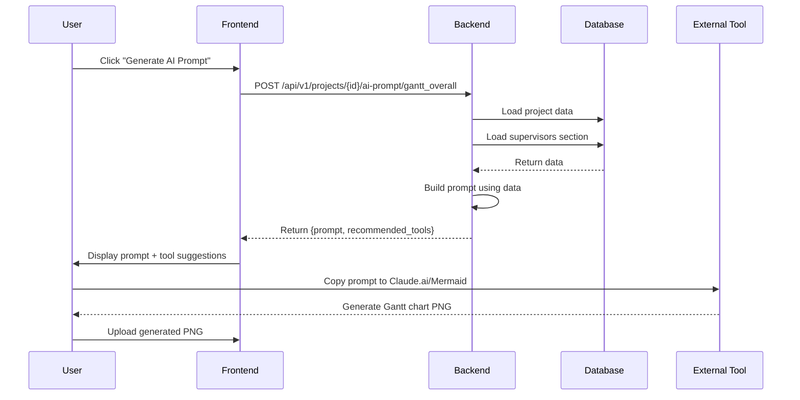

# AI Prompt Generation for Gantt Charts

## Overview
The application generates AI prompts to help users create diagrams (architecture diagrams and Gantt charts) using external AI tools. The prompts are dynamically built based on project data.

## How It Works

### 1. API Endpoint
**Endpoint**: `POST /api/v1/projects/{project_id}/ai-prompt/{prompt_type}`

**Valid prompt types**:
- `architecture` - For system architecture diagrams
- `gantt_overall` - For overall project Gantt chart
- `gantt_shutdown` - For 14-day commissioning Gantt chart

### 2. Gantt Chart Prompt Generation

#### Overall Gantt Chart (`gantt_overall`)
**Function**: `build_gantt_overall_prompt(project, supervisors_content)`

**Data Sources**:
- Project info: `solution_name`, `client_name`
- Supervisors section: `pm_days`, `dev_days`, `comm_days`

**Generated Prompt Includes**:
```
- Project Overview (solution name, client, timeline estimates)
- 7 Project Phases:
  1. Project Kickoff & Planning
  2. Requirements Analysis & Design
  3. Development & Implementation
  4. Factory Acceptance Testing (FAT)
  5. Site Commissioning & Installation
  6. User Training
  7. Go-Live & Handover
- Requirements: dependencies, milestones, buffer time
- Style requirements: professional, white background, color-coded, 1920x1080px PNG
```

**Example Prompt**:
```
Create a professional project Gantt chart for PMYMS for JSPL.

**Project Overview:**
- Solution: PMYMS
- Client: JSPL
- PM Days: 10
- Development Days: 45
- Commissioning Days: 14

**Project Phases to Include:**
1. Project Kickoff & Planning
2. Requirements Analysis & Design
...
```

#### Shutdown/Commissioning Gantt Chart (`gantt_shutdown`)
**Function**: `build_gantt_shutdown_prompt(project)`

**Data Sources**:
- Project info: `solution_name`, `client_name`
- Fixed 14-day timeline (hardcoded)

**Generated Prompt Includes**:
```
- Project Overview
- 14-Day Commissioning Activities:
  Day 1-2: Site Preparation & Equipment Setup
  Day 3-4: Hardware Installation & Network Configuration
  Day 5-6: Software Deployment & Integration
  Day 7-8: System Testing & Validation
  Day 9-10: User Training & Documentation
  Day 11-12: Parallel Run with Existing System
  Day 13-14: Final Validation & Go-Live
- Requirements: daily breakdown, dependencies, critical path
- Style requirements: professional, white background, color-coded, 1920x1080px PNG
```

### 3. Recommended Tools
The API also returns recommended tools for creating the diagrams:

**For Gantt Charts**:
1. **Claude.ai** - Can generate Mermaid Gantt chart code from prompts
2. **Mermaid Live Editor** - Render Mermaid Gantt charts and export as PNG
3. **Tom's Planner** - Online Gantt chart tool with export options

### 4. Workflow



## Code Structure

### Backend Files
1. **`backend/app/ai_prompts/router.py`**
   - API endpoint handler
   - Validates prompt type
   - Loads project and section data
   - Calls appropriate builder function

2. **`backend/app/ai_prompts/builders.py`**
   - `build_gantt_overall_prompt()` - Creates overall Gantt prompt
   - `build_gantt_shutdown_prompt()` - Creates commissioning Gantt prompt
   - `build_architecture_prompt()` - Creates architecture diagram prompt
   - `get_recommended_tools()` - Returns tool suggestions

### Key Features

#### Dynamic Data Integration
- Prompts use actual project data (solution name, client name)
- Timeline estimates from supervisors section (pm_days, dev_days, comm_days)
- If data is missing, uses defaults like "TBD" or "the project"

#### Structured Prompts
- Clear sections: Overview, Requirements, Style
- Specific deliverables listed
- Technical specifications (resolution, format)
- Professional styling guidelines

#### Tool Recommendations
- Suggests AI-powered tools (Claude.ai)
- Suggests diagram rendering tools (Mermaid Live Editor)
- Suggests specialized tools (Tom's Planner for Gantt)

## Example API Response

```json
{
  "prompt": "Create a professional project Gantt chart for PMYMS for JSPL.\n\n**Project Overview:**\n- Solution: PMYMS\n- Client: JSPL\n- PM Days: 10\n- Development Days: 45\n- Commissioning Days: 14\n\n**Project Phases to Include:**\n1. Project Kickoff & Planning\n2. Requirements Analysis & Design\n...",
  "recommended_tools": [
    {
      "name": "Claude.ai",
      "url": "https://claude.ai/",
      "note": "Can generate Mermaid Gantt chart code from prompts"
    },
    {
      "name": "Mermaid Live Editor",
      "url": "https://mermaid.live/",
      "note": "Render Mermaid Gantt charts and export as PNG"
    },
    {
      "name": "Tom's Planner",
      "url": "https://www.tomsplanner.com/",
      "note": "Online Gantt chart tool with export options"
    }
  ]
}
```

## Usage in Frontend

The frontend would typically:
1. Call the API endpoint when user clicks "Generate AI Prompt"
2. Display the prompt in a modal or text area
3. Show recommended tools with links
4. Provide a "Copy to Clipboard" button
5. Allow user to upload the generated PNG after creating it externally

## Benefits

1. **Consistency**: All prompts follow the same professional format
2. **Context-aware**: Uses actual project data for relevant prompts
3. **Time-saving**: Users don't need to write prompts from scratch
4. **Guidance**: Recommends appropriate tools for the task
5. **Quality**: Includes specific requirements for professional output

## Future Enhancements

Potential improvements:
- Direct integration with Mermaid.js to render charts in-app
- Integration with AI APIs to generate diagrams automatically
- Template customization for different industries
- More granular timeline breakdowns based on project complexity
