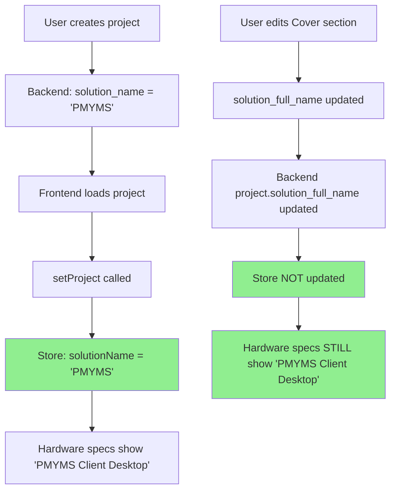
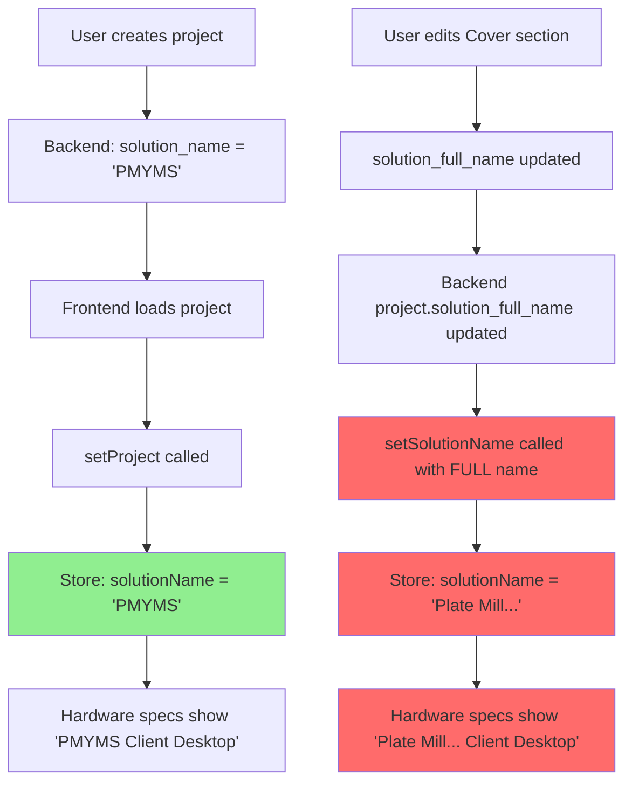

# Cover Section Store Sync Fix

## Problem

The `CoverSection.tsx` component was **incorrectly updating the Zustand store** with the wrong field value, causing the short solution name to be overwritten with the full solution name.

### The Issue

**Incorrect Code**:
```typescript
const { setSolutionName } = useProjectStore();

const handleChange = async (field: keyof CoverContent, value: string) => {
  // ... save logic ...
  
  // ❌ WRONG: Updates solutionName with solution_full_name value
  if (field === 'solution_full_name') {
    setSolutionName(value);
  }
};
```

### Why This Breaks

The Zustand store has **two separate fields**:
- `solutionName` - **SHORT name** (e.g., "PMYMS")
- `solutionFullName` - **FULL name** (e.g., "Plate Mill Yard Management System")

The Cover section only edits `solution_full_name`, but was pushing that value into `solutionName` in the store.

### Impact

**Before Fix**:
1. User creates project with `solution_name: "PMYMS"`
2. Store correctly initialized: `solutionName: "PMYMS"`
3. Hardware specs rows 5-6 show: "PMYMS Client Desktop" ✓
4. User edits Cover section, changes `solution_full_name` to "Plate Mill Yard Management System"
5. Cover section calls `setSolutionName("Plate Mill Yard Management System")` ❌
6. Store corrupted: `solutionName: "Plate Mill Yard Management System"`
7. Hardware specs rows 5-6 now show: "Plate Mill Yard Management System Client Desktop" ❌

**After Fix**:
1. User creates project with `solution_name: "PMYMS"`
2. Store correctly initialized: `solutionName: "PMYMS"`
3. Hardware specs rows 5-6 show: "PMYMS Client Desktop" ✓
4. User edits Cover section, changes `solution_full_name` to "Plate Mill Yard Management System"
5. Cover section does NOT update store ✓
6. Store remains correct: `solutionName: "PMYMS"` ✓
7. Hardware specs rows 5-6 still show: "PMYMS Client Desktop" ✓

---

## Solution

### Removed Incorrect Store Update

**Fixed Code**:
```typescript
// Removed: const { setSolutionName } = useProjectStore();

const handleChange = async (field: keyof CoverContent, value: string) => {
  const updated = { ...content, [field]: value };
  setContent(updated);
  save(updated);

  // Update project record for global fields
  try {
    await updateProject(projectId, { [field]: value });
    // ✅ CORRECT: Do NOT update Zustand store here
    // solutionName in store is the SHORT name from project.solution_name
    // Cover section edits solution_full_name which is a different field
    // Store is only updated via setProject() on initial load
  } catch (error) {
    console.error('Error updating project:', error);
  }
};
```

---

## Understanding the Data Model

### Project Fields (Backend)

```python
class Project(Base):
    solution_name = Column(String)           # SHORT name (e.g., "PMYMS")
    solution_full_name = Column(String)      # FULL name (e.g., "Plate Mill Yard Management System")
    solution_abbreviation = Column(String)   # Abbreviation (e.g., "PMYMS")
```

### Zustand Store (Frontend)

```typescript
interface ProjectStore {
  solutionName: string;        // SHORT name - from project.solution_name
  solutionFullName: string;    // FULL name - from project.solution_full_name
  // ...
}
```

### Cover Section Content

```typescript
interface CoverContent {
  solution_full_name?: string;  // Only edits the FULL name
  client_name?: string;
  client_location?: string;
  // ... (does NOT edit solution_name)
}
```

### Where Each Field is Used

**`solutionName` (SHORT)**:
- Hardware specs rows 5-6 labels: `"{solutionName} Client Desktop"`
- Hardware specs rows 5-6 labels: `"{solutionName} Server"`
- Section titles and references throughout the UI
- Template variable: `{{ SolutionName }}`

**`solutionFullName` (FULL)**:
- Cover page title
- Document headers
- Executive summary
- Template variable: `{{ SolutionFullName }}`

---

## Store Update Flow

### Correct Flow (After Fix)



### Incorrect Flow (Before Fix)



---

## When Store IS Updated

The store should ONLY be updated in these scenarios:

### 1. Initial Project Load
```typescript
// EditorPage.tsx or similar
const project = await getProjectById(projectId);
setProject(project);  // ✅ Sets solutionName from project.solution_name
```

### 2. Project Refresh
```typescript
// After any operation that might change project data
const refreshedProject = await getProjectById(projectId);
setProject(refreshedProject);  // ✅ Re-syncs all fields
```

### 3. Explicit Store Actions
```typescript
// Only if there's a UI element that directly edits solution_name
// (Currently there is none - solution_name is set at project creation)
setSolutionName(newShortName);  // ✅ Only if intentional
```

---

## Why Cover Section Shouldn't Update Store

### Reason 1: Field Mismatch
- Cover section edits: `solution_full_name`
- Store field: `solutionName` (from `solution_name`)
- These are **different fields** with **different purposes**

### Reason 2: No UI for Short Name
- Cover section has NO input for `solution_name` (short name)
- Only has input for `solution_full_name` (full name)
- Cannot edit what it doesn't display

### Reason 3: Single Source of Truth
- `solution_name` is set at project creation (NewProjectModal)
- Should not be changed by editing other fields
- Store should reflect backend state, not derive it

---

## Testing

### Manual Test

1. **Create a project**:
   - Solution Name: "PMYMS"
   - Solution Full Name: "Plate Mill Yard Management System"

2. **Check hardware specs**:
   - Navigate to Hardware Specifications section
   - Row 5 should show: "PMYMS Client Desktop"
   - Row 6 should show: "PMYMS Server"

3. **Edit cover section**:
   - Navigate to Cover section
   - Change "Solution Full Name" to "Updated Plate Mill System"
   - Save changes

4. **Verify hardware specs unchanged**:
   - Navigate back to Hardware Specifications
   - Row 5 should STILL show: "PMYMS Client Desktop" ✓
   - Row 6 should STILL show: "PMYMS Server" ✓

### Automated Test

```typescript
describe('CoverSection store sync', () => {
  it('should NOT update solutionName when editing solution_full_name', async () => {
    const { result } = renderHook(() => useProjectStore());
    
    // Initial state
    act(() => {
      result.current.setProject({
        id: 'test-id',
        solution_name: 'PMYMS',
        solution_full_name: 'Plate Mill Yard Management System',
        // ... other fields
      });
    });
    
    expect(result.current.solutionName).toBe('PMYMS');
    expect(result.current.solutionFullName).toBe('Plate Mill Yard Management System');
    
    // Simulate Cover section edit
    // (Cover section should NOT call setSolutionName)
    
    // Store should remain unchanged
    expect(result.current.solutionName).toBe('PMYMS');  // ✅ Still short name
  });
});
```

---

## Related Components

### Components That Read `solutionName`

**HardwareSpecsSection.tsx**:
```typescript
const solutionName = useProjectStore((state) => state.solutionName);

// Row 5 label
<span>{solutionName} Client Desktop</span>

// Row 6 label
<span>{solutionName} Server</span>
```

These components expect `solutionName` to be the SHORT name, not the full name.

### Components That Should Update Store

**NewProjectModal.tsx**:
```typescript
// Sets solution_name at project creation
const newProject = await createProject({
  solution_name: shortName,        // ← This becomes store.solutionName
  solution_full_name: fullName,    // ← This becomes store.solutionFullName
});
```

**EditorPage.tsx**:
```typescript
// Loads project and syncs store
const project = await getProjectById(projectId);
setProject(project);  // ← Syncs all fields including solutionName
```

---

## Files Modified

- ✅ `frontend/src/components/sections/CoverSection.tsx` - Removed incorrect store update
- ✅ `COVER_SECTION_STORE_SYNC_FIX.md` - This documentation

---

## Prevention

### Code Review Checklist

When modifying section components:

1. **Understand field mapping**: Know which backend field maps to which store field
2. **Check store usage**: Search codebase for where store field is used
3. **Verify field purpose**: Short name vs full name vs abbreviation
4. **Test downstream effects**: Check components that read the store field
5. **Document assumptions**: Add comments explaining why store is/isn't updated

### Store Update Guidelines

**DO update store when**:
- Loading project data from backend (`setProject`)
- User explicitly edits a field that has a store equivalent
- Refreshing project state

**DON'T update store when**:
- Editing a field that maps to a DIFFERENT store field
- Editing section content (use auto-save instead)
- Field has no direct store equivalent

---

## Summary

**Problem**: Cover section updated `solutionName` with `solution_full_name` value  
**Solution**: Removed incorrect store update from Cover section  
**Impact**: Hardware specs labels now remain correct after editing cover  
**Risk**: None - fix prevents corruption, doesn't change intended behavior  
**Testing**: Manual verification + store state checks  

The Cover section now correctly updates only the backend project record without corrupting the Zustand store. 🎉
