# PROJECT_CONTEXT

Generated from the current repository state on `2026-06-08`.

This document is intended to be the definitive project knowledge base for human developers and AI coding assistants working on the TS Document Generator codebase.

## 1. Executive Summary

### Project Purpose

TS Document Generator is a local-first MVP used by Hitachi India to create Technical Specification documents from a structured editing interface instead of manually authoring Word documents. The product converts project metadata, standardized section boilerplate, custom user input, uploaded diagrams, and custom subsections into a Word `.docx` output based on a Jinja-enabled template.

Primary code references:
- [README.md](file:///c:/Users/Asus/Desktop/HICAD%20Projects/TS-Doc_Project/README.md)
- [main.py](file:///c:/Users/Asus/Desktop/HICAD%20Projects/TS-Doc_Project/backend/app/main.py)
- [Editor.tsx](file:///c:/Users/Asus/Desktop/HICAD%20Projects/TS-Doc_Project/frontend/src/pages/Editor.tsx)
- [docx_generator.py](file:///c:/Users/Asus/Desktop/HICAD%20Projects/TS-Doc_Project/backend/app/generation/docx_generator.py)

### Problem Being Solved

Manual TS authoring is slow, inconsistent, and error-prone. This system solves:

- repetitive entry of standard document sections
- inconsistent section ordering and formatting
- fragile copy/paste into Word templates
- manual revision tracking
- inconsistent figure/table naming
- limited reuse of project metadata across sections

### Target Users

- Hitachi India proposal/documentation engineers
- internal technical sales or solution teams preparing client-facing TS documents
- reviewers who need consistent section structure and revision history

### Business Goals

- reduce authoring time for TS documents
- standardize document structure and legal/compliance sections
- preserve Word-template fidelity while editing in a web UI
- support repeatable document generation with version history
- allow controlled extensibility through custom sections and subsections

### Core Value Proposition

The product gives users a guided editor that preserves Hitachi's document structure, injects default boilerplate, tracks section completion, supports diagrams and custom content, and exports a Word document that remains close to the official template.

## 2. Product Overview

### Key Features

- project creation with cover metadata and default abbreviations prefill
- 31 predefined document sections
- explicit per-section save workflow with draft isolation before save
- live Word-style preview with page layout and dynamic table of contents
- section completion tracking
- image upload for architecture and Gantt diagrams
- AI prompt generation for external diagram creation tools
- document generation into versioned `.docx` files
- automatic revision history creation and session-based incrementing
- custom sections and inline custom subsections with paragraph/table/image content
- list of figures and tables generation in preview and export
- edit highlighting metadata persisted with section content

Primary code references:
- [projects.service](file:///c:/Users/Asus/Desktop/HICAD%20Projects/TS-Doc_Project/backend/app/projects/service.py)
- [completion.py](file:///c:/Users/Asus/Desktop/HICAD%20Projects/TS-Doc_Project/backend/app/generation/completion.py)
- [DocumentPreview.tsx](file:///c:/Users/Asus/Desktop/HICAD%20Projects/TS-Doc_Project/frontend/src/components/preview/DocumentPreview.tsx)
- [SectionSidebar.tsx](file:///c:/Users/Asus/Desktop/HICAD%20Projects/TS-Doc_Project/frontend/src/components/layout/SectionSidebar.tsx)

### User Roles

Current MVP has no formal auth or RBAC. Functionally, there is one effective role:

- document editor: can create projects, edit all sections, upload diagrams, create custom sections, and generate documents

### User Journeys

#### Journey: Create a new TS document

1. User opens home screen.
2. User creates a project with solution/client metadata.
3. Backend creates `projects` row, `cover`, `abbreviations`, and `revision_history`.
4. User lands in editor and works section by section.
5. User uploads diagrams and optionally generates AI prompts for external tools.
6. User adds custom sections/subsections where template content is insufficient.
7. User saves sections explicitly.
8. Once required sections are complete, user generates a versioned Word document.

#### Journey: Continue editing an existing project

1. User opens project from home screen.
2. Editor loads project metadata and all saved section JSON.
3. Preview reconstructs Word-style document plus custom insertions.
4. User edits a section draft locally.
5. Draft remains local until SAVE is pressed.
6. Saved content persists to backend and preview updates using saved state plus edit metadata.

#### Journey: Download latest document

1. User opens home screen.
2. User clicks `Download Latest`.
3. Frontend fetches version list.
4. Frontend downloads the newest saved Word file if one exists.

### End-to-End Workflows

- Project creation workflow
- Section editing and explicit save workflow
- Revision history auto-tracking workflow
- Diagram upload and preview refresh workflow
- AI prompt generation workflow
- Custom section insertion workflow
- Document generation and versioning workflow

### Main Use Cases

- create a client-specific technical specification package
- capture structured offer/scope/schedule details
- insert project-specific diagrams and tables
- extend the document beyond the base template with custom content
- export an internally standardized Word document

## 3. System Architecture

### High-Level Architecture

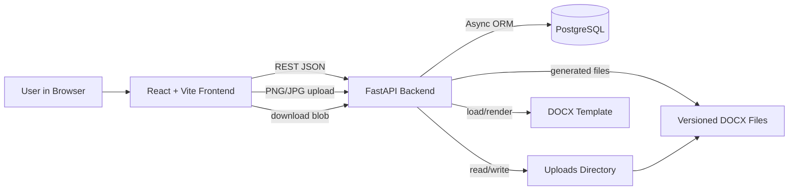

### Application Layers

#### Frontend

- route shell: [App.tsx](file:///c:/Users/Asus/Desktop/HICAD%20Projects/TS-Doc_Project/frontend/src/App.tsx)
- page layer: [Home.tsx](file:///c:/Users/Asus/Desktop/HICAD%20Projects/TS-Doc_Project/frontend/src/pages/Home.tsx), [Editor.tsx](file:///c:/Users/Asus/Desktop/HICAD%20Projects/TS-Doc_Project/frontend/src/pages/Editor.tsx)
- API adapters: `frontend/src/api/*`
- transient app state: Zustand stores plus local React state
- preview/rendering layer: [DocumentPreview.tsx](file:///c:/Users/Asus/Desktop/HICAD%20Projects/TS-Doc_Project/frontend/src/components/preview/DocumentPreview.tsx)
- editing layer: [PredefinedSectionEditor.tsx](file:///c:/Users/Asus/Desktop/HICAD%20Projects/TS-Doc_Project/frontend/src/components/input/PredefinedSectionEditor.tsx) and custom section editors

#### Backend

- application entry: [main.py](file:///c:/Users/Asus/Desktop/HICAD%20Projects/TS-Doc_Project/backend/app/main.py)
- config/database: [config.py](file:///c:/Users/Asus/Desktop/HICAD%20Projects/TS-Doc_Project/backend/app/config.py), [database.py](file:///c:/Users/Asus/Desktop/HICAD%20Projects/TS-Doc_Project/backend/app/database.py)
- domain routers: `projects`, `sections`, `generation`, `images`, `ai_prompts`
- service layer: domain services and generation helpers
- persistence: SQLAlchemy async ORM over PostgreSQL
- file system: uploaded images + generated DOCX versions under `UPLOAD_DIR`

### Request Flow

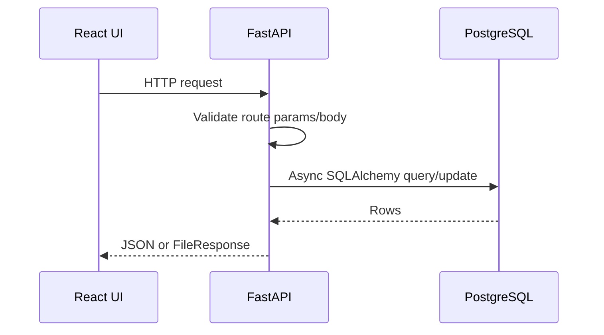

### Data Flow

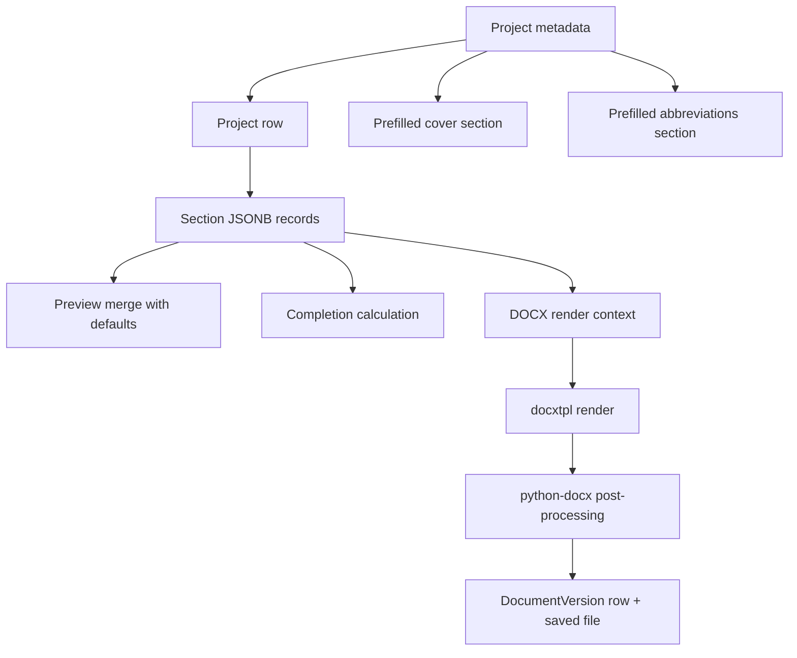

### Authentication Flow

No authentication flow exists in the current MVP.

- no users table
- no login/register endpoints
- no session cookies
- no JWT issuance
- no RBAC enforcement

This is a trusted local/internal deployment model, not a multi-user SaaS architecture.

### Authorization Model

Absent. All frontend actions assume a fully trusted editor.

## 4. Technical Stack

### Stack Inventory

| Technology | Why It Is Used | Where It Is Used | Depends On |
| --- | --- | --- | --- |
| React 18 | SPA UI rendering | `frontend/src/*` | TypeScript, React Router |
| TypeScript | type safety for editor/preview state | `frontend/src/*` | React, Vite |
| Vite | fast dev server and build tool | [package.json](file:///c:/Users/Asus/Desktop/HICAD%20Projects/TS-Doc_Project/frontend/package.json), [vite.config.ts](file:///c:/Users/Asus/Desktop/HICAD%20Projects/TS-Doc_Project/frontend/vite.config.ts) | Node |
| React Router | home/editor route switching | [main.tsx](file:///c:/Users/Asus/Desktop/HICAD%20Projects/TS-Doc_Project/frontend/src/main.tsx), [App.tsx](file:///c:/Users/Asus/Desktop/HICAD%20Projects/TS-Doc_Project/frontend/src/App.tsx) | React |
| Zustand | minimal global UI/project metadata store | [project.store.ts](file:///c:/Users/Asus/Desktop/HICAD%20Projects/TS-Doc_Project/frontend/src/store/project.store.ts), [ui.store.ts](file:///c:/Users/Asus/Desktop/HICAD%20Projects/TS-Doc_Project/frontend/src/store/ui.store.ts) | React |
| Axios | REST API client with centralized error handling | [client.ts](file:///c:/Users/Asus/Desktop/HICAD%20Projects/TS-Doc_Project/frontend/src/api/client.ts) | browser HTTP |
| react-hot-toast | user feedback for API and UI actions | many frontend components | React |
| TipTap | rich text editing for paragraphs | [RichTextEditor.tsx](file:///c:/Users/Asus/Desktop/HICAD%20Projects/TS-Doc_Project/frontend/src/components/shared/RichTextEditor.tsx), [ParagraphSubsectionEditor.tsx](file:///c:/Users/Asus/Desktop/HICAD%20Projects/TS-Doc_Project/frontend/src/components/input/ParagraphSubsectionEditor.tsx) | React |
| react-dropzone | drag/drop diagram upload UX | [DiagramUpload.tsx](file:///c:/Users/Asus/Desktop/HICAD%20Projects/TS-Doc_Project/frontend/src/components/shared/DiagramUpload.tsx) | browser file APIs |
| Tailwind CSS | styling on some screens; mixed with inline styles | home page and shared styles | PostCSS |
| FastAPI | REST API and file endpoints | [main.py](file:///c:/Users/Asus/Desktop/HICAD%20Projects/TS-Doc_Project/backend/app/main.py), routers | Pydantic, SQLAlchemy |
| Pydantic v2 | request/response validation | backend `schemas.py`, [config.py](file:///c:/Users/Asus/Desktop/HICAD%20Projects/TS-Doc_Project/backend/app/config.py) | FastAPI |
| SQLAlchemy async | ORM and async DB access | [database.py](file:///c:/Users/Asus/Desktop/HICAD%20Projects/TS-Doc_Project/backend/app/database.py), services/models | asyncpg |
| asyncpg | PostgreSQL async driver | [requirements.txt](file:///c:/Users/Asus/Desktop/HICAD%20Projects/TS-Doc_Project/backend/requirements.txt) | PostgreSQL |
| PostgreSQL 15 | durable structured storage + JSONB section data | [docker-compose.yml](file:///c:/Users/Asus/Desktop/HICAD%20Projects/TS-Doc_Project/docker-compose.yml), Alembic migration | Docker |
| Alembic | schema migrations | `backend/alembic/*` | SQLAlchemy |
| docxtpl | render Jinja variables into Word template | [docx_generator.py](file:///c:/Users/Asus/Desktop/HICAD%20Projects/TS-Doc_Project/backend/app/generation/docx_generator.py) | python-docx |
| python-docx | post-process DOCX for captions/TOC/reference tables | [document_references.py](file:///c:/Users/Asus/Desktop/HICAD%20Projects/TS-Doc_Project/backend/app/generation/document_references.py) | DOCX files |
| Pillow | server-side image validation | [images/service.py](file:///c:/Users/Asus/Desktop/HICAD%20Projects/TS-Doc_Project/backend/app/images/service.py) | uploaded bytes |
| aiofiles | async file writes for image upload | [images/router.py](file:///c:/Users/Asus/Desktop/HICAD%20Projects/TS-Doc_Project/backend/app/images/router.py) | filesystem |
| Docker Compose | local orchestration for DB/backend/frontend | [docker-compose.yml](file:///c:/Users/Asus/Desktop/HICAD%20Projects/TS-Doc_Project/docker-compose.yml) | Docker |
| Vitest + Testing Library | unit/component tests | frontend tests | Vite, jsdom |
| Playwright | browser E2E tests | [playwright.config.ts](file:///c:/Users/Asus/Desktop/HICAD%20Projects/TS-Doc_Project/playwright.config.ts), `e2e/*` | running app |
| Pytest + pytest-asyncio | backend unit/integration tests | `backend/tests/*` | Python |

### Third-Party Integrations

Current codebase integrates with no authenticated third-party APIs.

External tools are only suggested to the user for manual diagram generation:

- Eraser
- Claude
- Mermaid Live Editor
- Draw.io
- Tom's Planner

Those recommendations are hardcoded prompt guidance, not runtime integrations. See [builders.py](file:///c:/Users/Asus/Desktop/HICAD%20Projects/TS-Doc_Project/backend/app/ai_prompts/builders.py).

### Deployment Infrastructure

- local Docker Compose orchestrates all services
- backend image runs Alembic then Uvicorn
- frontend image runs Vite dev server
- persistent volumes:
  - `postgres_data`
  - `backend_uploads`

## 5. Folder Structure Analysis

### Top-Level Map

| Path | Purpose |
| --- | --- |
| `backend/` | FastAPI app, ORM models, migration scripts, DOCX generation code, template files, tests |
| `frontend/` | React editor, preview UI, API client, stores, custom section tools, tests |
| `e2e/` | Playwright end-to-end scenarios |
| `.kiro/specs/` | design/requirements/task artifacts for implemented features |
| `docker-compose.yml` | local environment orchestration |
| `README.md` | setup and high-level usage |
| `PROJECT_CONTEXT.md` | this knowledge base |

### Backend Navigation Map

| Path | Purpose |
| --- | --- |
| `backend/app/main.py` | FastAPI app creation, CORS, static uploads mount, exception handlers, router registration |
| `backend/app/config.py` | environment-backed settings |
| `backend/app/database.py` | async engine, session factory, declarative base |
| `backend/app/projects/` | project CRUD, create-time section prefill, revision bootstrap |
| `backend/app/sections/` | generic section CRUD and revision-trigger logic |
| `backend/app/generation/` | completion logic, context assembly, DOCX render, document references, version routes |
| `backend/app/images/` | upload/list/delete of fixed image types |
| `backend/app/ai_prompts/` | prompt builders for external diagram tools |
| `backend/alembic/` | DB migration environment and revisions |
| `backend/templates/` | source and converted Word templates plus test output |
| `backend/scripts/` | template conversion and repair utilities |
| `backend/tests/` | backend unit/integration/regression tests |

### Frontend Navigation Map

| Path | Purpose |
| --- | --- |
| `frontend/src/main.tsx` | browser entry point |
| `frontend/src/App.tsx` | top-level routes and global modal mounting |
| `frontend/src/pages/Home.tsx` | project listing, delete, latest download |
| `frontend/src/pages/Editor.tsx` | orchestration page for project load, draft/save, layout sizing, preview/editor sync |
| `frontend/src/api/` | thin REST client layer |
| `frontend/src/store/` | Zustand project/UI stores |
| `frontend/src/components/layout/` | header, sidebar, right input panel |
| `frontend/src/components/preview/` | Word-like preview, pagination, custom insertion UI |
| `frontend/src/components/input/` | editors for predefined and custom subsection content |
| `frontend/src/components/modals/` | project creation and section insertion flows |
| `frontend/src/components/sections/` | default content definitions and some legacy/section-specific pieces |
| `frontend/src/components/shared/` | reusable inputs, uploaders, dialogs, rich text editor, badges |
| `frontend/src/utils/` | custom section ordering, draft store, edit metadata, reference numbering |
| `frontend/src/types/` | app and custom-section type definitions |

### Dependency Hierarchy

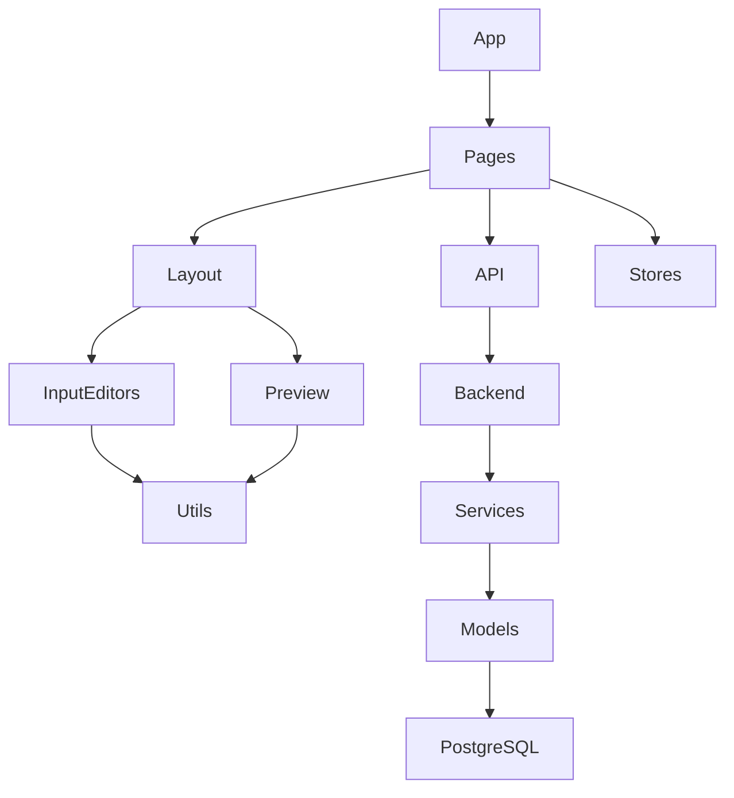

### Entry Points

- frontend runtime: [main.tsx](file:///c:/Users/Asus/Desktop/HICAD%20Projects/TS-Doc_Project/frontend/src/main.tsx)
- frontend route root: [App.tsx](file:///c:/Users/Asus/Desktop/HICAD%20Projects/TS-Doc_Project/frontend/src/App.tsx)
- backend runtime: [main.py](file:///c:/Users/Asus/Desktop/HICAD%20Projects/TS-Doc_Project/backend/app/main.py)
- DB schema init: [001_initial_migration.py](file:///c:/Users/Asus/Desktop/HICAD%20Projects/TS-Doc_Project/backend/alembic/versions/001_initial_migration.py)

## 6. Database Documentation

### Schema Summary

The database is intentionally small. The dominant data model is:

- one `Project`
- many `SectionData` rows keyed by `section_key`
- many `DocumentVersion` rows

There is no user/auth schema.

Primary code references:
- [projects.models](file:///c:/Users/Asus/Desktop/HICAD%20Projects/TS-Doc_Project/backend/app/projects/models.py)
- [sections.models](file:///c:/Users/Asus/Desktop/HICAD%20Projects/TS-Doc_Project/backend/app/sections/models.py)
- [generation.models](file:///c:/Users/Asus/Desktop/HICAD%20Projects/TS-Doc_Project/backend/app/generation/models.py)
- [001_initial_migration.py](file:///c:/Users/Asus/Desktop/HICAD%20Projects/TS-Doc_Project/backend/alembic/versions/001_initial_migration.py)

### ER Diagram

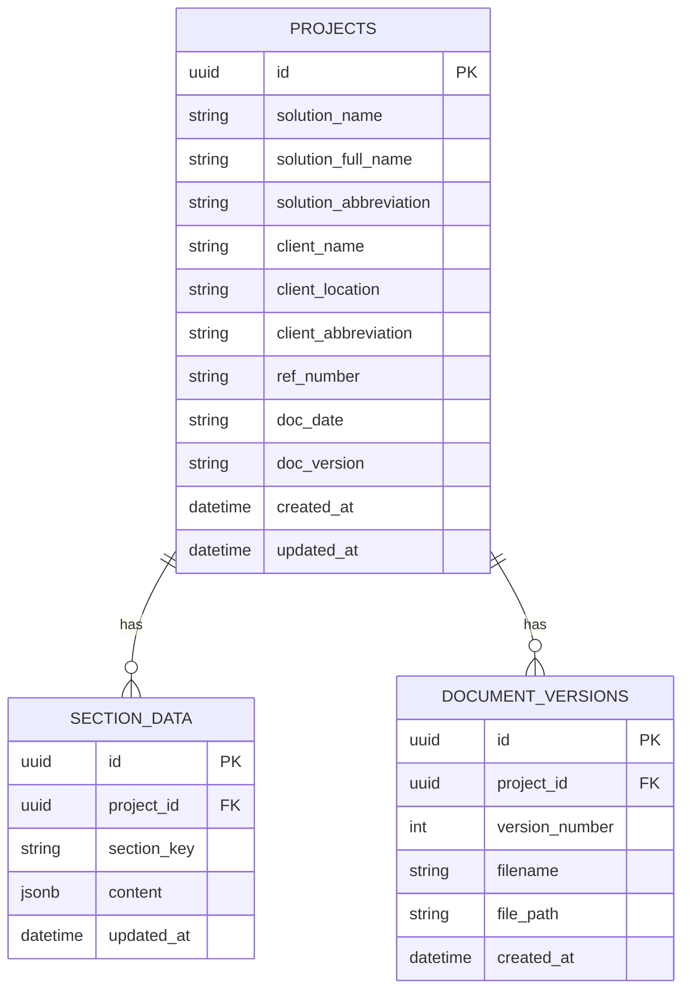

### Table: `projects`

Business meaning:

- canonical project header metadata
- source of truth for project identity and certain cover-level fields

Why it exists:

- lets the app list projects without scanning section JSON
- stores reusable metadata injected across the document

How it interacts with other tables:

- parent row for all `section_data`
- parent row for all `document_versions`

Important fields:

- `solution_name`: short name used in listings and filenames
- `solution_full_name`: full formal solution name used in cover/export
- `client_*`: customer metadata
- `doc_version`: manual document version string distinct from generated version number

Constraints:

- primary key on `id`
- non-null on core required fields

### Table: `section_data`

Business meaning:

- one JSON payload per project section, including predefined sections and custom sections

Why it exists:

- avoids a wide relational schema for 31 template sections plus custom content
- supports heterogeneous section payloads

How it interacts:

- linked to one project by `project_id`
- all completion, preview, and export logic reads from this table

Important fields:

- `section_key`: logical section identifier
- `content`: JSONB payload storing section-specific structure

Constraints:

- unique constraint `uq_project_section` on `(project_id, section_key)`
- foreign key to `projects.id` with cascade delete

Indexes:

- primary key only
- no explicit secondary indexes beyond unique constraint

Business note:

- custom sections are not normalized into separate tables; they are also stored here

### Table: `document_versions`

Business meaning:

- metadata for generated Word files

Why it exists:

- supports historical downloads and version listing

How it interacts:

- linked to one project
- points to a physical file path under uploads

Important fields:

- `version_number`: monotonic per project in current service logic
- `filename`: user-download filename
- `file_path`: server-side absolute/relative stored path

Constraints:

- primary key on `id`
- foreign key to `projects.id` with cascade delete

Notable omission:

- there is no DB-level unique constraint enforcing `(project_id, version_number)`

### Section Data Business Model

The most important business entity is not relational; it is the JSON contract for each section key.

Examples:

- `cover` contains title/client metadata
- `revision_history` contains `rows`
- `features` contains `items`
- `tech_stack`, `hardware_specs`, `software_specs` contain tabular `rows`
- `system_config` and Gantt sections mostly hold static text while images live on disk
- custom sections store:
  - `title`
  - `insertAfterKey`
  - `displayMode`
  - `subsections[]`

### Data Lifecycle

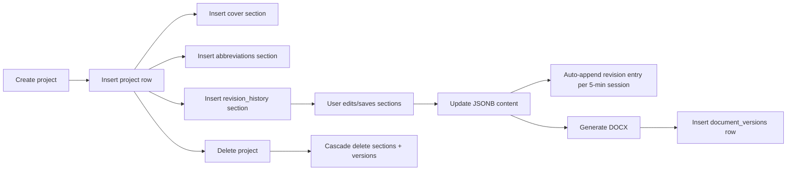

## 7. API Documentation

Auth for all endpoints: none.

Base prefixes:

- `/api/v1/projects`
- `/api/v1`

### Projects Domain

#### `POST /api/v1/projects`

- Purpose: create a project and bootstrap default sections
- Request body:
  - `solution_name` required
  - `solution_full_name` required
  - `client_name` required
  - `client_location` required
  - optional: `solution_abbreviation`, `client_abbreviation`, `ref_number`, `doc_date`, `doc_version`
- Validation: Pydantic `ProjectCreate`
- Response: `ProjectDetail`
- Side effects:
  - inserts `projects`
  - inserts `cover`
  - inserts `abbreviations`
  - inserts initial `revision_history`
- Errors:
  - `422` request validation
  - `409` DB constraint violation

Code refs:
- [projects.router](file:///c:/Users/Asus/Desktop/HICAD%20Projects/TS-Doc_Project/backend/app/projects/router.py)
- [projects.service](file:///c:/Users/Asus/Desktop/HICAD%20Projects/TS-Doc_Project/backend/app/projects/service.py)

#### `GET /api/v1/projects`

- Purpose: list project cards for home screen
- Response: array of `ProjectSummary`
- Business logic:
  - loads sections
  - calculates completion status
  - computes completion percentage excluding 4 non-completable sections

#### `GET /api/v1/projects/{project_id}`

- Purpose: load full project metadata plus completion map
- Response: `ProjectDetail`
- Errors: `404` if project missing

#### `PATCH /api/v1/projects/{project_id}`

- Purpose: partial project metadata update
- Request body: any subset of project fields
- Response: `ProjectDetail`
- Errors: `404` if project missing

Important architectural note:

- this updates `projects` only, not `cover` automatically
- the frontend manually keeps `cover` and project metadata synchronized when saving the cover section

#### `DELETE /api/v1/projects/{project_id}`

- Purpose: delete project and cascaded relational data
- Response: `204`
- Errors: `404` if project missing

### Sections Domain

#### Valid section keys

Predefined keys are enumerated in [sections.router](file:///c:/Users/Asus/Desktop/HICAD%20Projects/TS-Doc_Project/backend/app/sections/router.py). Backend also accepts:

- `custom_section_{timestamp}_{uuid}`
- `custom_subsection_{timestamp}_{uuid}`

Current frontend actively persists custom content under `custom_section_*` keys, including inline subsection records via `displayMode: "subsection"`.

#### `GET /api/v1/projects/{project_id}/sections`

- Purpose: load all section rows for editor hydration
- Response: array of `SectionDataResponse`

#### `GET /api/v1/projects/{project_id}/sections/{section_key}`

- Purpose: get one section
- Validation: rejects invalid keys with `400`
- Special behavior: auto-creates missing section with empty `{}` content
- Response: `SectionDataResponse`

#### `PUT /api/v1/projects/{project_id}/sections/{section_key}`

- Purpose: create/update section JSON
- Request body:
  - `{ "content": { ... } }`
- Validation:
  - `section_key` must be predefined or valid custom pattern
- Response: `SectionDataResponse`
- Side effects:
  - persists section content
  - if section is not `revision_history`, may append one revision entry per 5-minute editing session

#### `DELETE /api/v1/projects/{project_id}/sections/{section_key}`

- Purpose: delete one section row
- Validation: invalid keys rejected with `400`
- Special rule: `cover` cannot be deleted
- Response: `204`

### Generation Domain

#### `POST /api/v1/projects/{project_id}/generate`

- Purpose: generate a Word document and persist version metadata
- Request body: none
- Response: `FileResponse` `.docx`
- Validation/business rules:
  - project must exist
  - required sections must be complete
  - excluded from completion gate: `binding_conditions`, `cybersecurity`, `disclaimer`, `scope_definitions`
- Errors:
  - `404` project missing
  - `422` incomplete required sections with payload:
    - `message`
    - `missing_sections[]`

#### `GET /api/v1/projects/{project_id}/versions`

- Purpose: list generated versions for a project
- Response: array of `DocumentVersionResponse` ordered descending by `version_number`

#### `GET /api/v1/versions/{version_id}/download`

- Purpose: download an existing generated file
- Errors:
  - `404` version missing
  - `404` file missing on disk

### Images Domain

Valid `image_type` values:

- `architecture`
- `gantt_overall`
- `gantt_shutdown`

#### `POST /api/v1/projects/{project_id}/images/{image_type}`

- Purpose: upload diagram image
- Content type: `multipart/form-data`
- Validation:
  - MIME type must be `image/png` or `image/jpeg`
  - file size max 10 MB
  - Pillow must verify the file as a real image
- Storage:
  - saved as `/uploads/images/{project_id}/{image_type}.png`
- Response:
  - `{ "url": "http://localhost:8000/uploads/images/..." }`

#### `GET /api/v1/projects/{project_id}/images`

- Purpose: list uploaded fixed image slots for a project
- Response: array of `{ type, url }`

#### `DELETE /api/v1/projects/{project_id}/images/{image_type}`

- Purpose: remove an uploaded diagram
- Errors:
  - `400` invalid type
  - `404` image not found

### AI Prompt Domain

Valid `prompt_type` values:

- `architecture`
- `gantt_overall`
- `gantt_shutdown`

#### `POST /api/v1/projects/{project_id}/ai-prompt/{prompt_type}`

- Purpose: generate a human-readable prompt for external AI diagram tools
- Response:
  - `prompt`
  - `recommended_tools[]`
- Data sources:
  - project metadata
  - `tech_stack` for architecture prompts
  - `supervisors` for overall Gantt prompts

## 8. Authentication & Security

### Current State

This project does not implement application-level authentication or authorization.

What is absent:

- login flow
- registration flow
- session management
- JWT strategy
- RBAC permissions
- protected routes
- auth middleware

### Security Controls That Do Exist

- image upload validation by content type, size, and image decode verification
- CORS restricted to localhost origins in [main.py](file:///c:/Users/Asus/Desktop/HICAD%20Projects/TS-Doc_Project/backend/app/main.py)
- no arbitrary file upload route beyond fixed image endpoints
- cover section cannot be deleted
- invalid section keys rejected by regex/allowlist

### Security Risks / Considerations

- generic exception handler returns raw `str(exc)` to clients; this can leak internal details
- no auth means any caller with network access to the backend can mutate data
- uploaded files are publicly served through the `/uploads` static mount
- no antivirus/content scanning for uploads
- no CSRF strategy, though no cookie auth exists
- no rate limiting

### Recommendation for Future Auth

If multi-user deployment is required, add:

- user table and sessions/JWT
- project ownership or workspace boundaries
- route-level dependencies in FastAPI
- frontend auth guard and API interceptor support

## 9. Business Logic Deep Dive

### Feature: Project Creation

User action:

- submit new project modal

Frontend processing:

- [NewProjectModal.tsx](file:///c:/Users/Asus/Desktop/HICAD%20Projects/TS-Doc_Project/frontend/src/components/modals/NewProjectModal.tsx) validates required fields locally
- POST to `/api/v1/projects`
- on success navigates to `/editor/{id}`

Backend processing:

- create `Project`
- prefill `cover`
- prefill `abbreviations`
- create initial revision entry
- commit in one transaction

Sequence:

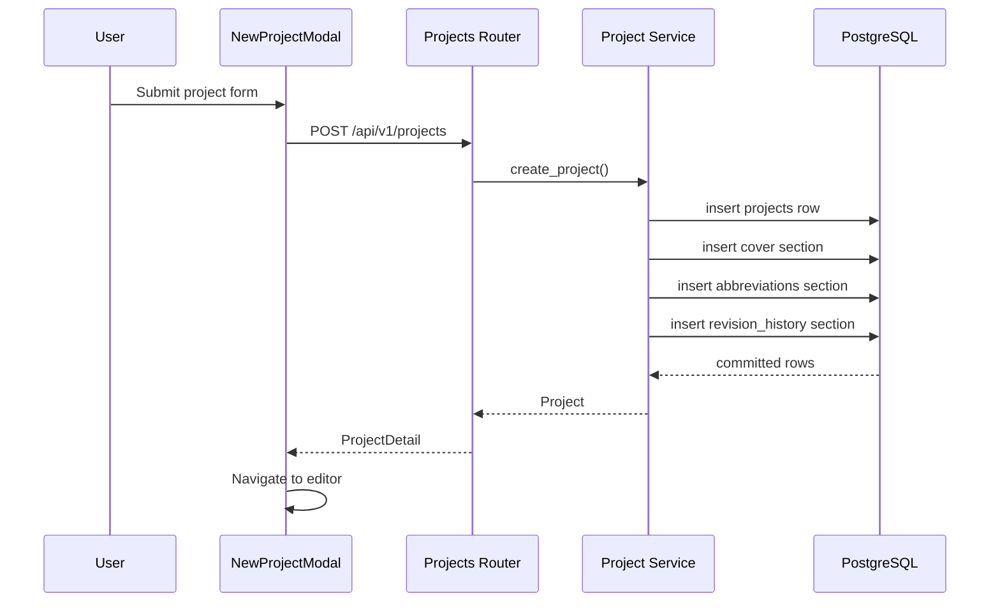

Critical rules:

- project creation is atomic
- every new project must start with `cover`, `abbreviations`, and `revision_history`

### Feature: Section Editing and Save

User action:

- edit fields in the right panel
- click `SAVE`

Frontend processing:

- editors update an in-memory draft map through `useAutoSave()` and `sectionDraftStore`
- preview remains on persisted content until explicit save
- save builds edit metadata diff markers
- if saving `cover`, frontend also patches project metadata

Backend processing:

- upsert section JSON
- potentially append one revision entry if outside 5-minute session window

Sequence:

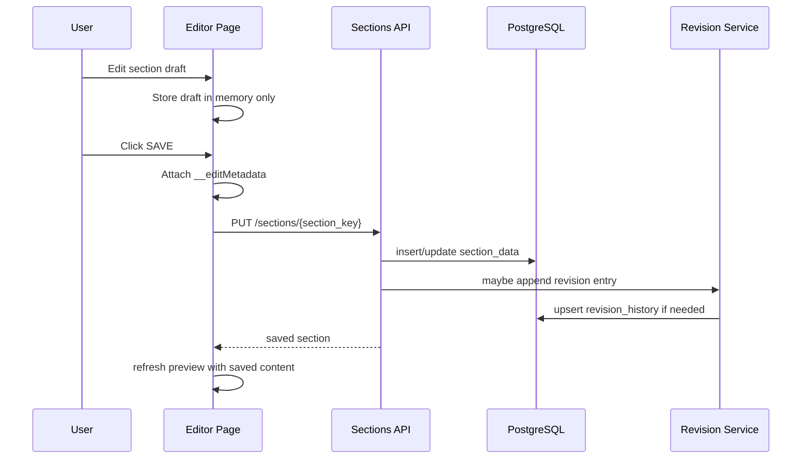

Critical rules:

- draft changes do not hit backend automatically
- saved content is the only preview/export source of truth
- revision history updates must not recursively generate more revision entries

### Feature: Completion Tracking

Implementation:

- centralized in [completion.py](file:///c:/Users/Asus/Desktop/HICAD%20Projects/TS-Doc_Project/backend/app/generation/completion.py)
- home page and project detail use backend-calculated completion
- sidebar also derives completion progress from Zustand state

Important behavior:

- only 27 sections count toward completion
- excluded sections: `binding_conditions`, `cybersecurity`, `disclaimer`, `scope_definitions`
- several sections are considered complete merely by existing in `sections_dict`
- diagram sections (`system_config`, `overall_gantt`, `shutdown_gantt`) are effectively "visited == complete"

Important implementation oddity:

- `abbreviations` completion checks the 14th row (`rows[13]`), which is prefilled in defaults; this effectively makes the section complete by default once standard rows exist

### Feature: Revision History Auto-Tracking

Implementation:

- [revision_service.py](file:///c:/Users/Asus/Desktop/HICAD%20Projects/TS-Doc_Project/backend/app/projects/revision_service.py)
- [sections/service.py](file:///c:/Users/Asus/Desktop/HICAD%20Projects/TS-Doc_Project/backend/app/sections/service.py)

Rules:

- new project gets initial row with `rev_no = "0"` and `details = "First issue"`
- first non-revision section change creates `rev_no = "1"` / `Second issue`
- additional section saves within 5 minutes do not create more revisions
- after 5 minutes, next save creates another revision row

### Feature: DOCX Generation

User action:

- click `Generate Document`

Backend processing:

- validate project exists
- load all sections
- calculate completion
- reject generation if required sections missing
- compute next document version number
- render template with docxtpl
- post-process with python-docx:
  - captions
  - TOC field
  - custom section insertion
  - list of figures/tables
- save generated file
- persist `document_versions`
- return file download

Sequence:

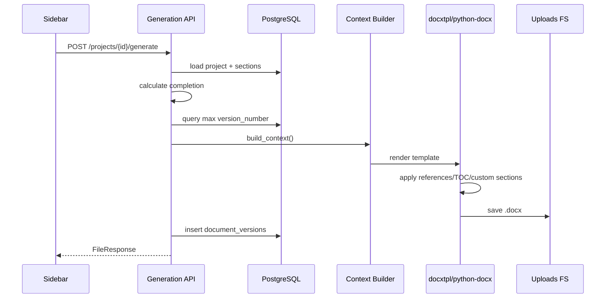

### Feature: Image Workflow

- fixed template diagrams upload through `images` endpoints
- preview listens for `project-images-changed` window event and reloads image URLs
- export uses files on disk for built-in figures
- custom subsection images are stored inline as base64 in section JSON and materialized to temp files during DOCX rendering

### Feature: AI Prompt Workflow

- frontend requests prompt text from backend
- backend synthesizes prompt from project/section data
- user manually copies prompt to an external tool
- user manually exports PNG and uploads it back

This is advisory automation, not model inference inside the app.

### Feature: Custom Sections / Inline Subsections

Implementation split:

- ordering/key rules: [customSectionUtils.ts](file:///c:/Users/Asus/Desktop/HICAD%20Projects/TS-Doc_Project/frontend/src/utils/customSectionUtils.ts)
- authoring modal: [SectionTypeModal.tsx](file:///c:/Users/Asus/Desktop/HICAD%20Projects/TS-Doc_Project/frontend/src/components/modals/SectionTypeModal.tsx)
- preview rendering/insertion: [DocumentPreview.tsx](file:///c:/Users/Asus/Desktop/HICAD%20Projects/TS-Doc_Project/frontend/src/components/preview/DocumentPreview.tsx)
- backend export parity: [document_references.py](file:///c:/Users/Asus/Desktop/HICAD%20Projects/TS-Doc_Project/backend/app/generation/document_references.py)

Rules:

- top-level custom sections are stored as `custom_section_*`
- inline subsections are also stored as `custom_section_*` with `displayMode: "subsection"`
- `insertAfterKey` controls placement
- insertion order is timestamp-based and recursive
- subsection content types: `table`, `image`, `paragraph`

## 10. State Management

### Client State

Global state via Zustand:

- `useProjectStore`
  - project id
  - solution/client names
  - section completion map
- `useUiStore`
  - new project modal visibility
  - active section key

Local/component state:

- editor layout widths
- active section/subsection
- preview zoom
- draft section content
- manual save status
- image URLs
- custom section modal state

### Server State

No React Query/SWR/TanStack Query is used.

Server state is fetched imperatively through Axios wrappers:

- projects
- sections
- versions
- images
- AI prompts

### Data Fetching Strategy

- home page fetches projects on mount
- editor page fetches project details and all sections on mount
- preview fetches images on mount and image-change events
- version history fetched on demand from home page

### Caching

- no normalized server cache library
- minimal browser localStorage only for:
  - preview zoom
  - editor left/right panel widths
- draft caching is in-memory only via `Map`

### Optimistic Updates

Not broadly used.

- draft edits update local UI immediately
- persisted state waits for successful save response

### Form Handling

- mostly controlled React state
- no form library
- dynamic editor infers form controls from section JSON structure for predefined sections

## 11. Analytics System

No analytics subsystem exists in the current repository.

Absent:

- event tracking
- telemetry pipeline
- KPI aggregation
- reporting backend
- dashboards
- user/session analytics

Closest approximation:

- completion percentages are operational UI metrics, not analytics infrastructure

## 12. Component Documentation

### `EditorPage`

- Purpose: main orchestration container
- Responsibilities:
  - load project + sections
  - maintain persisted vs draft content split
  - handle explicit save
  - synchronize cover save with project patch
  - manage layout sizing and section routing

### `SectionSidebar`

- Purpose: left navigation and generation entry point
- Responsibilities:
  - grouped section navigation
  - completion badges
  - custom section list
  - generation trigger
  - missing-section feedback

### `SectionInputPanel`

- Purpose: right-side editor host
- Responsibilities:
  - mount correct editor type for active section
  - expose SAVE button and save status
  - host custom-section editor or predefined-section editor

### `PredefinedSectionEditor`

- Purpose: generic editor for all predefined sections
- Design:
  - fetches section if needed
  - merges persisted content with defaults
  - recursively renders strings, arrays, matrices, record tables, and nested records
  - adds diagram upload block for image-backed sections

### `DocumentPreview`

- Purpose: browser-side Word-like preview and structural authoring surface
- Responsibilities:
  - merge defaults into saved content
  - render numbered sections and TOC
  - render required placeholders in red
  - show edit metadata highlighting
  - support page breaks and add-section actions
  - keep preview/export numbering parity through document reference utilities

### `CustomSectionInput`

- Purpose: edit custom section title and subsections
- Responsibilities:
  - select subsection
  - edit/delete subsection
  - delete section while reattaching children to prior anchor

### `SectionTypeModal`

- Purpose: create new custom section or subsection from preview insertion points
- Responsibilities:
  - choose section vs subsection
  - choose content type
  - choose insertion anchor
  - support multi-block creation in one modal flow

### `DiagramUpload`

- Purpose: fixed-slot upload for architecture and Gantt images
- Responsibilities:
  - list current uploaded image
  - validate client-side before POST
  - dispatch preview refresh event

## 13. Service Layer Analysis

### `projects.service`

Responsibilities:

- create/update/delete/list projects
- bootstrap cover and abbreviations section defaults
- coordinate initial revision history creation

### `projects.revision_service`

Responsibilities:

- generate ordinal issue labels
- format date in English ordinal form
- create initial revision history
- append subsequent revision rows
- ensure revision history exists for legacy projects

### `sections.service`

Responsibilities:

- get all sections
- auto-create missing section on read
- upsert section JSON
- manage one-revision-per-session throttling
- delete section

### `generation.completion`

Responsibilities:

- compute per-section completion map
- strip HTML for rich text validation

### `generation.context_builder`

Responsibilities:

- map project + section JSON to docxtpl variables
- strip preview-only metadata
- pad/fill template rows
- prepare custom section data and inline images for DOCX rendering

### `generation.docx_generator`

Responsibilities:

- load template
- build/finalize context
- render docxtpl output
- save versioned file
- invoke reference post-processing

### `generation.document_references`

Responsibilities:

- collect ordered figure/table references across built-in and custom content
- insert captions
- generate final figure/table lists
- insert dynamic TOC field
- insert custom sections into exported DOCX with preview-parity anchors

### `images.service`

Responsibilities:

- validate upload size/type/image integrity

### `ai_prompts.builders`

Responsibilities:

- create external-tool prompt text
- return recommended tools list

## 14. Data Flow Documentation

### User Registration

Not applicable. No user system exists.

### Authentication

Not applicable. No auth system exists.

### Booking Flow

Not applicable. This product is a document generator, not a booking system.

### Payment Flow

Not applicable. No billing or payments exist.

### Analytics Flow

Not applicable. No analytics subsystem exists.

### Notification Flow

Only UI toast notifications exist.

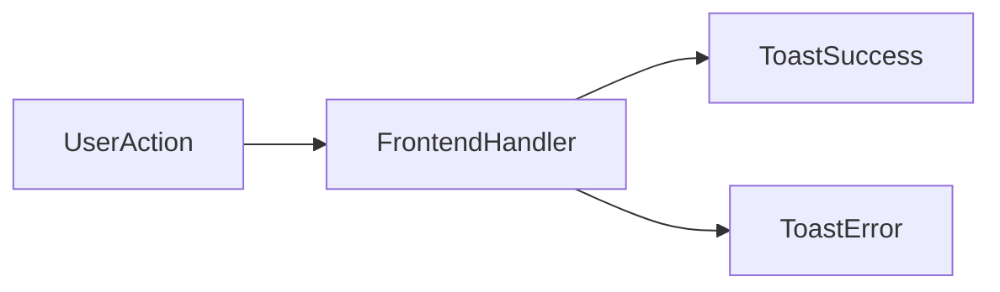

### Core End-to-End Flow: Project to DOCX

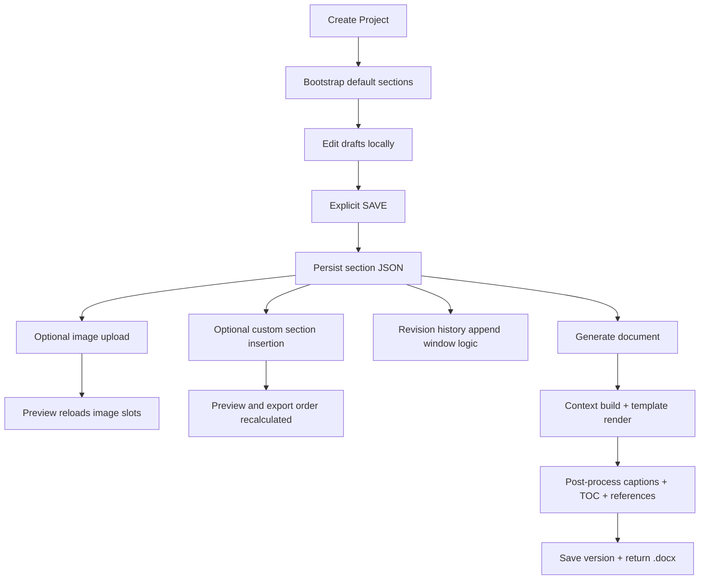

## 15. Feature Inventory

### Existing Features

- project CRUD
- per-project section persistence
- explicit section save
- default section content merge
- completion tracking
- Word preview with pagination and TOC
- diagram upload
- AI prompt generation
- document versioning and download
- custom section and subsection insertion
- edit metadata highlighting
- figure/table reference generation

### Partially Implemented Features

- async generation polling stub exists but generation is synchronous
- auth/security scaffolding does not exist despite some placeholder content in docs/constants
- some legal/template placeholder constants exist outside the main preview system

### Experimental / Advanced Features

- inline custom subsection sections via `displayMode: "subsection"`
- persisted edit markers for preview highlighting
- DOCX post-processing that mirrors preview insertion points

### Missing Features

- authentication/authorization
- multi-user collaboration
- audit logs beyond revision section text
- true autosave to backend
- background/asynchronous generation jobs
- search/filter across projects
- server-side cleanup of orphaned files
- analytics/reporting

### Technical Debt Areas

- mixed styling approach: Tailwind and extensive inline styles
- no DB-level uniqueness on document version numbers
- generic exception handler leaks raw error messages
- some tests/documentation still describe autosave while runtime behavior is explicit save
- placeholder constants in `frontend/src/constants/lockedSections.ts` are not the active source of truth
- completion logic has a few fragile assumptions about section presence and abbreviations row indexing
- project metadata and cover section are dual sources of truth and require coordinated updates

## 16. Architecture Decisions

### Architectural Style

- monorepo with separate frontend and backend apps
- REST over JSON, no GraphQL
- relational DB with JSONB for section content
- template-driven document generation

### Design Patterns Used

- router + service separation on backend
- generic schema-driven editor for predefined sections
- merge-defaults pattern for document sections
- event-driven UI refresh for image updates and draft changes
- file-backed asset model for diagrams and generated versions

### Tradeoffs

#### JSONB section storage

Pros:

- flexible section schemas
- easy custom content support

Cons:

- weak DB-level validation
- harder querying/reporting
- business rules live mostly in application code

#### Explicit save instead of server autosave

Pros:

- avoids preview/export drift while user is mid-edit
- reduces noisy revision history churn

Cons:

- users can lose unsaved in-memory draft changes on refresh/navigation
- some tests/docs still imply autosave semantics

#### Word template preservation

Pros:

- high fidelity to client-required output
- easier legal/template reuse

Cons:

- export pipeline is complex and template-coupled
- DOCX post-processing is brittle to template structure changes

### Scalability Considerations

- current scope is appropriate for low-user internal use
- no background workers or queue
- custom section JSON growth is manageable at MVP scale
- file system storage may become a concern with many versions/images

### Performance Optimizations

- async DB engine
- bounded DB pool
- selectinload for projects with sections
- client-side preview computation avoids frequent backend roundtrips
- template and image processing only on generation/upload paths

## 17. Development Guide

### Local Setup

1. Ensure Docker Desktop is running.
2. Keep `TS_Template_original.docx` in `backend/templates/`.
3. Run:

```bash
docker-compose up --build
```

4. Convert the template:

```bash
docker-compose exec backend python scripts/convert_template.py
```

5. Open:

- frontend: `http://localhost:5173`
- backend docs: `http://localhost:8000/docs`

Code refs:
- [README.md](file:///c:/Users/Asus/Desktop/HICAD%20Projects/TS-Doc_Project/README.md)
- [docker-compose.yml](file:///c:/Users/Asus/Desktop/HICAD%20Projects/TS-Doc_Project/docker-compose.yml)

### Environment Variables

Backend:

- `DATABASE_URL`
- `SYNC_DATABASE_URL`
- `UPLOAD_DIR`
- `TEMPLATE_PATH`

Frontend:

- `VITE_API_URL`

Source:
- [config.py](file:///c:/Users/Asus/Desktop/HICAD%20Projects/TS-Doc_Project/backend/app/config.py)
- [docker-compose.yml](file:///c:/Users/Asus/Desktop/HICAD%20Projects/TS-Doc_Project/docker-compose.yml)
- [client.ts](file:///c:/Users/Asus/Desktop/HICAD%20Projects/TS-Doc_Project/frontend/src/api/client.ts)

### Build Process

Frontend:

```bash
cd frontend
npm install
npm run build
```

Backend:

```bash
cd backend
pip install -r requirements.txt
alembic upgrade head
uvicorn app.main:app --reload
```

### Testing Process

Frontend unit tests:

```bash
cd frontend
npm test
```

Frontend E2E:

```bash
cd frontend
npm run test:e2e
```

Backend tests:

```bash
cd backend
pytest tests/ -v
```

### Deployment Workflow

Current deployment workflow is local/internal Docker Compose, not CI/CD-driven production deployment.

Backend container startup command:

- `alembic upgrade head && uvicorn app.main:app --host 0.0.0.0 --port 8000 --reload`

## 18. AI Agent Knowledge Section

### Project Vocabulary

| Term | Meaning |
| --- | --- |
| TS document | Technical Specification Word document generated for a client/project |
| Project | container for metadata plus all section content |
| Section | one predefined or custom document block stored in `section_data` |
| Custom section | user-added top-level section inserted after another section |
| Inline custom subsection | custom section record rendered as subsection(s) inside an existing top-level section |
| Revision history | special section storing issue rows, partially auto-managed |
| Completion | boolean per section from backend rules, not a generic validation framework |
| Preview | browser-side Word-like rendering of persisted section data plus defaults |
| Version | generated `.docx` file instance recorded in `document_versions` |

### Core Entities

- `Project`: canonical metadata row
- `SectionData`: arbitrary JSON section payload
- `DocumentVersion`: generated file metadata
- custom subsection payloads:
  - `table`
  - `image`
  - `paragraph`

### Critical Rules

- never break `(project_id, section_key)` uniqueness
- do not delete `cover`
- do not make `revision_history` updates recursively trigger new revisions
- preserve preview/export ordering parity for custom sections
- maintain the 4 excluded non-completable sections:
  - `binding_conditions`
  - `cybersecurity`
  - `disclaimer`
  - `scope_definitions`
- if updating cover-related project metadata, keep `projects` row and `cover` section synchronized
- custom section keys must remain lowercase and regex-compatible
- fixed image slot names must remain:
  - `architecture`
  - `gantt_overall`
  - `gantt_shutdown`

### Coding Conventions

- backend keeps thin routers and logic-heavy services/helpers
- frontend uses functional React components with local state
- editor behavior prefers merge-with-defaults instead of sparse rendering
- section payloads are plain JSON objects, not class instances
- custom section ordering derives from `insertAfterKey` plus timestamp ordering

### Feature Development Guidelines

When adding a new predefined section:

1. add key to backend `VALID_SECTION_KEYS`
2. add completion logic if completable
3. add default content and title in `predefinedSectionContent.ts`
4. update preview rendering in `DocumentPreview.tsx`
5. update DOCX context mapping if exported
6. update template placeholders if needed
7. add tests for preview/export/completion

When adding a new image-backed section:

1. decide whether it uses fixed image upload or inline custom images
2. update image slot enums and preview image loading if fixed
3. update document references if it should count as a figure

When adding custom content behavior:

1. keep preview and export logic in sync
2. update both frontend `documentReferences.ts` and backend `document_references.py` if numbering changes

### Existing Architectural Patterns Future Code Must Follow

- keep generation deterministic from saved section state
- avoid hidden server-side mutation on simple reads except the existing missing-section auto-create behavior
- prefer section-level JSON evolution over new DB tables unless query/reporting demands otherwise
- maintain separation between draft UI state and saved state unless intentionally redesigning the editor

### Reusable Components / Modules

Reuse before creating new code:

- [mergeSectionContent](file:///c:/Users/Asus/Desktop/HICAD%20Projects/TS-Doc_Project/frontend/src/components/sections/predefinedSectionContent.ts)
- [buildContentWithEditMetadata](file:///c:/Users/Asus/Desktop/HICAD%20Projects/TS-Doc_Project/frontend/src/utils/editMetadata.ts)
- [buildDocumentReferences](file:///c:/Users/Asus/Desktop/HICAD%20Projects/TS-Doc_Project/frontend/src/utils/documentReferences.ts)
- [calculate_section_completion](file:///c:/Users/Asus/Desktop/HICAD%20Projects/TS-Doc_Project/backend/app/generation/completion.py)
- [build_context](file:///c:/Users/Asus/Desktop/HICAD%20Projects/TS-Doc_Project/backend/app/generation/context_builder.py)
- [apply_document_references](file:///c:/Users/Asus/Desktop/HICAD%20Projects/TS-Doc_Project/backend/app/generation/document_references.py)

### Common Pitfalls

- preview shows only saved content plus defaults; draft edits do not appear until SAVE
- cover/project dual-write can drift if backend-only or frontend-only changes are made
- completion percentages in sparse project states can be misleading because some code assumes the full template exists
- custom sections require parity changes in both preview and export paths
- built-in image sections depend on filesystem uploads, not section JSON
- DOCX generation is tightly coupled to template headings and anchor text
- e2e tests include outdated autosave assumptions; do not treat them as exact behavior documentation

## 19. Future Feature Prompt Generator

### Template: New Predefined Section Feature

```md
Implement a new predefined section called `{section_key}` for the TS Document Generator.

Requirements:
- Add backend validation for the new section key.
- Add default content/title in `frontend/src/components/sections/predefinedSectionContent.ts`.
- Extend `frontend/src/components/preview/DocumentPreview.tsx` to render the section in the correct document position.
- Extend `backend/app/generation/context_builder.py` if the section must appear in DOCX output.
- Extend `backend/app/generation/completion.py` if the section affects completion status.
- Update any figure/table reference logic if the section introduces images or tables.
- Add focused frontend and backend tests following current repository patterns.

Follow existing architecture:
- Keep router thin and business logic in services/helpers.
- Store section content in `section_data.content` JSONB.
- Maintain preview/export parity.
```

### Template: New API Endpoint

```md
Add a new FastAPI endpoint under domain `{domain}` for TS Document Generator.

Requirements:
- Place route in `backend/app/{domain}/router.py`.
- Put non-trivial business logic in a service/helper module.
- Use Pydantic request/response schemas.
- Use existing async DB session dependency from `app.database.get_db`.
- Return consistent FastAPI error responses using `HTTPException`.
- Add integration tests in `backend/tests/integration`.

If the endpoint affects preview or generation:
- document the new contract in `PROJECT_CONTEXT.md`
- update matching frontend `src/api/*` adapter
```

### Template: Database Migration

```md
Add a schema change to TS Document Generator.

Requirements:
- Update SQLAlchemy models in `backend/app/*/models.py`.
- Create an Alembic migration under `backend/alembic/versions/`.
- Preserve existing data and cascade behavior.
- Prefer additive changes unless explicitly asked to break compatibility.
- Add/update tests that verify schema shape and runtime behavior.

Before adding a new table, justify why JSONB `section_data.content` is insufficient.
```

### Template: New UI Feature

```md
Implement a new editor/preview feature in the TS Document Generator frontend.

Constraints:
- Keep persisted section data in backend `section_data`.
- Keep unsaved edits local until explicit SAVE unless the task explicitly redesigns save behavior.
- Use existing `Editor.tsx` orchestration pattern.
- Reuse shared editor components where possible.
- If the feature affects document structure, update both browser preview and backend DOCX export.
- Add component tests with Vitest/Testing Library.
```

## 20. AI_QUICK_CONTEXT

### What This Project Is

TS Document Generator is a local/internal React + FastAPI + PostgreSQL app that lets Hitachi India build Technical Specification Word documents from structured web forms and a Word-like preview. The backend stores project metadata plus per-section JSON, renders a `.docx` from a Jinja-enabled template, post-processes captions/TOC/reference lists, versions the file, and serves it back for download.

### How It Works

- `projects` stores high-level metadata.
- `section_data` stores every predefined and custom section as JSONB.
- New projects auto-create `cover`, `abbreviations`, and `revision_history`.
- The editor loads all sections, but user edits stay in an in-memory draft until SAVE.
- SAVE writes a section JSON payload, attaches `__editMetadata`, and may append one revision-history row per 5-minute session window.
- The preview merges saved section data with default section boilerplate and renders a paginated Word-like document.
- Custom content is inserted by `insertAfterKey` and optional inline-subsection mode.
- Generation validates required sections, renders a DOCX template with `docxtpl`, then uses `python-docx` to add dynamic TOC, figure/table captions, reference tables, and custom inserted content.

### Key Architecture

- Frontend:
  - route shell in [App.tsx](file:///c:/Users/Asus/Desktop/HICAD%20Projects/TS-Doc_Project/frontend/src/App.tsx)
  - orchestration in [Editor.tsx](file:///c:/Users/Asus/Desktop/HICAD%20Projects/TS-Doc_Project/frontend/src/pages/Editor.tsx)
  - preview in [DocumentPreview.tsx](file:///c:/Users/Asus/Desktop/HICAD%20Projects/TS-Doc_Project/frontend/src/components/preview/DocumentPreview.tsx)
- Backend:
  - app entry in [main.py](file:///c:/Users/Asus/Desktop/HICAD%20Projects/TS-Doc_Project/backend/app/main.py)
  - project services in [projects/service.py](file:///c:/Users/Asus/Desktop/HICAD%20Projects/TS-Doc_Project/backend/app/projects/service.py)
  - section services in [sections/service.py](file:///c:/Users/Asus/Desktop/HICAD%20Projects/TS-Doc_Project/backend/app/sections/service.py)
  - generation in [context_builder.py](file:///c:/Users/Asus/Desktop/HICAD%20Projects/TS-Doc_Project/backend/app/generation/context_builder.py), [docx_generator.py](file:///c:/Users/Asus/Desktop/HICAD%20Projects/TS-Doc_Project/backend/app/generation/docx_generator.py), [document_references.py](file:///c:/Users/Asus/Desktop/HICAD%20Projects/TS-Doc_Project/backend/app/generation/document_references.py)

### Important Business Rules

- no auth exists; trusted internal MVP only
- 31 predefined sections exist, but only 27 count toward completion
- excluded from completion count/generation gating:
  - `binding_conditions`
  - `cybersecurity`
  - `disclaimer`
  - `scope_definitions`
- `cover` cannot be deleted
- custom section keys must match lowercase regex
- cover save must keep section JSON and project row synchronized
- preview/export parity is critical; if you change ordering/captions/custom sections in one place, update the other

### Feature Development Approach

- for new sections, update frontend defaults + preview + backend completion/context/export
- for new custom content behavior, update both frontend `documentReferences.ts` and backend `document_references.py`
- keep routers thin and logic in services/helpers
- store heterogeneous section payloads in JSONB unless there is a strong reason to normalize

### High-Risk Areas

- completion logic assumptions
- revision history throttling
- custom section ordering/insertion
- dual source of truth for cover/project metadata
- DOCX post-processing tied to template structure and heading text

