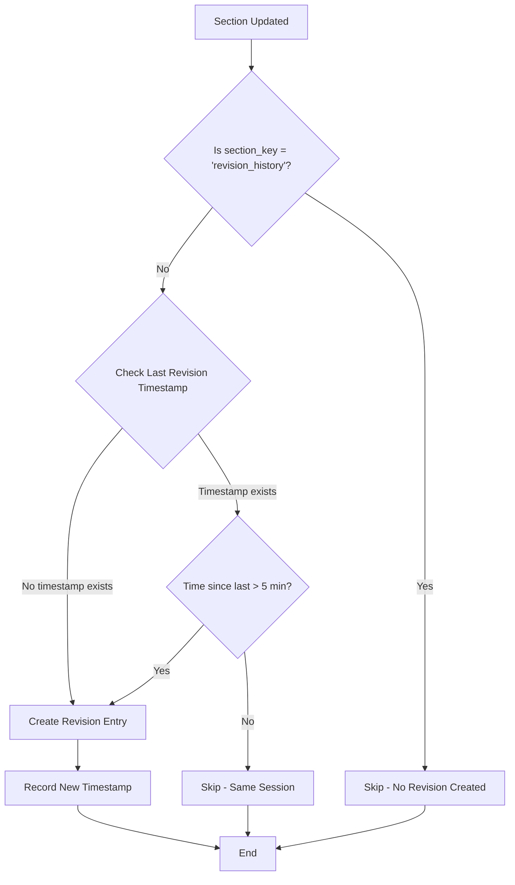

# Revision History Flow - Visual Guide

## Before Fix (❌ Incorrect Behavior)

```
User Opens Document
        ↓
Edit Overview Section → Auto-save → Create Revision Entry #1 ❌
        ↓
Edit Features Section → Auto-save → Create Revision Entry #2 ❌
        ↓
Edit Executive Summary → Auto-save → Create Revision Entry #3 ❌
        ↓
Edit Process Flow → Auto-save → Create Revision Entry #4 ❌

Result: 4 revision entries for 1 editing session ❌
```

## After Fix (✅ Correct Behavior)

```
User Opens Document
        ↓
Edit Overview Section → Auto-save → Create Revision Entry #1 ✓
        ↓                              (Timestamp recorded: 10:00)
Edit Features Section → Auto-save → Check timestamp
        ↓                              (10:02 - within 5 min)
        ↓                              → Skip revision creation ✓
Edit Executive Summary → Auto-save → Check timestamp
        ↓                              (10:03 - within 5 min)
        ↓                              → Skip revision creation ✓
Edit Process Flow → Auto-save → Check timestamp
        ↓                              (10:04 - within 5 min)
        ↓                              → Skip revision creation ✓

Result: 1 revision entry for 1 editing session ✓
```

## Session Window Logic

```
┌─────────────────────────────────────────────────────────────┐
│                    Editing Session Timeline                  │
├─────────────────────────────────────────────────────────────┤
│                                                              │
│  10:00 ──┬── First Change                                   │
│          │   ✓ Create Revision Entry #1                     │
│          │   📝 Record timestamp: 10:00                     │
│          │                                                   │
│  10:02 ──┼── Second Change                                  │
│          │   ⏱️  Check: 10:02 - 10:00 = 2 min < 5 min      │
│          │   ✗ Skip revision (same session)                 │
│          │                                                   │
│  10:04 ──┼── Third Change                                   │
│          │   ⏱️  Check: 10:04 - 10:00 = 4 min < 5 min      │
│          │   ✗ Skip revision (same session)                 │
│          │                                                   │
│  10:05 ──┴── Session Window (5 minutes)                     │
│                                                              │
│  10:10 ──┬── Fourth Change (NEW SESSION)                    │
│          │   ⏱️  Check: 10:10 - 10:00 = 10 min > 5 min     │
│          │   ✓ Create Revision Entry #2                     │
│          │   📝 Record timestamp: 10:10                     │
│          │                                                   │
└─────────────────────────────────────────────────────────────┘
```

## Decision Flow



## Code Flow

```python
# 1. User makes a change
upsert_section(db, project_id, "overview", content)
    ↓
# 2. Check if it's revision_history section
if section_key != 'revision_history':
    ↓
# 3. Check session window
_maybe_create_revision_entry(db, project_id)
    ↓
# 4. Get last revision timestamp
last_time = _last_revision_timestamps.get(project_id)
    ↓
# 5. Calculate time difference
if last_time is None or (now - last_time) > 5 minutes:
    ↓
# 6. Create revision entry
append_revision_entry(db, project_id)
    ↓
# 7. Update timestamp
_last_revision_timestamps[project_id] = now
```

## Real-World Example

### Scenario: User Edits Multiple Sections

```
📅 Monday, 10:00 AM
User: Opens project "ERP System Upgrade"

10:00:15 - Edits Overview section
          → Revision Entry #1 created ✓
          → Details: "Second issue"
          → Date: 21-04-2026
          → Rev No: 1

10:02:30 - Edits Features section
          → No revision created (same session)

10:03:45 - Edits Executive Summary
          → No revision created (same session)

10:05:00 - Edits Process Flow
          → No revision created (same session)

10:15:20 - Edits Overview again (after 15 min break)
          → Revision Entry #2 created ✓
          → Details: "Third issue"
          → Date: 21-04-2026
          → Rev No: 2

Result: 2 revision entries for 2 editing sessions ✓
```

## Revision History Table Result

| Sr. No. | Revised By | Checked By | Approved By | Details | Date | Rev No |
|---------|------------|------------|-------------|---------|------|--------|
| | | | | First issue | 20-04-2026 | 0 |
| | | | | Second issue | 21-04-2026 | 1 |
| | | | | Third issue | 21-04-2026 | 2 |

**Note:** Only 2 new entries created despite 5 section edits!

## Key Benefits

1. **Cleaner History**: No spam of duplicate entries
2. **Logical Grouping**: One entry per editing session
3. **User-Friendly**: Matches user expectations
4. **Efficient**: Reduces database writes
5. **Flexible**: 5-minute window is configurable

## Session Window Comparison

| Window Duration | Use Case | Behavior |
|----------------|----------|----------|
| 1 minute | Very granular tracking | More revision entries |
| 5 minutes ✓ | **Recommended** | Balanced approach |
| 10 minutes | Lenient tracking | Fewer revision entries |
| 1 hour | Very lenient | Very few entries |

## Summary

✅ **Fixed**: Multiple changes in one session = 1 revision entry
✅ **Fixed**: No changes = no revision entry
✅ **Fixed**: Clean, predictable revision history
✅ **Fixed**: Matches user expectations
