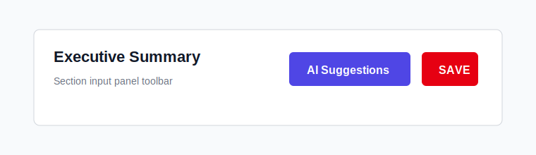
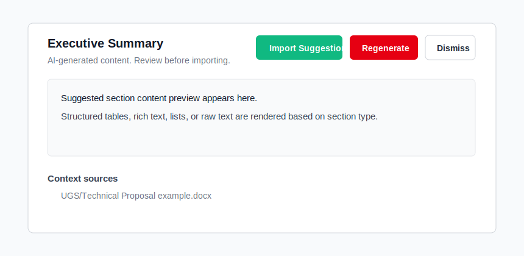
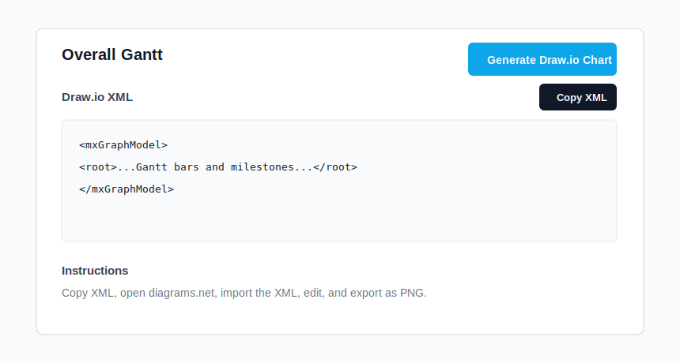

# AI Suggestions User Guide

AI Suggestions helps draft TS document section content using the selected project TS type, saved project data, current draft edits, curated category context, and historical TS documents.

## Before You Start

A project must have a TS Type selected. Legacy projects with no TS Type show the AI Suggestions button as disabled.

The AI Suggestions button is intentionally hidden for these sections:

- Cover
- Revision History
- Abbreviations

These sections are metadata-driven or managed by existing workflows.

## Request A Suggestion

1. Open a project in the editor.
2. Select an eligible section.
3. Make any draft edits you want the AI to consider.
4. Click AI Suggestions in the section toolbar.
5. Review the suggestion panel.

The AI sees your current unsaved draft content. You do not need to save before requesting a suggestion.

## Review The Suggestion

The panel shows the generated content, context source metadata when available, and the available actions.

Actions:

- Import Suggestion: copies the generated content into the current draft editor state.
- Regenerate: requests a new suggestion for the same section using the current draft state.
- Dismiss: closes the panel without changing the draft.

Important: Importing does not save to the database. After importing, review and edit the draft, then click the normal SAVE button for the section.

## Structured And Raw Suggestions

When the AI response matches the section schema, the panel can import structured content directly.

Examples:

- Rich-text sections receive HTML narrative content.
- Table sections receive row arrays with the expected field names.
- Mixed-field sections receive JSON objects that merge into editable fields.
- Custom sections receive one suggestion per saved subsection.

If the AI returns content that cannot be parsed into the expected shape, the panel shows raw text. You can still review it manually, but direct structured import may be unavailable.

## Custom Sections

Custom sections must be saved at least once before AI Suggestions can use them. This gives the backend a stable title and subsection structure.

For custom sections:

- The AI never creates or deletes subsections.
- The AI preserves each subsection type.
- Suggestions are mapped back by subsection index.
- Paragraph subsections receive rich text.
- Table subsections receive rows based on the saved table schema.
- Image subsections receive description or caption text only.

## Draw.io Gantt Charts

Draw.io chart generation is available only for:

- Overall Gantt
- Shutdown Gantt

Workflow:

1. Click AI Suggestions for `overall_gantt` or `shutdown_gantt`.
2. Review the text suggestion.
3. Click Generate Draw.io Chart.
4. Copy the generated XML.
5. Open draw.io or diagrams.net.
6. Import the XML.
7. Edit the chart if needed.
8. Export the chart as PNG and upload it through the normal document workflow if required.

## Example Workflow

Example: creating a UGS proposal section.

1. Create a project and select `Data Analysis/Data Centralization/UGS` as the TS Type.
2. Open Executive Summary.
3. Add a short draft note such as `Customer requires centralized OT data integration for plant reporting`.
4. Click AI Suggestions.
5. Review the generated executive summary.
6. Click Import Suggestion.
7. Edit names, dates, assumptions, and any customer-specific details.
8. Click SAVE.
9. Verify the preview and exported DOCX show the edited content normally.

## Quality Checklist

Before saving AI-assisted content:

- Verify customer name, plant location, scope, dates, and commercial commitments.
- Remove generic claims that do not apply to the project.
- Confirm technical architecture details with the SME.
- Check exclusions and prerequisites carefully.
- Ensure imported tables have realistic row values.
- Save only after the suggestion has been reviewed.

## Troubleshooting

| Symptom | Likely cause | What to do |
| --- | --- | --- |
| AI Suggestions is disabled | Project has no TS Type or Groq is not configured | Select a TS Type for the project or ask an admin to configure Groq. |
| `AI suggestions are not configured` | `GROQ_API_KEY` is missing in the backend | Ask an admin to set the backend environment variable. |
| Custom section returns not found | The custom section has not been saved yet | Save the custom section, then request AI Suggestions again. |
| Draw.io button is missing | Current section is not a Gantt section | Use Overall Gantt or Shutdown Gantt. |
| Raw text appears instead of structured content | Groq returned a response outside the expected schema | Review manually or click Regenerate. |
